# AWS S3云存储集成

<cite>
**本文档引用的文件**
- [server.js](file://server.js)
- [package.json](file://package.json)
- [public/index.html](file://public/index.html)
- [public/main.html](file://public/main.html)
- [scripts/create_files_table.js](file://scripts/create_files_table.js)
- [scripts/init_db.js](file://scripts/init_db.js)
- [sql/01_create_db.sql](file://sql/01_create_db.sql)
- [sql/02_create_tables.sql](file://sql/02_create_tables.sql)
- [sql/03_insert_test_data.sql](file://sql/03_insert_test_data.sql)
- [sql/04_create_files_table.sql](file://sql/04_create_files_table.sql)
- [数据表设计方案.md](file://数据表设计方案.md)
- [.gitignore](file://.gitignore)
</cite>

## 目录
1. [项目概述](#项目概述)
2. [项目结构](#项目结构)
3. [核心组件](#核心组件)
4. [架构概览](#架构概览)
5. [详细组件分析](#详细组件分析)
6. [AWS S3集成实现](#aws-s3集成实现)
7. [数据库设计](#数据库设计)
8. [性能考虑](#性能考虑)
9. [故障排除指南](#故障排除指南)
10. [总结](#总结)

## 项目概述

这是一个基于Node.js和Express构建的企业级文件管理系统，集成了AWS S3云存储服务。系统提供了完整的文件上传、下载、管理和展示功能，支持多种文件类型的分类管理，包括文档、图片、视频、音频等。

### 主要特性
- **AWS S3云存储集成**：使用官方SDK进行安全的云端文件存储
- **多文件类型支持**：支持Word、Excel、PPT、PDF、图片、3D模型、视频、音频等多种文件格式
- **用户权限管理**：基于部门层级的权限控制机制
- **响应式Web界面**：提供友好的用户交互体验
- **分页浏览**：支持大量文件的高效浏览和管理

## 项目结构

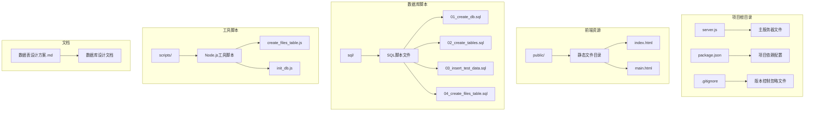

**图表来源**
- [server.js:1-283](file://server.js#L1-L283)
- [package.json:1-21](file://package.json#L1-L21)

**章节来源**
- [server.js:1-283](file://server.js#L1-L283)
- [package.json:1-21](file://package.json#L1-L21)

## 核心组件

### 服务器端核心组件

系统采用模块化的架构设计，主要包含以下核心组件：

1. **Express Web服务器**：处理HTTP请求和路由
2. **AWS S3客户端**：负责与云存储服务交互
3. **MySQL数据库连接池**：管理数据库连接和事务
4. **文件上传处理器**：处理Base64编码的文件数据
5. **用户认证中间件**：验证用户身份和权限

### 前端组件

1. **登录界面**：用户身份验证
2. **文件管理界面**：文件上传、浏览和管理
3. **拖拽上传区域**：支持拖拽和点击上传
4. **文件列表展示**：表格形式展示文件信息
5. **分页控件**：支持大数据量的分页浏览

**章节来源**
- [server.js:17-35](file://server.js#L17-L35)
- [public/index.html:1-227](file://public/index.html#L1-L227)
- [public/main.html:1-1069](file://public/main.html#L1-L1069)

## 架构概览

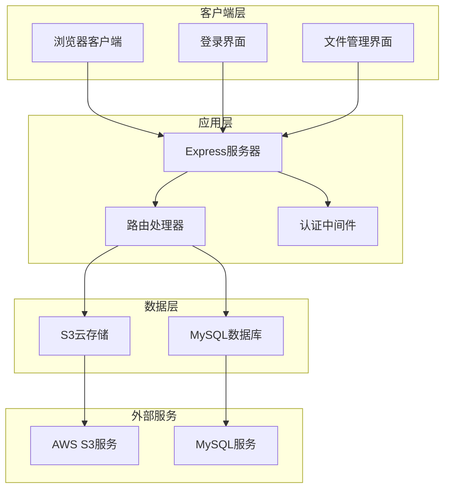

**图表来源**
- [server.js:37-282](file://server.js#L37-L282)
- [package.json:13-19](file://package.json#L13-L19)

系统采用经典的三层架构设计：
- **表现层**：HTML/CSS/JavaScript前端界面
- **业务逻辑层**：Node.js Express服务器处理业务逻辑
- **数据访问层**：MySQL数据库存储元数据，AWS S3存储实际文件

## 详细组件分析

### Express服务器配置

服务器初始化和配置是整个系统的核心基础：

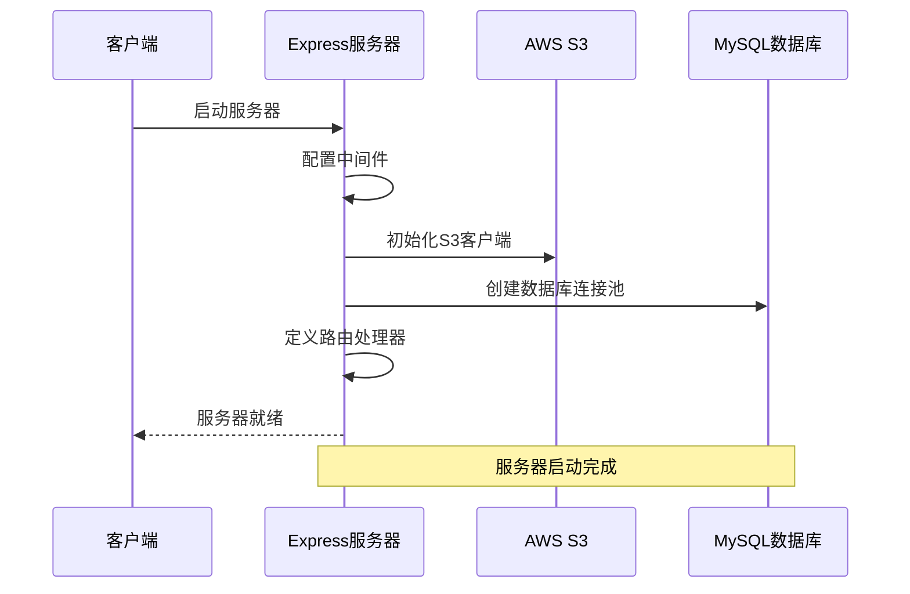

**图表来源**
- [server.js:8-35](file://server.js#L8-L35)

### 用户认证流程

系统实现了基于会话的用户认证机制：

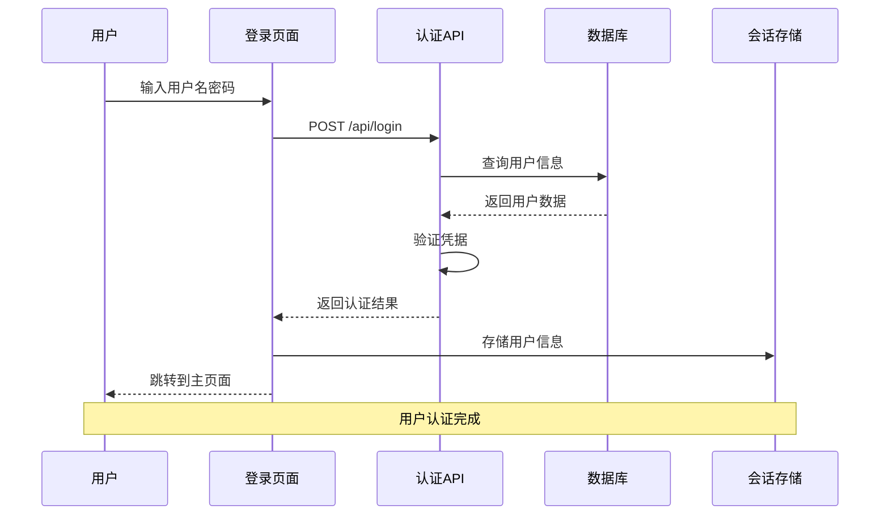

**图表来源**
- [server.js:37-68](file://server.js#L37-L68)
- [public/index.html:182-218](file://public/index.html#L182-L218)

**章节来源**
- [server.js:37-68](file://server.js#L37-L68)
- [public/index.html:182-218](file://public/index.html#L182-L218)

### 文件上传处理流程

文件上传是系统的核心功能之一，涉及多个步骤的处理：

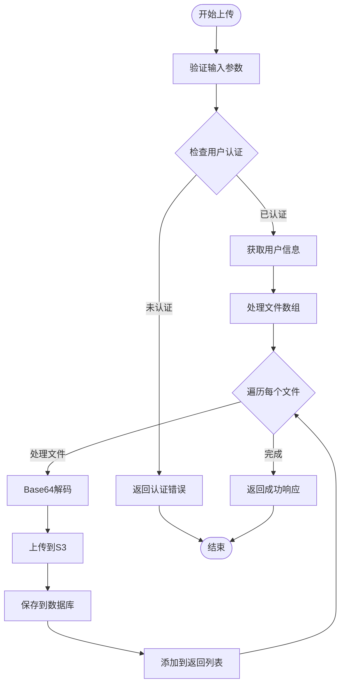

**图表来源**
- [server.js:112-182](file://server.js#L112-L182)

**章节来源**
- [server.js:112-182](file://server.js#L112-L182)

### 文件类型识别系统

系统实现了智能的文件类型识别机制：

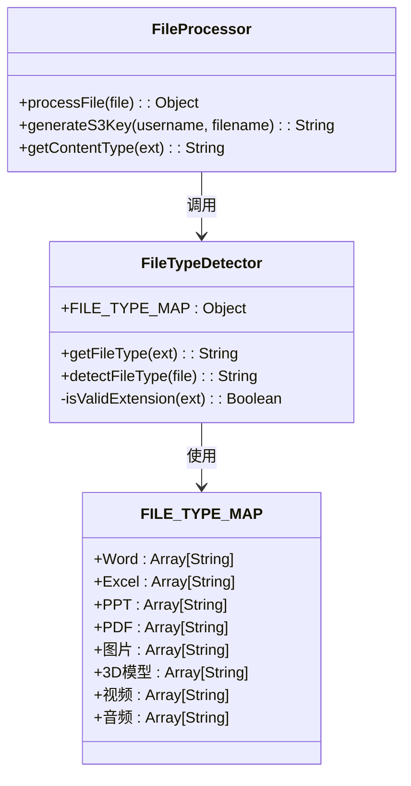

**图表来源**
- [server.js:92-109](file://server.js#L92-L109)
- [server.js:184-201](file://server.js#L184-L201)

**章节来源**
- [server.js:92-109](file://server.js#L92-L109)
- [server.js:184-201](file://server.js#L184-L201)

## AWS S3集成实现

### S3客户端配置

系统使用AWS SDK v3进行S3集成，配置了必要的认证信息：

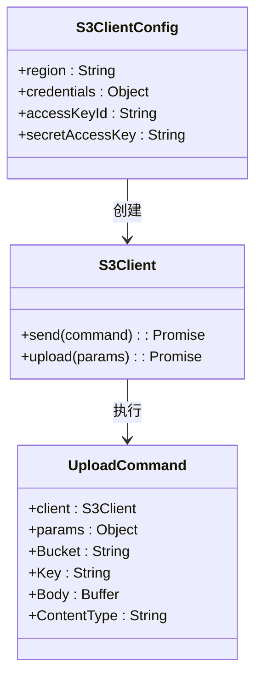

**图表来源**
- [server.js:17-24](file://server.js#L17-L24)
- [server.js:147-155](file://server.js#L147-L155)

### 文件存储策略

系统采用了高效的文件存储策略：

1. **目录结构**：`uploads/{username}/{timestamp}_{filename}`
2. **唯一性保证**：使用时间戳确保文件名唯一
3. **元数据分离**：文件内容存储在S3，元数据存储在数据库
4. **URL生成**：动态生成可访问的S3对象URL

**章节来源**
- [server.js:141-160](file://server.js#L141-L160)

### 错误处理机制

S3集成包含了完善的错误处理机制：

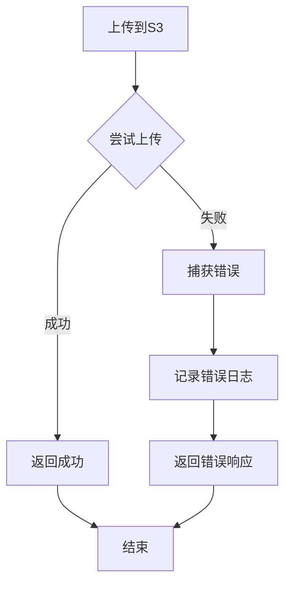

**图表来源**
- [server.js:177-181](file://server.js#L177-L181)

**章节来源**
- [server.js:177-181](file://server.js#L177-L181)

## 数据库设计

### 数据库架构

系统采用关系型数据库设计，支持复杂的层级关系和权限控制：

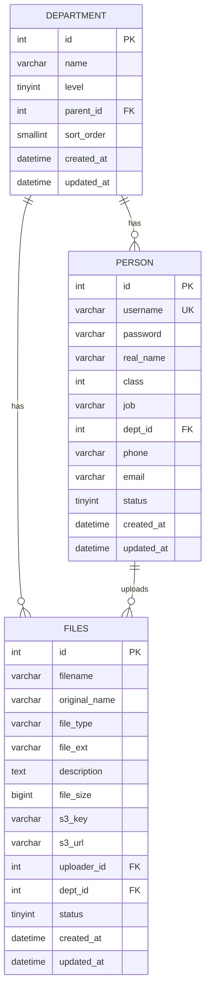

**图表来源**
- [sql/02_create_tables.sql:6-42](file://sql/02_create_tables.sql#L6-L42)
- [sql/04_create_files_table.sql:6-28](file://sql/04_create_files_table.sql#L6-L28)

### 数据表设计特点

1. **部门层级设计**：采用邻接表模式实现四级组织结构
2. **用户权限体系**：通过class字段实现分级权限控制
3. **文件元数据管理**：分离存储文件内容和元数据信息
4. **索引优化**：为常用查询字段建立索引提高性能

**章节来源**
- [sql/02_create_tables.sql:6-42](file://sql/02_create_tables.sql#L6-L42)
- [sql/04_create_files_table.sql:6-28](file://sql/04_create_files_table.sql#L6-L28)

### 数据初始化流程

系统提供了完整的数据初始化脚本：

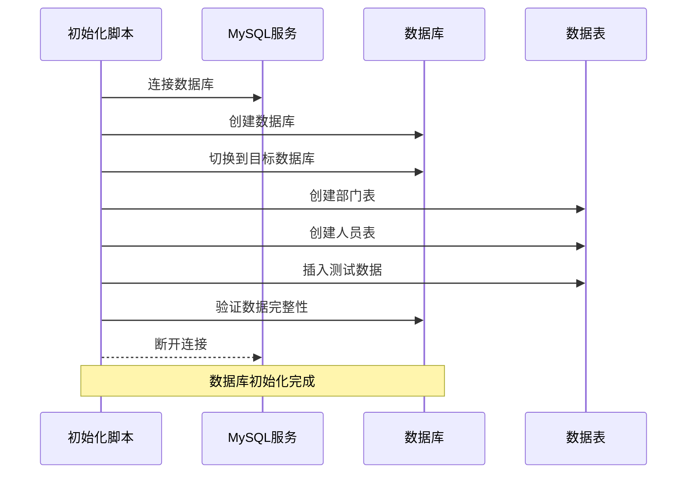

**图表来源**
- [scripts/init_db.js:20-61](file://scripts/init_db.js#L20-L61)

**章节来源**
- [scripts/init_db.js:20-61](file://scripts/init_db.js#L20-L61)

## 性能考虑

### 并发处理能力

系统具备良好的并发处理能力：

1. **连接池管理**：MySQL使用连接池减少连接开销
2. **异步处理**：所有I/O操作采用异步模式
3. **内存优化**：Base64文件数据按需处理，避免内存溢出
4. **缓存策略**：S3对象URL可直接访问，减少服务器负载

### 扩展性设计

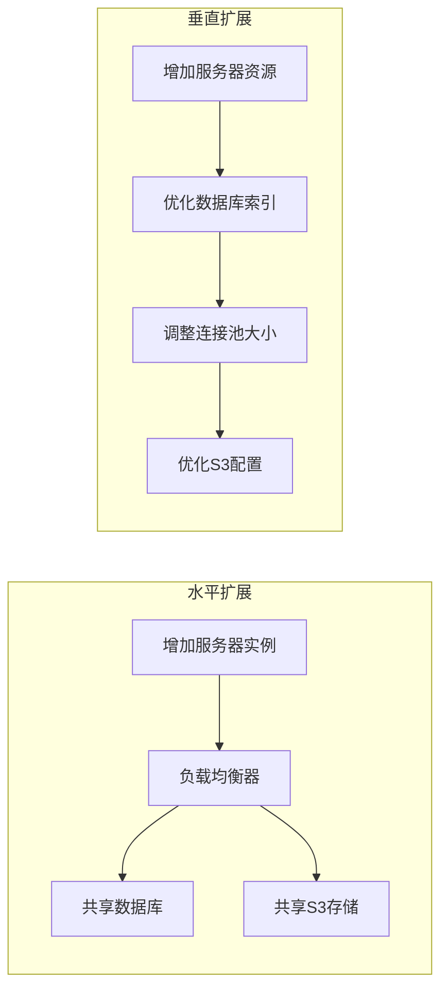

### 性能监控建议

1. **数据库性能**：监控慢查询和连接数
2. **S3访问**：监控请求延迟和错误率
3. **服务器资源**：监控CPU、内存和磁盘使用率
4. **用户体验**：监控页面加载时间和API响应时间

## 故障排除指南

### 常见问题及解决方案

#### AWS S3配置问题

**问题**：无法连接到S3存储
**可能原因**：
- AWS凭证配置错误
- 区域设置不正确
- 网络连接问题

**解决方案**：
1. 验证`.env`文件中的AWS配置
2. 检查S3存储桶权限设置
3. 确认网络连接正常

#### 数据库连接问题

**问题**：数据库连接失败
**可能原因**：
- 数据库服务不可用
- 凭证配置错误
- 网络防火墙阻拦

**解决方案**：
1. 检查数据库服务状态
2. 验证连接参数配置
3. 测试网络连通性

#### 文件上传失败

**问题**：文件上传过程中断
**可能原因**：
- Base64数据过大
- S3存储空间不足
- 网络超时

**解决方案**：
1. 检查文件大小限制
2. 验证S3存储配额
3. 增加超时时间设置

**章节来源**
- [server.js:177-181](file://server.js#L177-L181)
- [server.js:64-67](file://server.js#L64-L67)

### 调试技巧

1. **启用详细日志**：在开发环境中启用更详细的错误日志
2. **使用调试工具**：利用浏览器开发者工具检查网络请求
3. **单元测试**：编写针对关键功能的测试用例
4. **性能分析**：使用性能分析工具识别瓶颈

## 总结

本项目成功实现了基于AWS S3的云存储集成，构建了一个功能完整的企业级文件管理系统。系统的主要优势包括：

### 技术亮点

1. **现代化架构**：采用Node.js + Express + AWS S3的技术栈
2. **完整的功能**：从用户认证到文件管理的全功能实现
3. **良好的扩展性**：模块化设计便于功能扩展和维护
4. **安全性考虑**：实现了基本的用户认证和权限控制

### 应用价值

1. **成本效益**：利用云存储降低本地存储成本
2. **可靠性**：借助AWS基础设施保证服务稳定性
3. **易用性**：提供直观的Web界面和拖拽上传功能
4. **可维护性**：清晰的代码结构和完善的文档

### 改进建议

1. **安全增强**：考虑实现HTTPS加密和更严格的权限控制
2. **性能优化**：添加CDN支持和文件预览功能
3. **监控完善**：集成完整的性能监控和日志系统
4. **功能扩展**：添加文件版本管理和协作功能

该系统为企业提供了可靠的云端文件管理解决方案，具备良好的技术基础和发展潜力。