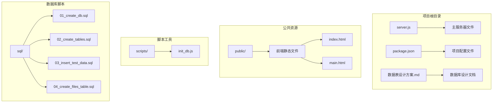
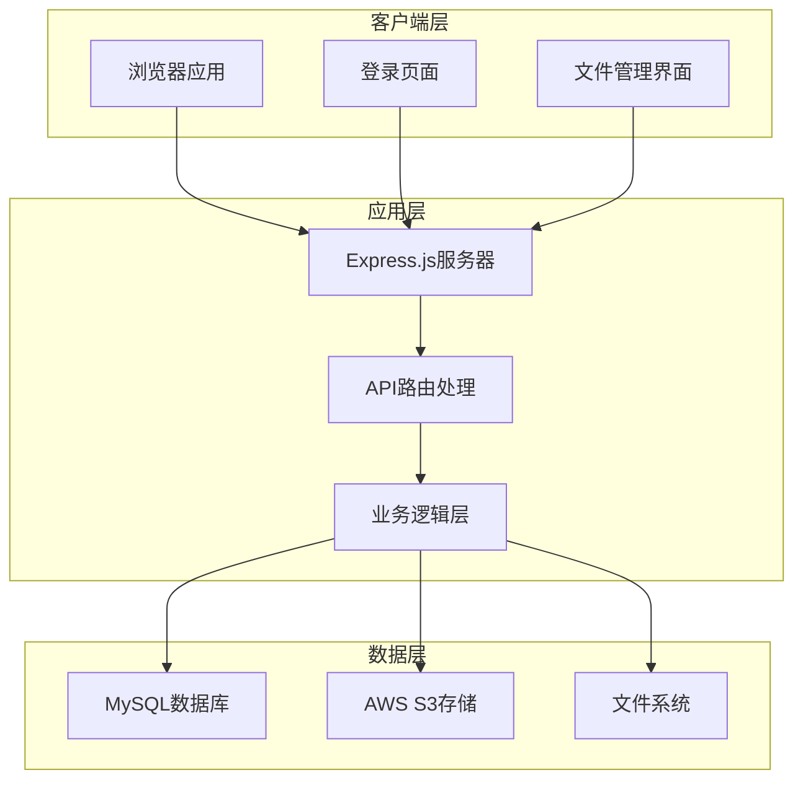
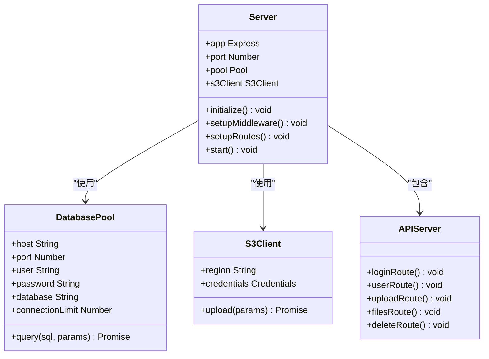
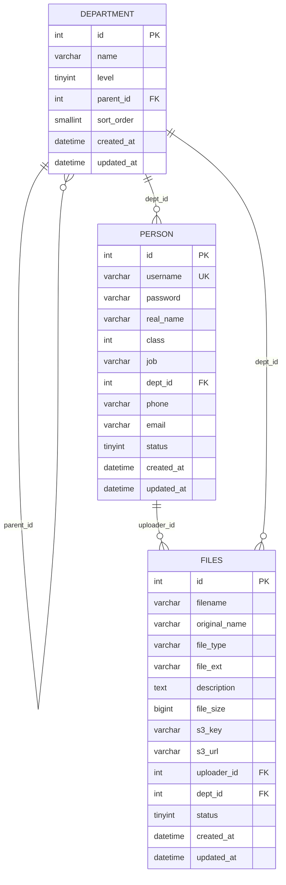
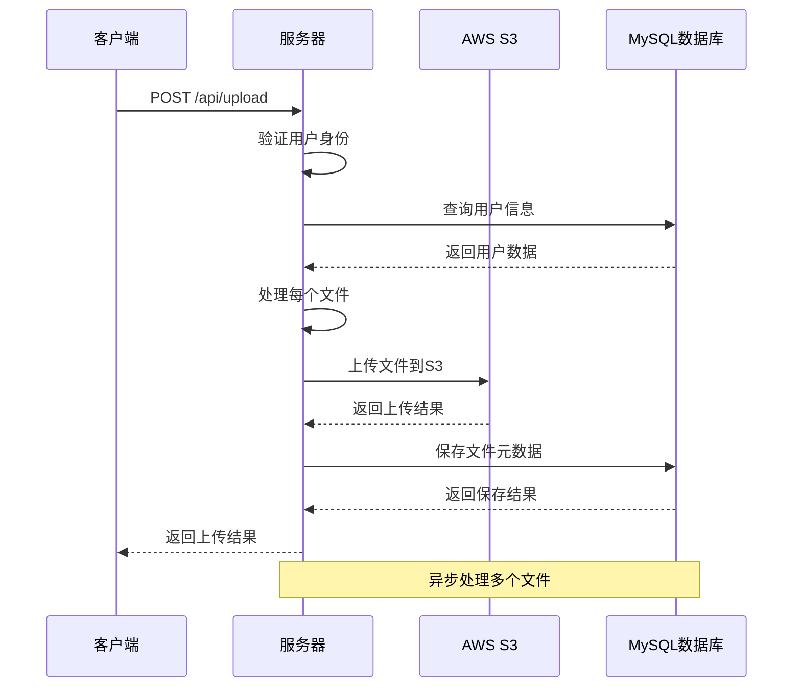
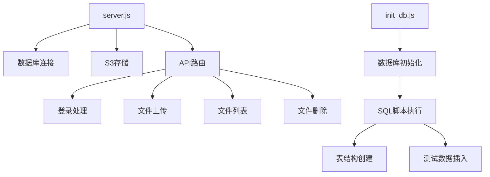
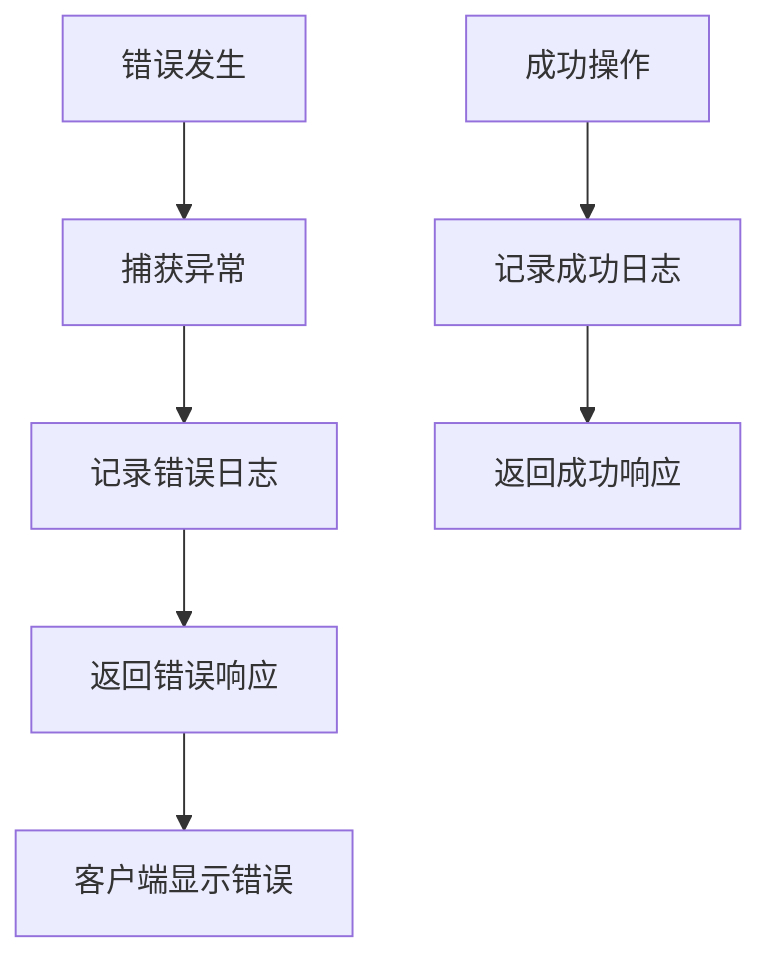

# 服务器架构文档

<cite>
**本文档中引用的文件**
- [server.js](file://server.js)
- [package.json](file://package.json)
- [public/index.html](file://public/index.html)
- [public/main.html](file://public/main.html)
- [scripts/init_db.js](file://scripts/init_db.js)
- [sql/01_create_db.sql](file://sql/01_create_db.sql)
- [sql/02_create_tables.sql](file://sql/02_create_tables.sql)
- [sql/03_insert_test_data.sql](file://sql/03_insert_test_data.sql)
- [sql/04_create_files_table.sql](file://sql/04_create_files_table.sql)
- [数据表设计方案.md](file://数据表设计方案.md)
</cite>

## 目录
1. [项目概述](#项目概述)
2. [项目结构](#项目结构)
3. [核心组件](#核心组件)
4. [架构概览](#架构概览)
5. [详细组件分析](#详细组件分析)
6. [依赖关系分析](#依赖关系分析)
7. [性能考虑](#性能考虑)
8. [故障排除指南](#故障排除指南)
9. [结论](#结论)

## 项目概述

这是一个基于Node.js构建的公司文件管理系统，采用前后端分离架构。系统提供用户登录认证、文件上传管理、文件浏览等功能，支持多种文件类型的分类管理和存储。

**章节来源**
- [server.js:1-283](file://server.js#L1-L283)
- [package.json:1-21](file://package.json#L1-L21)

## 项目结构

项目采用模块化的文件组织方式，主要包含以下目录和文件：



**图表来源**
- [server.js:1-283](file://server.js#L1-L283)
- [package.json:1-21](file://package.json#L1-L21)

**章节来源**
- [server.js:1-283](file://server.js#L1-L283)
- [package.json:1-21](file://package.json#L1-L21)

## 核心组件

### 服务器端组件

系统的核心由Express.js框架驱动，包含以下主要组件：

1. **HTTP服务器** - 基于Express.js创建的Web服务器
2. **数据库连接池** - 使用mysql2/promise建立MySQL连接池
3. **AWS S3集成** - 用于文件存储的云存储服务
4. **API路由** - 提供RESTful接口服务

### 前端组件

前端采用纯HTML/CSS/JavaScript实现，包含：

1. **登录页面** - 用户身份验证界面
2. **主控制台** - 文件管理功能界面
3. **文件上传组件** - 支持拖拽和批量上传
4. **文件列表展示** - 分页和筛选功能

**章节来源**
- [server.js:8-35](file://server.js#L8-L35)
- [public/index.html:1-227](file://public/index.html#L1-L227)
- [public/main.html:1-1087](file://public/main.html#L1-L1087)

## 架构概览

系统采用经典的三层架构模式：



**图表来源**
- [server.js:1-283](file://server.js#L1-L283)
- [package.json:13-19](file://package.json#L13-L19)

## 详细组件分析

### Express.js服务器架构

服务器使用Express.js框架构建，具备以下特性：



**图表来源**
- [server.js:8-35](file://server.js#L8-L35)
- [server.js:37-68](file://server.js#L37-L68)
- [server.js:112-182](file://server.js#L112-L182)

### 数据库设计架构

系统采用邻接表模式设计部门层级关系：



**图表来源**
- [sql/02_create_tables.sql:6-42](file://sql/02_create_tables.sql#L6-L42)
- [sql/04_create_files_table.sql:6-28](file://sql/04_create_files_table.sql#L6-L28)

### 文件上传处理流程

文件上传采用异步处理模式，支持批量上传和S3存储：



**图表来源**
- [server.js:112-182](file://server.js#L112-L182)
- [server.js:146-157](file://server.js#L146-L157)
- [server.js:163-167](file://server.js#L163-L167)

**章节来源**
- [server.js:112-182](file://server.js#L112-L182)
- [sql/04_create_files_table.sql:6-28](file://sql/04_create_files_table.sql#L6-L28)

## 依赖关系分析

### 外部依赖

系统依赖以下主要第三方库：

```mermaid
graph LR
subgraph "核心依赖"
A[express] --> B[Web框架]
C[mysql2] --> D[MySQL驱动]
E[dotenv] --> F[环境变量管理]
end
subgraph "AWS SDK"
G[@aws-sdk/client-s3] --> H[S3客户端]
I[@aws-sdk/lib-storage] --> J[上传管理]
end
subgraph "前端依赖"
K[Bootstrap] --> L[样式框架]
M[jQuery] --> N[DOM操作]
end
```

**图表来源**
- [package.json:13-19](file://package.json#L13-L19)

### 内部模块依赖



**图表来源**
- [server.js:1-283](file://server.js#L1-L283)
- [scripts/init_db.js:20-61](file://scripts/init_db.js#L20-L61)

**章节来源**
- [package.json:13-19](file://package.json#L13-L19)
- [scripts/init_db.js:20-61](file://scripts/init_db.js#L20-L61)

## 性能考虑

### 数据库优化

1. **索引策略**：
   - 文件表建立了多个复合索引以优化查询性能
   - 包含文件类型、上传人、部门、创建时间等常用查询字段

2. **连接池管理**：
   - 配置了最大连接数限制，避免资源耗尽
   - 启用了连接等待机制，提高并发处理能力

3. **查询优化**：
   - 使用参数化查询防止SQL注入
   - 实现分页查询减少单次响应数据量

### 文件存储优化

1. **S3存储优势**：
   - 使用云端存储减轻本地服务器压力
   - 支持高可用性和自动备份
   - 提供CDN加速访问

2. **文件处理优化**：
   - 采用Base64编码传输，简化客户端处理
   - 支持批量文件上传和异步处理

**章节来源**
- [server.js:27-35](file://server.js#L27-L35)
- [sql/04_create_files_table.sql:24-27](file://sql/04_create_files_table.sql#L24-L27)

## 故障排除指南

### 常见问题及解决方案

#### 数据库连接问题
- **症状**：服务器启动时报数据库连接错误
- **原因**：数据库配置不正确或数据库服务未启动
- **解决**：检查`.env`文件中的数据库连接参数

#### S3存储权限问题
- **症状**：文件上传失败，返回权限错误
- **原因**：AWS凭证配置不正确或存储桶权限不足
- **解决**：验证AWS_ACCESS_KEY_ID和AWS_SECRET_ACCESS_KEY设置

#### 文件上传限制
- **症状**：大文件上传失败
- **原因**：请求体大小限制过小
- **解决**：调整Express.js的请求体大小限制

### 日志监控

系统提供了基本的日志记录机制：



**图表来源**
- [server.js:64-67](file://server.js#L64-L67)
- [server.js:178-181](file://server.js#L178-L181)

**章节来源**
- [server.js:64-67](file://server.js#L64-L67)
- [server.js:178-181](file://server.js#L178-L181)

## 结论

该文件管理系统展现了良好的架构设计和实现质量。系统采用了现代化的技术栈，包括Node.js、Express.js、MySQL和AWS S3，实现了完整的文件管理功能。

### 主要优势

1. **架构清晰** - 采用分层架构，职责分离明确
2. **技术先进** - 使用最新的Node.js生态系统工具
3. **可扩展性** - 模块化设计便于功能扩展
4. **安全性** - 实现了基本的身份验证和授权机制
5. **用户体验** - 提供直观的文件管理界面

### 改进建议

1. **安全增强** - 建议使用加密存储密码而非明文存储
2. **错误处理** - 可以添加更详细的错误分类和处理机制
3. **性能优化** - 考虑添加缓存层以提高查询性能
4. **监控告警** - 建议添加完整的监控和告警系统

该系统为公司文件管理提供了一个可靠、易用的解决方案，具备良好的维护性和扩展性。