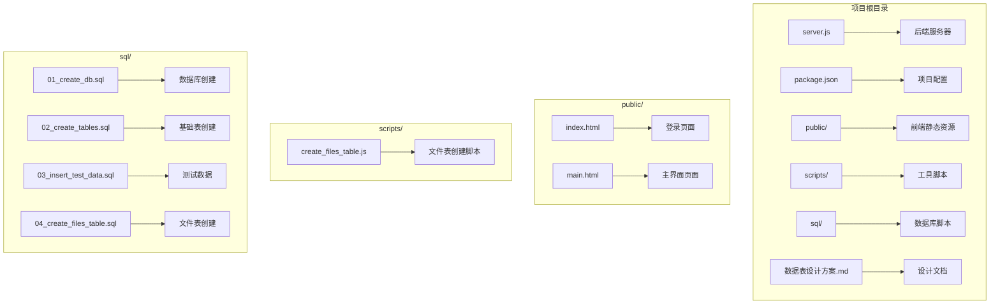
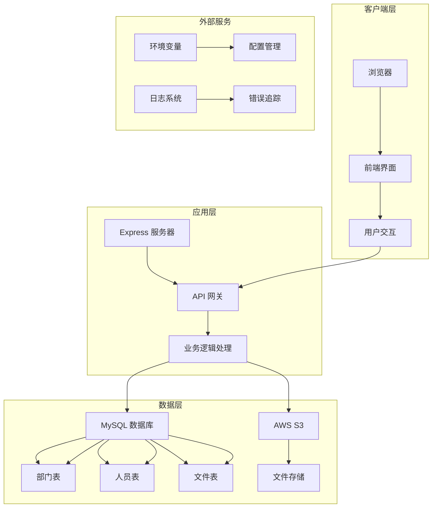
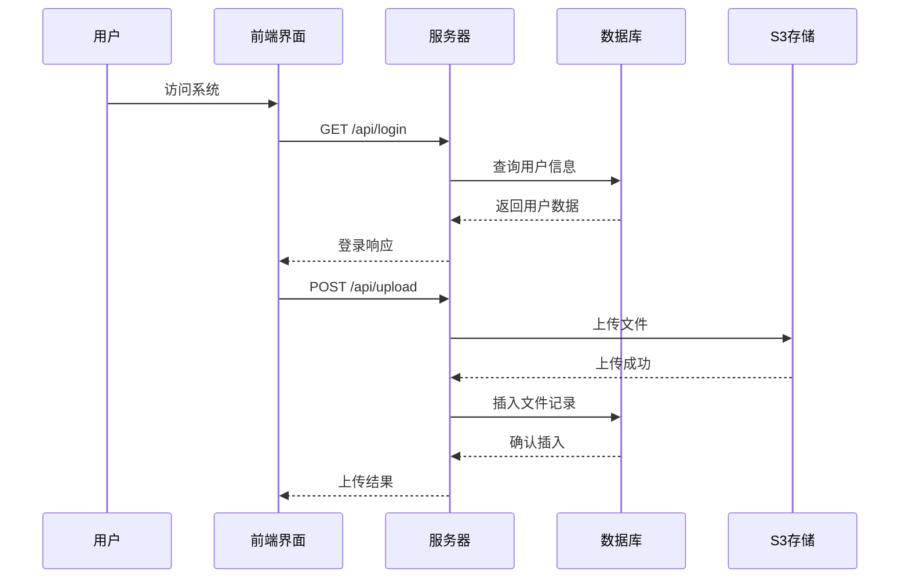
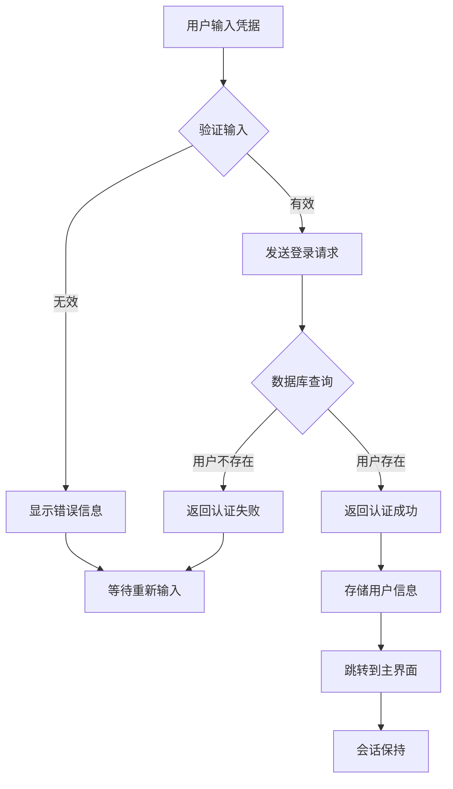
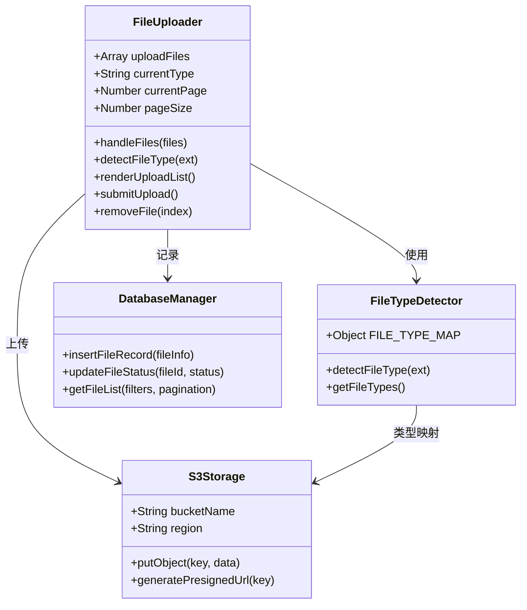
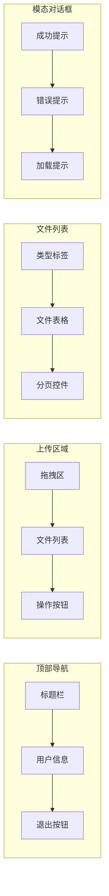
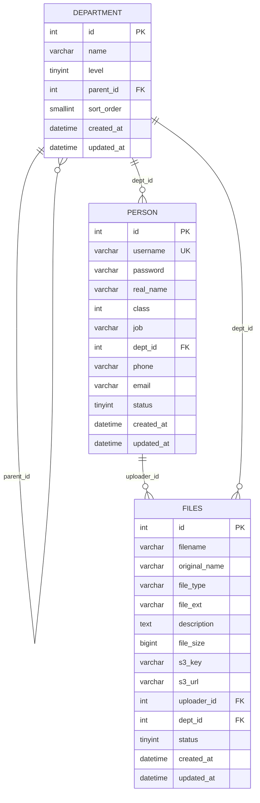

# 前端界面系统

<cite>
**本文档引用的文件**
- [server.js](file://server.js)
- [package.json](file://package.json)
- [public/index.html](file://public/index.html)
- [public/main.html](file://public/main.html)
- [scripts/create_files_table.js](file://scripts/create_files_table.js)
- [sql/01_create_db.sql](file://sql/01_create_db.sql)
- [sql/02_create_tables.sql](file://sql/02_create_tables.sql)
- [sql/03_insert_test_data.sql](file://sql/03_insert_test_data.sql)
- [sql/04_create_files_table.sql](file://sql/04_create_files_table.sql)
- [数据表设计方案.md](file://数据表设计方案.md)
</cite>

## 目录
1. [项目概述](#项目概述)
2. [项目结构](#项目结构)
3. [核心组件](#核心组件)
4. [架构概览](#架构概览)
5. [详细组件分析](#详细组件分析)
6. [依赖关系分析](#依赖关系分析)
7. [性能考虑](#性能考虑)
8. [故障排除指南](#故障排除指南)
9. [结论](#结论)

## 项目概述

这是一个基于 Node.js 和 Express 的企业级文件管理系统，提供完整的前端界面和后端服务。系统支持用户登录认证、文件上传管理、文件浏览展示等功能，采用现代化的前后端分离架构设计。

### 主要功能特性
- 用户登录认证系统
- 文件上传与管理
- 文件分类浏览
- 分页查询功能
- 响应式界面设计
- AWS S3 文件存储集成

## 项目结构

项目采用标准的前后端分离架构，主要包含以下目录结构：



**图表来源**
- [server.js:1-283](file://server.js#L1-L283)
- [public/index.html:1-227](file://public/index.html#L1-L227)
- [public/main.html:1-1094](file://public/main.html#L1-L1094)

**章节来源**
- [server.js:1-283](file://server.js#L1-L283)
- [package.json:1-21](file://package.json#L1-L21)

## 核心组件

### 后端服务器组件

系统的核心是基于 Express.js 构建的 Web 服务器，提供 RESTful API 接口和静态文件服务。

#### 服务器配置
- **端口监听**: 默认 3000 端口，可通过环境变量配置
- **静态文件服务**: 提供 public 目录下的 HTML、CSS、JavaScript 文件
- **请求解析**: 支持 JSON 和 URL 编码请求体，最大 50MB

#### 数据库连接池
- **连接池配置**: 最大 10 个连接，等待连接超时
- **MySQL 连接**: 使用 mysql2/promise 库提供异步数据库操作
- **连接参数**: 从环境变量读取主机、端口、用户名、密码等配置

#### AWS S3 集成
- **客户端配置**: 支持多种 AWS 区域和凭证方式
- **文件上传**: 使用 @aws-sdk/lib-storage 库进行断点续传
- **存储策略**: 按用户目录结构组织文件存储

**章节来源**
- [server.js:8-35](file://server.js#L8-L35)
- [server.js:17-24](file://server.js#L17-L24)

### 前端界面组件

#### 登录页面 (index.html)
- **响应式设计**: 适配各种屏幕尺寸
- **渐变背景**: 现代化的视觉效果
- **表单验证**: 前端基础验证和错误提示
- **本地存储**: 使用 localStorage 存储用户会话信息

#### 主界面页面 (main.html)
- **模块化布局**: 顶部导航 + 主内容区 + 侧边栏
- **拖拽上传**: 支持拖拽和点击两种文件选择方式
- **实时预览**: 文件类型检测和预览功能
- **分页展示**: 支持多种分页大小和页码切换

**章节来源**
- [public/index.html:1-227](file://public/index.html#L1-L227)
- [public/main.html:1-1094](file://public/main.html#L1-L1094)

## 架构概览

系统采用典型的三层架构设计，实现了前后端完全分离：



**图表来源**
- [server.js:37-68](file://server.js#L37-L68)
- [server.js:112-182](file://server.js#L112-L182)
- [server.js:204-253](file://server.js#L204-L253)

### 数据流架构



**图表来源**
- [server.js:37-68](file://server.js#L37-L68)
- [server.js:112-182](file://server.js#L112-L182)

## 详细组件分析

### 登录认证系统

#### 登录流程
系统实现了基于会话的认证机制，确保用户身份的安全性：



**图表来源**
- [public/index.html:182-218](file://public/index.html#L182-L218)
- [server.js:37-68](file://server.js#L37-L68)

#### 认证安全措施
- **明文密码存储**: 当前版本使用明文存储，建议升级为哈希存储
- **会话管理**: 使用 localStorage 存储用户名，需要添加令牌机制
- **权限控制**: 通过用户状态字段控制账户有效性

**章节来源**
- [server.js:37-68](file://server.js#L37-L68)
- [public/index.html:171-224](file://public/index.html#L171-L224)

### 文件上传系统

#### 上传架构
系统提供了完整的文件上传解决方案，支持多种文件类型和格式：



**图表来源**
- [public/main.html:803-883](file://public/main.html#L803-L883)
- [server.js:112-182](file://server.js#L112-L182)

#### 文件类型支持
系统支持以下文件类型分类：
- **文档类**: Word、Excel、PPT、PDF
- **媒体类**: 图片、视频、音频
- **3D模型**: OBJ、FBX、STL 等
- **其他**: CSV、TXT 等通用格式

**章节来源**
- [server.js:92-109](file://server.js#L92-L109)
- [public/main.html:721-734](file://public/main.html#L721-L734)

### 文件管理界面

#### 界面布局设计
主界面采用了现代化的卡片式布局设计：



**图表来源**
- [public/main.html:588-700](file://public/main.html#L588-L700)
- [public/main.html:930-1056](file://public/main.html#L930-L1056)

#### 交互功能
- **拖拽上传**: 支持拖拽文件到指定区域
- **批量操作**: 支持多文件同时上传和管理
- **实时预览**: 图片文件的缩略图预览
- **搜索过滤**: 按文件类型筛选文件列表

**章节来源**
- [public/main.html:774-800](file://public/main.html#L774-L800)
- [public/main.html:947-989](file://public/main.html#L947-L989)

## 依赖关系分析

### 核心依赖库

系统使用了以下关键依赖库：

```mermaid
graph TB
subgraph "Web框架"
A[express] --> B[Web服务器]
C[dotenv] --> D[环境变量管理]
end
subgraph "数据库"
E[mysql2] --> F[MySQL驱动]
end
subgraph "AWS服务"
G[@aws-sdk/client-s3] --> H[S3客户端]
I[@aws-sdk/lib-storage] --> J[存储上传]
end
subgraph "前端依赖"
K[静态文件服务] --> L[HTML/CSS/JS]
end
A --> E
A --> G
H --> J
```

**图表来源**
- [package.json:13-19](file://package.json#L13-L19)

### 数据库设计

系统采用邻接表模式设计部门层级结构，支持四级部门组织：



**图表来源**
- [sql/02_create_tables.sql:6-42](file://sql/02_create_tables.sql#L6-L42)
- [sql/04_create_files_table.sql:6-28](file://sql/04_create_files_table.sql#L6-L28)

**章节来源**
- [package.json:13-19](file://package.json#L13-L19)
- [数据表设计方案.md:1-115](file://数据表设计方案.md#L1-L115)

## 性能考虑

### 前端性能优化

#### 文件上传优化
- **Base64 编码**: 将文件转换为 Base64 格式传输，便于前端处理
- **批量上传**: 支持多文件同时上传，减少请求次数
- **进度反馈**: 实时显示上传进度和状态

#### 界面渲染优化
- **虚拟滚动**: 对于大量文件列表，可考虑实现虚拟滚动
- **懒加载**: 图片缩略图采用懒加载策略
- **缓存机制**: 利用浏览器缓存减少重复请求

### 后端性能优化

#### 数据库优化
- **索引策略**: 为常用查询字段建立索引
- **连接池管理**: 合理配置连接池大小
- **查询优化**: 使用 LIMIT 和 OFFSET 实现分页查询

#### 文件存储优化
- **CDN 集成**: S3 可与 CDN 结合提升访问速度
- **压缩策略**: 对图片等媒体文件进行压缩处理
- **缓存策略**: 实现文件访问缓存机制

## 故障排除指南

### 常见问题诊断

#### 登录认证问题
1. **用户名或密码错误**
   - 检查数据库中的用户记录
   - 验证密码是否正确存储
   - 确认用户状态为激活状态

2. **会话丢失**
   - 检查 localStorage 是否被清除
   - 验证浏览器 Cookie 设置
   - 确认跨域配置正确

#### 文件上传问题
1. **上传失败**
   - 检查 AWS S3 凭证配置
   - 验证存储桶权限设置
   - 确认文件大小限制

2. **文件类型识别错误**
   - 检查文件扩展名
   - 验证 MIME 类型映射
   - 确认文件格式支持

#### 数据库连接问题
1. **连接超时**
   - 检查 MySQL 服务状态
   - 验证连接参数配置
   - 确认防火墙设置

2. **查询错误**
   - 检查 SQL 语法
   - 验证表结构完整性
   - 确认索引存在

**章节来源**
- [server.js:64-67](file://server.js#L64-L67)
- [server.js:178-181](file://server.js#L178-L181)

### 调试技巧

#### 开发调试
- **日志输出**: 利用 console.error 输出详细错误信息
- **环境变量**: 使用 dotenv 管理不同环境配置
- **错误处理**: 实现统一的错误响应格式

#### 生产监控
- **性能监控**: 监控 API 响应时间和数据库查询
- **错误追踪**: 集成错误监控服务
- **日志分析**: 定期分析系统日志

## 结论

这个前端界面系统是一个功能完整的企业级文件管理解决方案，具有以下特点：

### 技术优势
- **现代化架构**: 采用前后端分离设计，便于维护和扩展
- **用户体验**: 提供直观的界面和流畅的操作体验
- **技术栈成熟**: 使用广泛采用的技术栈，社区支持良好
- **可扩展性**: 模块化设计便于功能扩展

### 改进建议
1. **安全性增强**: 
   - 实现密码哈希存储
   - 添加 JWT 令牌认证
   - 实施 CSRF 保护

2. **性能优化**:
   - 实现文件上传进度条
   - 添加图片懒加载
   - 优化数据库查询

3. **功能完善**:
   - 添加文件下载功能
   - 实现文件搜索过滤
   - 增加文件版本管理

该系统为企业提供了可靠的文件管理基础设施，为后续的功能扩展和性能优化奠定了良好的基础。