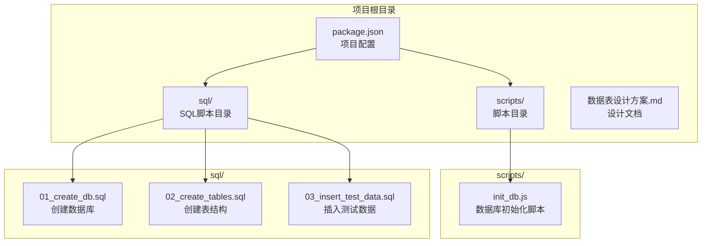
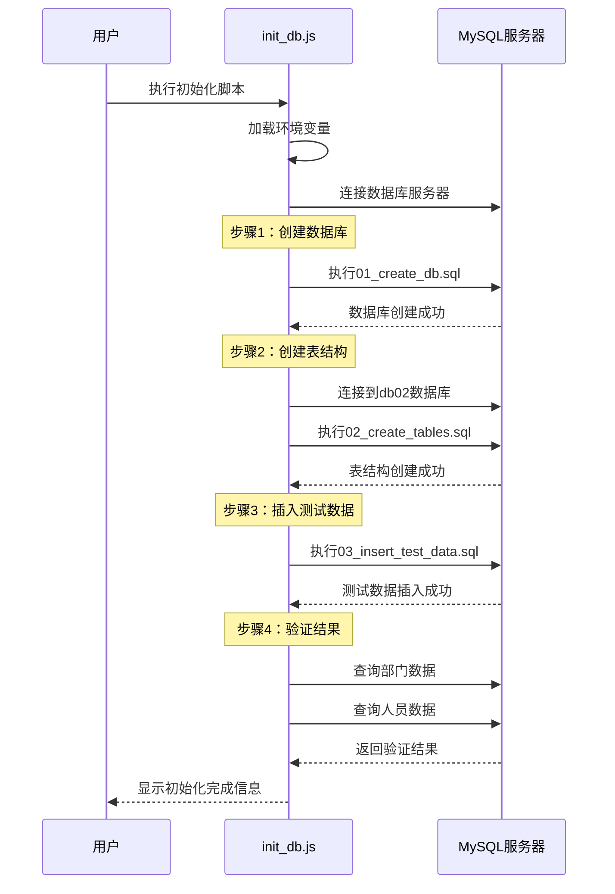
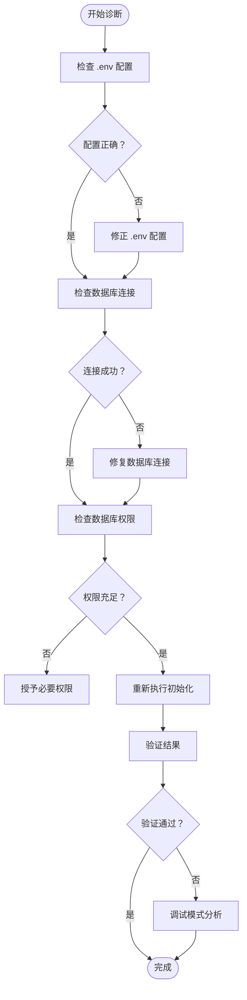

# 快速开始

<cite>
**本文档引用的文件**
- [package.json](file://package.json)
- [init_db.js](file://scripts/init_db.js)
- [01_create_db.sql](file://sql/01_create_db.sql)
- [02_create_tables.sql](file://sql/02_create_tables.sql)
- [03_insert_test_data.sql](file://sql/03_insert_test_data.sql)
- [数据表设计方案.md](file://数据表设计方案.md)
</cite>

## 目录
1. [简介](#简介)
2. [项目结构](#项目结构)
3. [环境要求](#环境要求)
4. [安装步骤](#安装步骤)
5. [数据库配置](#数据库配置)
6. [数据库初始化](#数据库初始化)
7. [验证步骤](#验证步骤)
8. [常见问题与解决方案](#常见问题与解决方案)
9. [配置示例](#配置示例)
10. [故障排除指南](#故障排除指南)
11. [总结](#总结)

## 简介

files2 是一个基于 Node.js 和 MySQL 的部门人员管理系统，采用邻接表模式实现四级部门层级结构。该项目提供了完整的数据库初始化脚本和测试数据，帮助开发者快速搭建和验证系统功能。

## 项目结构

项目采用模块化组织方式，核心文件结构如下：



**图表来源**
- [package.json:1-18](file://package.json#L1-L18)
- [init_db.js:1-67](file://scripts/init_db.js#L1-L67)

**章节来源**
- [package.json:1-18](file://package.json#L1-L18)
- [数据表设计方案.md:1-115](file://数据表设计方案.md#L1-L115)

## 环境要求

### Node.js 版本要求

项目需要以下版本的 Node.js 环境：

- **Node.js**: 16.x 或更高版本
- **npm**: 8.x 或更高版本

### 数据库要求

- **MySQL**: 5.7 或更高版本
- **数据库字符集**: utf8mb4 支持
- **存储引擎**: InnoDB

### 系统依赖

项目使用以下核心依赖包：

| 依赖包 | 版本 | 用途 |
|--------|------|------|
| dotenv | ^17.3.1 | 环境变量管理 |
| mysql2 | ^3.20.0 | MySQL 数据库驱动 |

**章节来源**
- [package.json:13-16](file://package.json#L13-L16)

## 安装步骤

### 步骤 1：克隆项目

```bash
git clone <repository-url>
cd files2
```

### 步骤 2：安装依赖

在项目根目录执行以下命令安装所有依赖：

```bash
npm install
```

此命令会根据 package.json 中的 dependencies 自动安装所需的包。

### 步骤 3：验证安装

安装完成后，可以通过以下方式验证：

```bash
npm list dotenv mysql2
```

如果显示已安装的版本信息，则表示安装成功。

**章节来源**
- [package.json:6-8](file://package.json#L6-L8)

## 数据库配置

### 环境变量配置

项目使用 `.env` 文件来管理数据库连接参数。请在项目根目录创建 `.env` 文件，并添加以下配置项：

```env
DB_HOST=localhost
DB_PORT=3306
DB_USER=your_username
DB_PASSWORD=your_password
DB_DATABASE=db02
```

### 配置项说明

| 配置项 | 默认值 | 说明 |
|--------|--------|------|
| DB_HOST | localhost | MySQL 服务器地址 |
| DB_PORT | 3306 | MySQL 服务器端口 |
| DB_USER | - | 数据库用户名 |
| DB_PASSWORD | - | 数据库密码 |
| DB_DATABASE | db02 | 目标数据库名称 |

### 数据库权限要求

执行初始化脚本需要以下数据库权限：

- CREATE DATABASE 权限
- CREATE TABLE 权限
- INSERT 权限
- SELECT 权限

**章节来源**
- [init_db.js:20-41](file://scripts/init_db.js#L20-L41)

## 数据库初始化

### 初始化流程概述

数据库初始化过程分为四个主要步骤：

1. **创建数据库** - 创建名为 `db02` 的数据库实例
2. **创建表结构** - 创建 `department` 和 `person` 表
3. **插入测试数据** - 插入预定义的部门和人员数据
4. **验证结果** - 查询并显示初始化结果

### 执行初始化脚本

在项目根目录执行以下命令启动数据库初始化：

```bash
node scripts/init_db.js
```

### 初始化过程详解



**图表来源**
- [init_db.js:20-61](file://scripts/init_db.js#L20-L61)
- [01_create_db.sql:1-7](file://sql/01_create_db.sql#L1-L7)
- [02_create_tables.sql:1-43](file://sql/02_create_tables.sql#L1-L43)
- [03_insert_test_data.sql:1-45](file://sql/03_insert_test_data.sql#L1-L45)

**章节来源**
- [init_db.js:20-61](file://scripts/init_db.js#L20-L61)

## 验证步骤

### 验证数据库连接

初始化完成后，脚本会自动执行验证步骤。您应该看到类似以下的输出：

```
=== Step 4: 验证结果 ===

部门表共 X 条记录：
  [level1] id=1  某某科技有限公司  parent_id=NULL
  [level2] id=2  市场部  parent_id=1
  ...

人员表共 Y 条记录：
  [class0] admin  系统管理员  dept_id=1
  [class1] zhangjian  总经理  dept_id=1
  ...
```

### 手动验证查询

您也可以手动连接数据库进行验证：

```sql
-- 验证部门表
SELECT id, name, level, parent_id FROM department ORDER BY level, sort_order;

-- 验证人员表  
SELECT id, username, class, job, dept_id FROM person ORDER BY class;
```

### 预期结果

- **部门表**: 应该包含 10 条记录（1个公司，4个一级部门，3个二级部门，2个三级部门）
- **人员表**: 应该包含 7 条记录（1个admin，1个总经理，2个部门经理，3个普通员工）

**章节来源**
- [init_db.js:49-58](file://scripts/init_db.js#L49-L58)

## 常见问题与解决方案

### 问题1：数据库连接失败

**症状**:
```
执行失败： connect ECONNREFUSED
```

**解决方案**:
1. 检查 MySQL 服务是否正在运行
2. 验证数据库主机和端口配置
3. 确认数据库用户凭据正确
4. 检查防火墙设置

### 问题2：权限不足错误

**症状**:
```
ERROR 1044 (42000): Access denied for user
```

**解决方案**:
1. 使用具有足够权限的数据库用户
2. 确保用户具有 CREATE DATABASE 权限
3. 检查用户权限配置

### 问题3：字符集编码问题

**症状**:
```
ERROR 1273 (HY000): Unknown collation
```

**解决方案**:
1. 确保 MySQL 版本支持 utf8mb4
2. 检查数据库字符集设置
3. 修改 SQL 脚本中的字符集配置

### 问题4：端口被占用

**症状**:
```
ERROR 2013 (HY000): Lost connection to MySQL server
```

**解决方案**:
1. 更改 DB_PORT 环境变量
2. 检查其他程序是否占用了端口
3. 使用防火墙工具检查端口状态

### 问题5：Node.js 版本不兼容

**症状**:
```
SyntaxError: Unexpected token export
```

**解决方案**:
1. 升级到 Node.js 16.x 或更高版本
2. 检查 package.json 中的 engine 字段
3. 清理 npm 缓存后重新安装

**章节来源**
- [init_db.js:63-66](file://scripts/init_db.js#L63-L66)

## 配置示例

### 完整的 .env 文件示例

```env
# 数据库连接配置
DB_HOST=localhost
DB_PORT=3306
DB_USER=root
DB_PASSWORD=password123
DB_DATABASE=db02

# 应用配置
NODE_ENV=development
DEBUG=true
```

### 开发环境配置

对于本地开发环境，推荐使用以下配置：

```env
DB_HOST=localhost
DB_PORT=3306
DB_USER=dev_user
DB_PASSWORD=dev_password
DB_DATABASE=files2_dev
```

### 生产环境配置

对于生产环境，建议使用更严格的配置：

```env
DB_HOST=prod-db.company.com
DB_PORT=3306
DB_USER=app_user
DB_PASSWORD=secure_password
DB_DATABASE=files2_prod
```

### 高级配置选项

```env
# 连接池配置
DB_CONNECTION_LIMIT=10
DB_TIMEOUT=60000

# SSL 连接配置
DB_SSL_ENABLED=false
DB_CA_CERT=/path/to/ca.pem
DB_CLIENT_CERT=/path/to/client.pem
DB_CLIENT_KEY=/path/to/client-key.pem
```

**章节来源**
- [init_db.js:22-39](file://scripts/init_db.js#L22-L39)

## 故障排除指南

### 日志分析

初始化脚本会在控制台输出详细的执行日志。每个 SQL 语句执行后都会显示 `[OK]` 标记，例如：

```
[OK] CREATE TABLE IF NOT EXISTS department (
```

如果某个语句执行失败，脚本会显示错误信息并终止执行。

### 错误诊断流程



**图表来源**
- [init_db.js:63-66](file://scripts/init_db.js#L63-L66)

### 调试模式

如果遇到问题，可以启用调试模式：

1. 在 `.env` 文件中添加 `DEBUG=true`
2. 重新执行初始化脚本
3. 查看详细的错误堆栈信息

### 性能优化建议

1. **连接池配置**: 根据应用负载调整连接池大小
2. **索引优化**: 为常用查询字段建立适当索引
3. **查询优化**: 使用 EXPLAIN 分析慢查询
4. **缓存策略**: 实施适当的查询结果缓存

**章节来源**
- [init_db.js:14-17](file://scripts/init_db.js#L14-L17)

## 总结

通过以上步骤，您应该能够成功安装和配置 files2 项目。以下是关键要点：

### 成功标准

- ✅ Node.js 环境准备就绪
- ✅ 依赖包正确安装
- ✅ 数据库连接正常
- ✅ 初始化脚本执行成功
- ✅ 验证查询返回预期结果

### 后续步骤

1. **探索数据结构**: 查看 `数据表设计方案.md` 了解完整的数据库设计
2. **测试功能**: 基于初始化的数据进行功能测试
3. **扩展开发**: 在现有基础上添加新的功能模块
4. **部署准备**: 准备生产环境的配置和部署脚本

### 支持资源

- **官方文档**: [数据表设计方案.md](数据表设计方案.md)
- **源码参考**: [init_db.js](scripts/init_db.js)
- **SQL 脚本**: [01_create_db.sql](sql/01_create_db.sql), [02_create_tables.sql](sql/02_create_tables.sql), [03_insert_test_data.sql](sql/03_insert_test_data.sql)

如遇任何问题，请检查上述配置和日志输出，或参考故障排除指南中的详细解决方案。