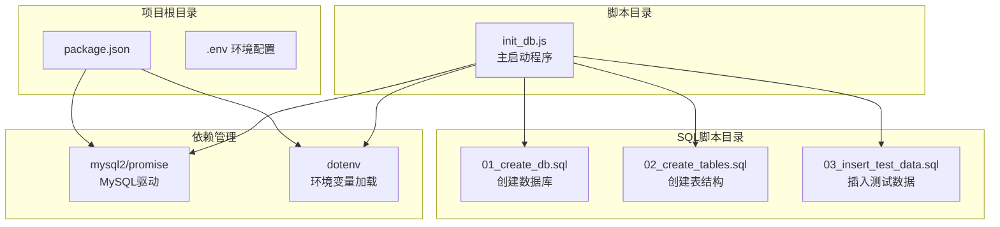
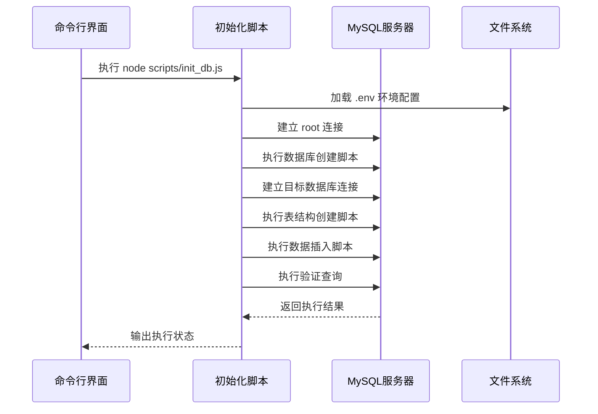
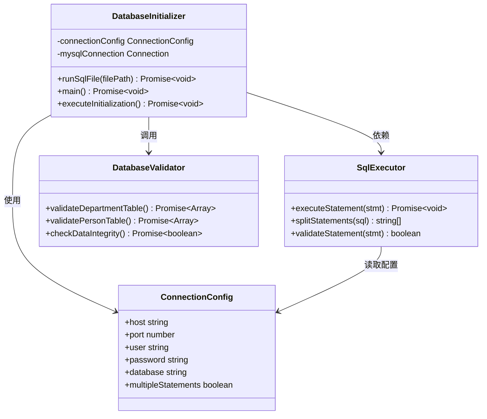
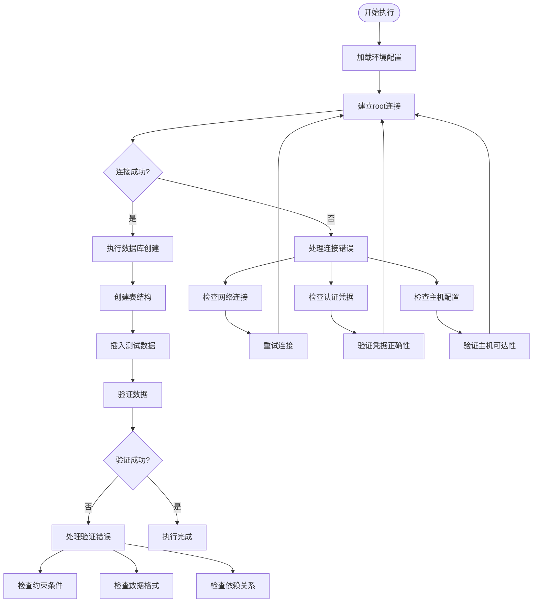
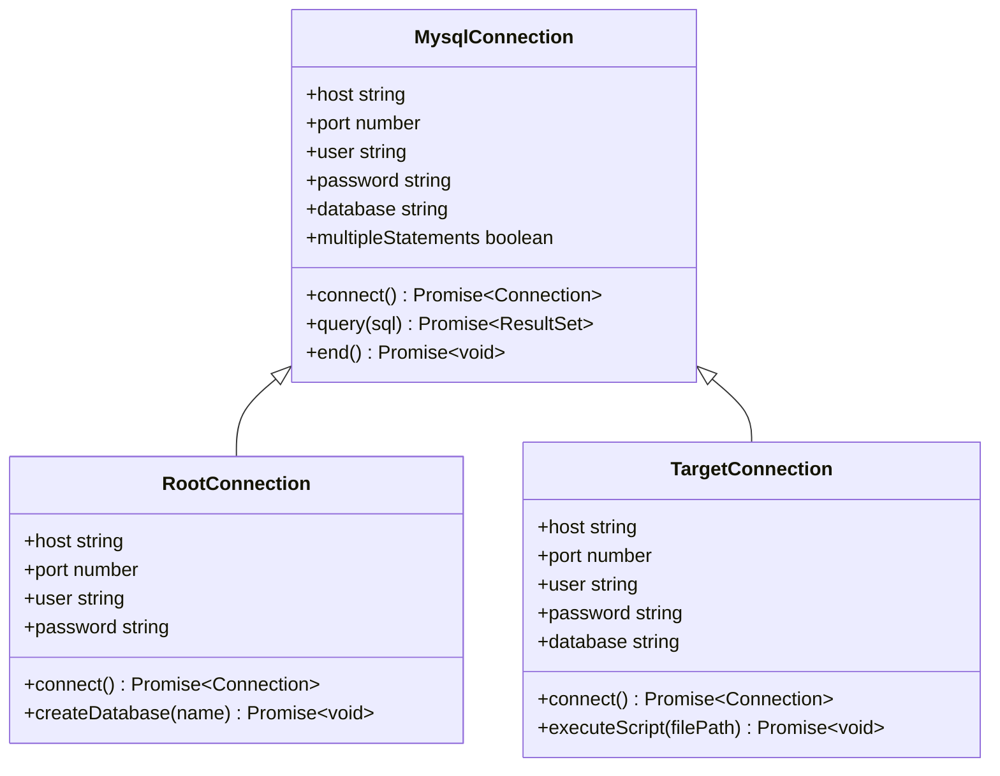
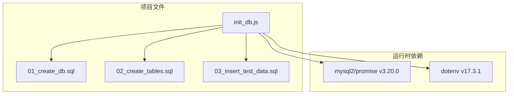
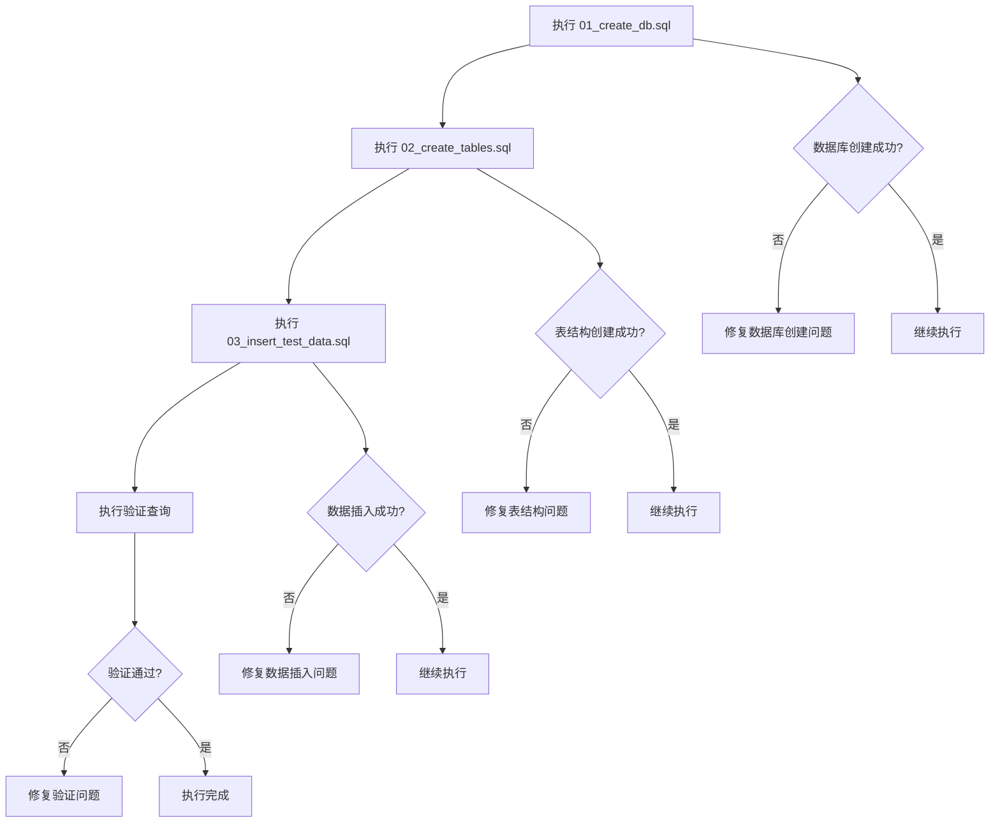

# 故障排除

<cite>
**本文档中引用的文件**
- [scripts/init_db.js](file://scripts/init_db.js)
- [sql/01_create_db.sql](file://sql/01_create_db.sql)
- [sql/02_create_tables.sql](file://sql/02_create_tables.sql)
- [sql/03_insert_test_data.sql](file://sql/03_insert_test_data.sql)
- [package.json](file://package.json)
- [数据表设计方案.md](file://数据表设计方案.md)
</cite>

## 目录
1. [简介](#简介)
2. [项目结构](#项目结构)
3. [核心组件](#核心组件)
4. [架构概览](#架构概览)
5. [详细组件分析](#详细组件分析)
6. [依赖分析](#依赖分析)
7. [性能考虑](#性能考虑)
8. [故障排除指南](#故障排除指南)
9. [结论](#结论)
10. [附录](#附录)

## 简介

本故障排除指南针对基于 MySQL 的数据库初始化脚本系统，涵盖常见的初始化问题、数据库连接错误和脚本执行失败情况。该系统包含三个主要组件：数据库初始化脚本、SQL 脚本文件和 Node.js 启动程序。本文档提供了系统化的问题诊断方法、解决步骤、错误代码解释、日志分析技巧和调试工具使用指南。

## 项目结构

该项目采用模块化结构，包含以下关键组件：



**图表来源**
- [scripts/init_db.js:1-67](file://scripts/init_db.js#L1-L67)
- [package.json:13-16](file://package.json#L13-L16)

**章节来源**
- [scripts/init_db.js:1-67](file://scripts/init_db.js#L1-L67)
- [package.json:1-18](file://package.json#L1-L18)

## 核心组件

### 初始化脚本组件

初始化脚本采用异步函数设计，包含四个主要执行阶段：

1. **数据库创建阶段**：使用 root 连接创建目标数据库
2. **表结构创建阶段**：切换到目标数据库并创建表结构
3. **数据插入阶段**：插入测试数据
4. **验证阶段**：验证数据完整性

### SQL 脚本组件

系统包含三个 SQL 脚本文件，按顺序执行：

- `01_create_db.sql`：创建数据库和字符集设置
- `02_create_tables.sql`：定义完整的表结构和约束
- `03_insert_test_data.sql`：插入预定义的测试数据

### 环境配置组件

使用 dotenv 库加载环境变量，支持以下配置项：
- `DB_HOST`：数据库主机地址
- `DB_PORT`：数据库端口（默认 3306）
- `DB_USER`：数据库用户名
- `DB_PASSWORD`：数据库密码
- `DB_DATABASE`：目标数据库名

**章节来源**
- [scripts/init_db.js:20-61](file://scripts/init_db.js#L20-L61)
- [sql/01_create_db.sql:1-7](file://sql/01_create_db.sql#L1-L7)
- [sql/02_create_tables.sql:1-43](file://sql/02_create_tables.sql#L1-L43)
- [sql/03_insert_test_data.sql:1-45](file://sql/03_insert_test_data.sql#L1-L45)

## 架构概览

系统采用分层架构设计，确保各组件职责分离：



**图表来源**
- [scripts/init_db.js:20-61](file://scripts/init_db.js#L20-L61)

**章节来源**
- [scripts/init_db.js:1-67](file://scripts/init_db.js#L1-L67)

## 详细组件分析

### 初始化脚本类图



**图表来源**
- [scripts/init_db.js:6-18](file://scripts/init_db.js#L6-L18)
- [scripts/init_db.js:20-61](file://scripts/init_db.js#L20-L61)

### 错误处理流程图



**图表来源**
- [scripts/init_db.js:63-66](file://scripts/init_db.js#L63-L66)
- [scripts/init_db.js:20-61](file://scripts/init_db.js#L20-L61)

**章节来源**
- [scripts/init_db.js:1-67](file://scripts/init_db.js#L1-L67)

### 数据库连接组件



**图表来源**
- [scripts/init_db.js:22-41](file://scripts/init_db.js#L22-L41)

**章节来源**
- [scripts/init_db.js:22-41](file://scripts/init_db.js#L22-L41)

## 依赖分析

### 依赖关系图



**图表来源**
- [package.json:13-16](file://package.json#L13-L16)
- [scripts/init_db.js:1-4](file://scripts/init_db.js#L1-L4)

**章节来源**
- [package.json:13-16](file://package.json#L13-L16)

### 版本兼容性

系统依赖的包版本具有以下特性：
- `mysql2/promise`：提供异步数据库操作能力
- `dotenv`：支持环境变量配置管理

## 性能考虑

### 批量执行优化

当前实现采用逐条执行 SQL 语句的方式，这种设计的优势包括：
- **错误定位精确**：单条语句失败时可精确定位问题
- **内存占用低**：不需要一次性加载大量 SQL 语句
- **执行可控**：可以对每条语句进行独立的错误处理

### 并发执行策略

对于大规模数据导入，可以考虑以下优化方案：
- **批量插入**：将多行 INSERT 合并为单个语句
- **事务包装**：使用事务提高批量操作性能
- **索引优化**：在导入前禁用非必要索引，导入后重建

## 故障排除指南

### 初始化问题诊断

#### 1. 环境配置问题

**常见症状**：
- 连接超时或拒绝
- 认证失败
- 数据库不存在

**诊断步骤**：
1. 检查 `.env` 文件是否存在于项目根目录
2. 验证环境变量配置的正确性
3. 确认数据库服务正在运行

**解决方法**：
- 确保所有必需的环境变量都已设置
- 验证数据库凭据的正确性
- 检查防火墙和网络连接

**章节来源**
- [scripts/init_db.js:1-4](file://scripts/init_db.js#L1-L4)

#### 2. 数据库连接错误

**常见症状**：
- ECONNREFUSED：连接被拒绝
- ENOTFOUND：主机名无法解析
- ER_ACCESS_DENIED_ERROR：访问被拒绝

**诊断步骤**：
1. 使用 `telnet` 或 `ping` 测试网络连通性
2. 验证 MySQL 服务端口是否开放
3. 检查 MySQL 用户权限配置

**解决方法**：
- 确认 MySQL 服务正常运行
- 验证防火墙规则允许连接
- 检查用户账户状态和权限

#### 3. SQL 语法错误

**常见症状**：
- 语法错误提示
- 字段类型不匹配
- 约束冲突

**诊断步骤**：
1. 检查 SQL 语句的语法正确性
2. 验证字段类型和长度限制
3. 确认外键约束的依赖关系

**解决方法**：
- 逐条执行 SQL 语句定位问题
- 检查字符集和排序规则设置
- 验证数据完整性约束

### 数据库连接错误详解

#### 连接参数配置

| 参数 | 默认值 | 用途 | 常见问题 |
|------|--------|------|----------|
| DB_HOST | localhost | 数据库主机地址 | 主机名解析失败 |
| DB_PORT | 3306 | 数据库端口号 | 端口被占用或防火墙阻拦 |
| DB_USER | root | 数据库用户名 | 用户不存在或密码错误 |
| DB_PASSWORD | 空 | 数据库密码 | 密码过期或权限不足 |
| DB_DATABASE | db02 | 目标数据库名 | 数据库不存在 |

#### 连接错误代码

**ECONNREFUSED (111)**：
- **原因**：MySQL 服务未运行或端口不可达
- **解决**：启动 MySQL 服务，检查防火墙设置

**ENOTFOUND (11001)**：
- **原因**：DNS 解析失败，主机名无法识别
- **解决**：使用 IP 地址替代主机名，检查 DNS 配置

**ER_ACCESS_DENIED_ERROR (1045)**：
- **原因**：用户名或密码错误，或用户权限不足
- **解决**：验证凭据正确性，检查用户权限

**章节来源**
- [scripts/init_db.js:22-41](file://scripts/init_db.js#L22-L41)

### 脚本执行失败排查

#### SQL 脚本执行问题

**常见问题类型**：

1. **数据库不存在**：
   - 症状：执行数据库创建脚本时报错
   - 解决：确保有足够的数据库创建权限

2. **表已存在**：
   - 症状：重复创建表结构
   - 解决：使用 `IF NOT EXISTS` 语句

3. **外键约束冲突**：
   - 症状：插入数据时违反外键约束
   - 解决：检查数据依赖关系和插入顺序

#### 执行顺序验证



**图表来源**
- [scripts/init_db.js:20-61](file://scripts/init_db.js#L20-L61)

**章节来源**
- [scripts/init_db.js:6-18](file://scripts/init_db.js#L6-L18)

### 日志分析技巧

#### 结构化日志输出

系统采用结构化的日志输出格式，便于问题诊断：

```javascript
// 成功执行的日志格式
console.log(`  [OK] ${stmt.substring(0, 60).replace(/\n/g, ' ')}...`);

// 错误日志格式
console.error('执行失败：', err.message);
```

**日志分析要点**：
1. **时间戳追踪**：观察执行时间线
2. **错误上下文**：查看失败语句的具体内容
3. **堆栈跟踪**：分析错误发生的调用链

#### 调试工具使用

**MySQL 客户端调试**：
- 使用 `mysql` 命令行工具手动执行 SQL 语句
- 启用 MySQL 慢查询日志
- 分析执行计划和性能指标

**Node.js 调试**：
- 使用 `node --inspect` 启动调试模式
- 设置断点分析异步执行流程
- 检查环境变量加载情况

### 网络连接问题解决方案

#### 网络连通性测试

**本地连接测试**：
```bash
# 测试端口连通性
telnet localhost 3306

# 测试 MySQL 服务状态
systemctl status mysql
```

**远程连接测试**：
```bash
# 测试网络延迟
ping database-server

# 测试防火墙规则
iptables -L
```

**DNS 解析测试**：
```bash
# 检查主机名解析
nslookup hostname

# 查看 DNS 配置
cat /etc/resolv.conf
```

#### 网络配置优化

**防火墙配置**：
- 开放 MySQL 默认端口 3306
- 配置允许的源 IP 地址范围
- 设置适当的连接超时时间

**网络性能优化**：
- 使用连接池管理数据库连接
- 配置适当的缓冲区大小
- 启用压缩传输（如需要）

### 权限不足问题排查

#### MySQL 权限模型

**数据库级权限**：
- `CREATE DATABASE`：创建数据库权限
- `DROP DATABASE`：删除数据库权限
- `ALTER`：修改数据库结构权限

**表级权限**：
- `CREATE TABLE`：创建表权限
- `INSERT`：插入数据权限
- `SELECT`：查询数据权限

#### 权限配置步骤

1. **检查用户权限**：
```sql
SHOW GRANTS FOR current_user();
```

2. **授予必要权限**：
```sql
GRANT CREATE, ALTER, DROP ON db02.* TO 'username'@'host';
GRANT SELECT, INSERT, UPDATE, DELETE ON db02.* TO 'username'@'host';
FLUSH PRIVILEGES;
```

3. **验证权限生效**：
```sql
SHOW GRANTS FOR 'username'@'host';
```

### SQL 语法错误解决方案

#### 常见语法错误类型

**表结构定义错误**：
- 缺少主键定义
- 字段类型不匹配
- 约束条件冲突

**数据插入错误**：
- 外键约束违反
- 唯一约束冲突
- 数据类型转换错误

#### 语法检查清单

**CREATE TABLE 语句检查**：
- [ ] 主键定义完整
- [ ] 外键引用有效
- [ ] 字段约束合理
- [ ] 引擎类型支持

**INSERT 语句检查**：
- [ ] 外键值存在
- [ ] 唯一键不冲突
- [ ] 数据类型匹配
- [ ] 字符集兼容

### 性能问题排查

#### 数据库性能监控

**慢查询识别**：
```sql
-- 启用慢查询日志
SET GLOBAL slow_query_log = 'ON';
SET GLOBAL long_query_time = 2;

-- 分析查询性能
EXPLAIN SELECT * FROM table WHERE condition;
```

**连接池监控**：
- 监控活跃连接数
- 检查连接等待时间
- 分析连接复用率

#### 性能优化建议

**索引优化**：
- 为常用查询字段建立索引
- 避免过度索引影响写入性能
- 定期分析索引使用情况

**查询优化**：
- 使用 EXPLAIN 分析执行计划
- 避免 SELECT *
- 合理使用 LIMIT 和 OFFSET

### 预防性维护和监控

#### 健康检查清单

**每日检查**：
- [ ] 数据库服务状态
- [ ] 磁盘空间使用率
- [ ] 连接数统计
- [ ] 错误日志检查

**每周检查**：
- [ ] 数据库备份验证
- [ ] 索引碎片分析
- [ ] 统计信息更新
- [ ] 权限审计

**每月检查**：
- [ ] 性能基准测试
- [ ] 安全漏洞扫描
- [ ] 备份恢复演练
- [ ] 监控告警配置

#### 监控指标建议

**关键性能指标**：
- 查询响应时间
- 连接池利用率
- 磁盘 I/O 操作
- 内存使用情况

**告警阈值设置**：
- 连接数超过 80%
- 查询响应时间超过 5 秒
- 磁盘空间低于 20%
- 错误率超过 1%

## 结论

本故障排除指南提供了针对数据库初始化系统的全面问题诊断和解决方法。通过理解系统的架构设计、掌握错误诊断技巧和实施预防性维护措施，可以有效提升系统的稳定性和可靠性。

关键要点包括：
- 建立完善的环境配置管理机制
- 实施分层次的错误处理策略
- 建立持续的性能监控体系
- 制定标准化的故障响应流程

建议定期回顾和更新故障排除流程，结合实际使用经验不断完善诊断方法和解决策略。

## 附录

### 常用命令参考

**数据库管理命令**：
```bash
# 启动 MySQL 服务
sudo systemctl start mysql

# 停止 MySQL 服务
sudo systemctl stop mysql

# 重启 MySQL 服务
sudo systemctl restart mysql

# 查看 MySQL 状态
sudo systemctl status mysql
```

**环境变量配置示例**：
```bash
# .env 文件示例
DB_HOST=localhost
DB_PORT=3306
DB_USER=root
DB_PASSWORD=password
DB_DATABASE=db02
```

### 最佳实践建议

1. **环境隔离**：为不同环境配置独立的 .env 文件
2. **权限最小化**：为应用程序使用最小必要的数据库权限
3. **备份策略**：建立定期自动备份机制
4. **监控告警**：配置关键指标的实时监控和告警
5. **文档维护**：保持故障排除文档与实际实现同步更新