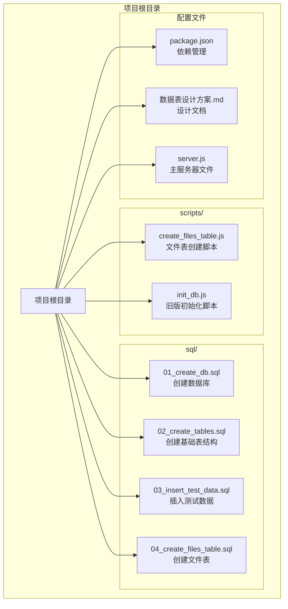
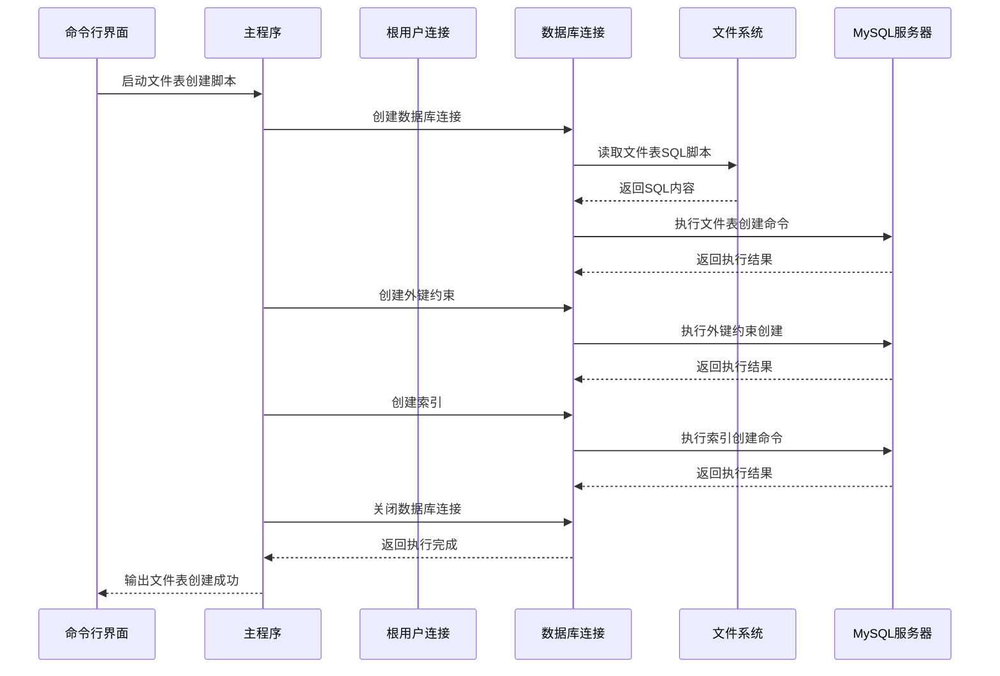
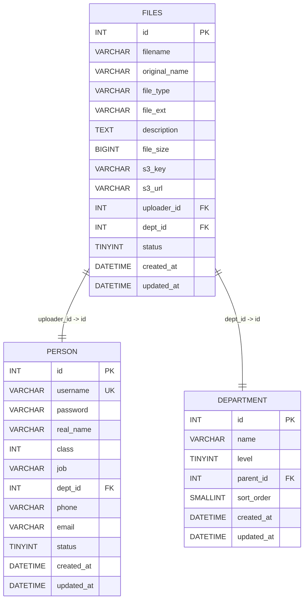
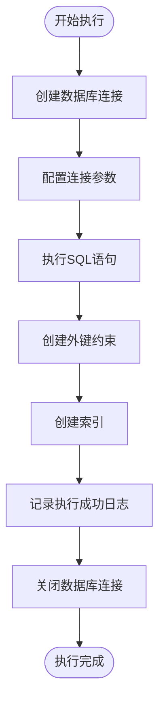
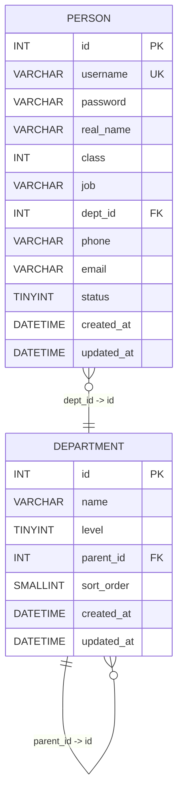
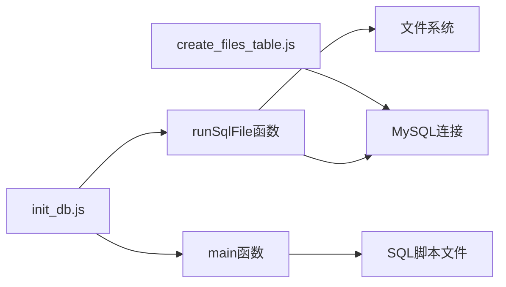
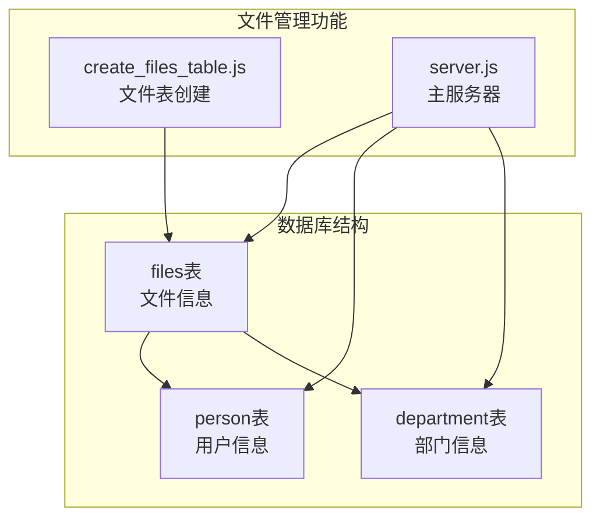

# 数据库初始化

<cite>
**本文档引用的文件**
- [scripts/create_files_table.js](file://scripts/create_files_table.js)
- [sql/04_create_files_table.sql](file://sql/04_create_files_table.sql)
- [scripts/init_db.js](file://scripts/init_db.js)
- [sql/01_create_db.sql](file://sql/01_create_db.sql)
- [sql/02_create_tables.sql](file://sql/02_create_tables.sql)
- [sql/03_insert_test_data.sql](file://sql/03_insert_test_data.sql)
- [package.json](file://package.json)
- [数据表设计方案.md](file://数据表设计方案.md)
- [server.js](file://server.js)
</cite>

## 更新摘要
**变更内容**
- 移除了旧的手动初始化脚本（init_db.js）
- 新增了专门的文件表创建脚本（create_files_table.js）
- 更新了数据库初始化流程，从手动脚本改为自动化文件表创建
- 增加了文件表的SQL脚本和自动化创建功能

## 目录
1. [简介](#简介)
2. [项目结构](#项目结构)
3. [核心组件](#核心组件)
4. [架构概览](#架构概览)
5. [详细组件分析](#详细组件分析)
6. [依赖分析](#依赖分析)
7. [性能考虑](#性能考虑)
8. [故障排除指南](#故障排除指南)
9. [结论](#结论)
10. [附录](#附录)

## 简介

这是一个用于数据库初始化的Node.js脚本，旨在自动化创建和配置MySQL数据库环境。该脚本提供了完整的数据库初始化流程，包括数据库创建、表结构定义、测试数据插入以及结果验证。项目采用模块化设计，将SQL操作分离到独立的脚本文件中，便于维护和扩展。

**更新** 项目现已从手动脚本初始化流程升级为自动化文件表创建模式，新增了专门的文件表创建功能，支持文件上传和管理的完整数据库结构。

## 项目结构

项目采用清晰的分层结构，将不同功能职责分离到相应的目录和文件中：



**图表来源**
- [scripts/create_files_table.js:1-44](file://scripts/create_files_table.js#L1-L44)
- [sql/04_create_files_table.sql:1-29](file://sql/04_create_files_table.sql#L1-L29)
- [scripts/init_db.js:1-67](file://scripts/init_db.js#L1-L67)
- [sql/01_create_db.sql:1-7](file://sql/01_create_db.sql#L1-L7)
- [sql/02_create_tables.sql:1-43](file://sql/02_create_tables.sql#L1-L43)
- [sql/03_insert_test_data.sql:1-45](file://sql/03_insert_test_data.sql#L1-L45)
- [package.json:1-21](file://package.json#L1-L21)
- [数据表设计方案.md:1-115](file://数据表设计方案.md#L1-L115)
- [server.js:1-283](file://server.js#L1-L283)

**章节来源**
- [scripts/create_files_table.js:1-44](file://scripts/create_files_table.js#L1-L44)
- [package.json:1-21](file://package.json#L1-L21)

## 核心组件

### 文件表创建脚本 (create_files_table.js)

新的文件表创建脚本是专门为文件管理功能设计的自动化初始化工具，负责创建文件表结构并配置完整的索引和约束。

**关键特性：**
- 使用dotenv配置环境变量
- 采用mysql2/promise驱动进行异步数据库操作
- 实现了完整的错误处理机制
- 提供详细的执行日志输出
- 支持外键约束和索引优化

### 旧版初始化脚本 (init_db.js)

**已移除** 旧的初始化脚本已被新的自动化文件表创建功能替代，但仍保留以供参考。

### SQL脚本模块

项目将SQL操作分解为四个独立的脚本文件，每个文件负责特定的初始化任务：

1. **数据库创建脚本**：创建目标数据库并设置字符集
2. **基础表结构脚本**：定义部门表和人员表的完整结构
3. **测试数据脚本**：插入预定义的测试数据
4. **文件表创建脚本**：专门创建文件管理所需的表结构

**章节来源**
- [scripts/create_files_table.js:4-44](file://scripts/create_files_table.js#L4-L44)
- [scripts/init_db.js:6-18](file://scripts/init_db.js#L6-L18)
- [scripts/init_db.js:20-61](file://scripts/init_db.js#L20-L61)

## 架构概览

整个初始化系统采用分层架构设计，实现了关注点分离和模块化管理：



**图表来源**
- [scripts/create_files_table.js:13-37](file://scripts/create_files_table.js#L13-L37)

## 详细组件分析

### 文件表结构设计

#### 文件表 (files)

文件表是专门为文件管理功能设计的表结构，支持文件上传、存储和检索的完整生命周期管理：



**图表来源**
- [sql/04_create_files_table.sql:6-28](file://sql/04_create_files_table.sql#L6-L28)

#### 文件表关键设计特点

**数据完整性保障：**
- 外键约束确保上传人和部门的有效性
- 状态字段支持软删除机制
- 时间戳字段自动管理创建和更新时间

**性能优化设计：**
- 多个索引支持常用查询场景
- 文件大小字段支持大文件存储
- S3集成支持云存储管理

**章节来源**
- [sql/04_create_files_table.sql:6-28](file://sql/04_create_files_table.sql#L6-L28)

### 数据库连接管理

#### 连接参数配置

连接参数通过环境变量进行配置，支持灵活的部署方式：

- **主机地址**：从DB_HOST环境变量读取
- **端口号**：从DB_PORT环境变量读取，默认3306
- **用户名**：从DB_USER环境变量读取
- **密码**：从DB_PASSWORD环境变量读取
- **数据库名**：从DB_DATABASE环境变量读取

**章节来源**
- [scripts/create_files_table.js:5-11](file://scripts/create_files_table.js#L5-L11)

### SQL执行引擎

#### 语句执行器

文件表创建脚本提供了简化的SQL执行功能：



**图表来源**
- [scripts/create_files_table.js:13-37](file://scripts/create_files_table.js#L13-L37)

#### 错误处理机制

每个SQL语句的执行都包含完整的错误处理逻辑：

- **连接级错误**：数据库连接问题会中断整个流程
- **语句级错误**：单个语句失败会影响整体执行
- **日志记录**：详细的执行日志便于调试和审计

**章节来源**
- [scripts/create_files_table.js:42-44](file://scripts/create_files_table.js#L42-L44)

### 数据库结构设计

#### 部门表 (department)

部门表采用邻接表模式实现四级组织结构：



**图表来源**
- [sql/02_create_tables.sql:6-42](file://sql/02_create_tables.sql#L6-L42)

#### 人员表 (person)

人员表设计支持用户权限管理和组织关系：

**关键设计特点：**
- 用户名唯一性约束
- 密码字段存储明文（安全风险）
- 用户级别通过class字段管理
- 手机号和邮箱格式验证
- 外键约束保证数据完整性

**章节来源**
- [sql/02_create_tables.sql:21-42](file://sql/02_create_tables.sql#L21-L42)

### 测试数据设计

#### 组织架构数据

测试数据模拟了典型的四级组织结构：

| 层级 | 部门名称 | 父部门 |
|------|----------|--------|
| 1 | 某某科技有限公司 | NULL |
| 2 | 市场部 | 公司 |
| 2 | 设计部 | 公司 |
| 2 | 技术部 | 公司 |
| 2 | 行政部 | 公司 |
| 3 | 华东市场组 | 市场部 |
| 3 | 华北市场组 | 市场部 |
| 3 | UI设计组 | 设计部 |
| 3 | 前端开发组 | 技术部 |
| 4 | 上海小组 | 华东市场组 |

#### 用户角色数据

测试用户涵盖了完整的权限层次：

| 用户名 | 角色级别 | 职位 | 所属部门 |
|--------|----------|------|----------|
| admin | 系统管理员 | 系统管理员 | 公司 |
| zhangjian | 总经理 | 总经理 | 公司 |
| lihua | 一级部门经理 | 市场部经理 | 市场部 |
| wangfang | 一级部门经理 | 设计部经理 | 设计部 |
| zhangsan | 二级部门主管 | 华东市场组主管 | 华东市场组 |
| lisi | 普通员工 | UI设计师 | UI设计组 |
| wangwu | 普通员工 | 前端工程师 | 前端开发组 |

**章节来源**
- [sql/03_insert_test_data.sql:8-44](file://sql/03_insert_test_data.sql#L8-L44)

## 依赖分析

### 外部依赖

项目使用了五个核心依赖包：

```mermaid
graph TB
subgraph "项目依赖"
PackageJSON[package.json]
subgraph "核心依赖"
DotEnv[dotenv ^17.3.1<br/>环境变量管理]
MySQL2[mysql2 ^3.20.0<br/>MySQL驱动]
Express[express ^5.2.1<br/>Web框架]
AWSSDK[@aws-sdk/client-s3<br/>AWS S3客户端]
AWSSDKLib[@aws-sdk/lib-storage<br/>AWS存储库]
end
subgraph "运行时依赖"
NodeJS[Node.js 运行时]
MySQLServer[MySQL 服务器]
end
end
PackageJSON --> DotEnv
PackageJSON --> MySQL2
PackageJSON --> Express
PackageJSON --> AWSSDK
PackageJSON --> AWSSDKLib
DotEnv --> NodeJS
MySQL2 --> NodeJS
Express --> NodeJS
AWSSDK --> NodeJS
AWSSDKLib --> NodeJS
NodeJS --> MySQLServer
```

**图表来源**
- [package.json:13-19](file://package.json#L13-L19)

### 内部模块依赖

脚本内部模块之间的依赖关系相对简单，主要体现在函数调用关系上：



**图表来源**
- [scripts/create_files_table.js:1-44](file://scripts/create_files_table.js#L1-L44)
- [scripts/init_db.js:6-18](file://scripts/init_db.js#L6-L18)
- [scripts/init_db.js:20-61](file://scripts/init_db.js#L20-L61)

**章节来源**
- [package.json:13-19](file://package.json#L13-L19)

## 性能考虑

### 连接池优化

当前实现使用了简单的连接模式，对于生产环境建议考虑以下优化：

1. **连接池管理**：使用mysql2的连接池功能
2. **批量操作**：将多个INSERT语句合并为批量操作
3. **索引优化**：在高频查询字段上建立适当索引
4. **事务批处理**：将相关操作放入事务中执行

### 执行效率提升

1. **并行执行**：某些SQL操作可以并行执行（如表创建）
2. **语句缓存**：重复执行的语句可以利用缓存
3. **网络优化**：减少不必要的网络往返

### 内存使用优化

1. **流式处理**：大文件的SQL语句可以流式处理
2. **垃圾回收**：及时释放不再使用的连接对象
3. **资源监控**：监控内存使用情况

## 故障排除指南

### 常见错误类型

#### 连接错误

**症状**：无法连接到MySQL服务器
**可能原因**：
- 网络连接问题
- 认证信息错误
- MySQL服务未启动
- 防火墙阻止连接

**解决方法**：
1. 验证环境变量配置
2. 检查MySQL服务状态
3. 测试网络连通性
4. 验证用户权限

#### 权限错误

**症状**：执行SQL语句时出现权限不足
**可能原因**：
- 用户缺少CREATE权限
- 目标数据库不存在
- 外键约束冲突

**解决方法**：
1. 确认用户具有足够的权限
2. 检查数据库是否已创建
3. 验证外键关系的正确性

#### 语法错误

**症状**：SQL语句执行失败
**可能原因**：
- SQL语法错误
- 字符编码问题
- 数据类型不匹配

**解决方法**：
1. 检查SQL语句的语法
2. 验证字符集设置
3. 确认数据类型兼容性

### 调试技巧

#### 日志分析

脚本提供了详细的执行日志，包括：
- 每个SQL语句的执行状态
- 数据验证结果
- 错误信息和堆栈跟踪

#### 环境检查

1. **环境变量验证**：确认所有必需的环境变量都已设置
2. **依赖版本检查**：验证Node.js和MySQL版本兼容性
3. **网络连通性测试**：确保能够访问MySQL服务器

**章节来源**
- [scripts/create_files_table.js:42-44](file://scripts/create_files_table.js#L42-L44)

## 结论

这个数据库初始化系统提供了一个完整、可扩展的解决方案，用于自动化数据库环境的创建和配置。其设计特点包括：

**优势**：
- 模块化设计，职责分离清晰
- 完善的错误处理机制
- 详细的执行日志
- 支持多种连接模式
- 专门的文件表创建功能

**更新内容**：
- 新增了专门的文件表创建脚本
- 支持文件管理功能的完整数据库结构
- 简化了初始化流程，提高了执行效率

**改进建议**：
- 增加连接池支持
- 实现更精细的错误恢复机制
- 添加性能监控功能
- 考虑添加密码加密功能

该系统适合中小型项目的数据库初始化需求，为后续的数据管理和应用开发奠定了坚实的基础。

## 附录

### 环境配置

#### 必需的环境变量

| 变量名 | 默认值 | 用途 |
|--------|--------|------|
| DB_HOST | localhost | MySQL服务器地址 |
| DB_PORT | 3306 | MySQL服务器端口 |
| DB_USER | root | 数据库用户名 |
| DB_PASSWORD | - | 数据库密码 |
| DB_DATABASE | db02 | 目标数据库名 |

### 安全最佳实践

#### 密码管理

**当前实现的问题**：
- 密码以明文形式存储
- 缺少密码哈希机制
- 安全风险较高

**建议的改进方案**：
1. 使用bcrypt或其他强哈希算法
2. 实施密码强度验证
3. 添加密码过期机制
4. 实现密码历史记录

#### 访问控制

1. **最小权限原则**：为初始化脚本分配最小必要权限
2. **网络隔离**：限制数据库访问的网络范围
3. **审计日志**：记录所有数据库操作
4. **定期审查**：定期审查用户权限和访问日志

### 部署指南

#### 开发环境部署

1. 安装Node.js和npm
2. 安装项目依赖：`npm install`
3. 配置环境变量
4. 运行文件表创建脚本：`node scripts/create_files_table.js`

#### 生产环境部署

1. **环境隔离**：使用独立的配置文件
2. **权限控制**：限制对敏感文件的访问
3. **备份策略**：在执行前备份现有数据
4. **监控告警**：设置执行状态监控

#### 自动化集成

1. **CI/CD集成**：将初始化脚本集成到部署流水线
2. **健康检查**：添加数据库连接和数据验证
3. **回滚机制**：实现失败时的自动回滚
4. **通知机制**：执行结果通知相关人员

### 文件表功能集成

#### 与主服务器的集成

文件表创建完成后，将与主服务器功能无缝集成：



**图表来源**
- [scripts/create_files_table.js:13-37](file://scripts/create_files_table.js#L13-L37)
- [server.js:163-167](file://server.js#L163-L167)

**章节来源**
- [server.js:163-167](file://server.js#L163-L167)