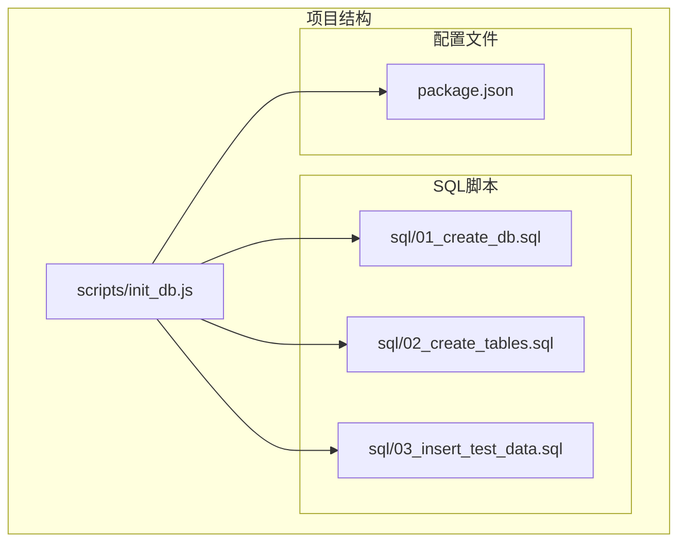
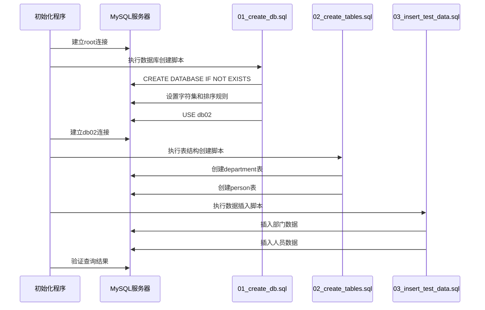
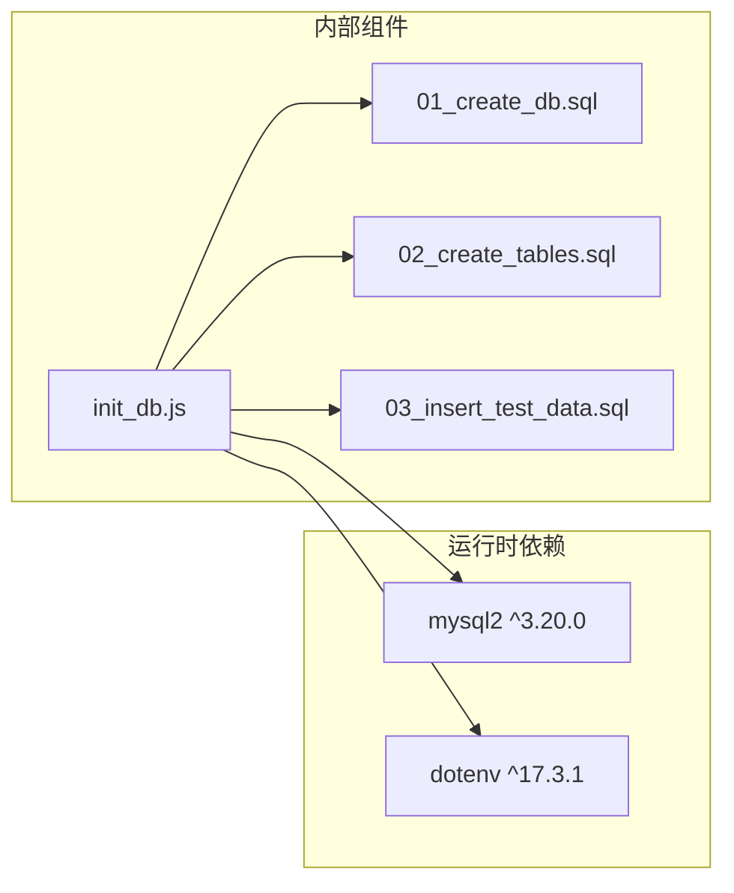

# 01_create_db.sql 数据库创建脚本

<cite>
**本文档引用的文件**
- [01_create_db.sql](file://sql/01_create_db.sql)
- [02_create_tables.sql](file://sql/02_create_tables.sql)
- [03_insert_test_data.sql](file://sql/03_insert_test_data.sql)
- [init_db.js](file://scripts/init_db.js)
- [package.json](file://package.json)
</cite>

## 目录
1. [简介](#简介)
2. [项目结构](#项目结构)
3. [核心组件](#核心组件)
4. [架构概览](#架构概览)
5. [详细组件分析](#详细组件分析)
6. [依赖关系分析](#依赖关系分析)
7. [性能考虑](#性能考虑)
8. [故障排除指南](#故障排除指南)
9. [结论](#结论)

## 简介

本文档深入分析了数据库初始化脚本中的核心组件，特别是01_create_db.sql脚本。该脚本负责创建数据库实例，配置字符集和排序规则，并设置后续操作的目标数据库。通过分析这个脚本，我们可以理解现代MySQL数据库的最佳实践，包括UTF8MB4字符集的选择、Unicode排序规则的应用，以及安全的数据库创建策略。

## 项目结构

该项目采用模块化的设计，将数据库初始化过程分解为多个独立的SQL脚本和一个JavaScript初始化程序：

**图表来源**
- [init_db.js:1-67](file://scripts/init_db.js#L1-L67)
- [01_create_db.sql:1-7](file://sql/01_create_db.sql#L1-L7)

**章节来源**
- [init_db.js:1-67](file://scripts/init_db.js#L1-L67)
- [package.json:1-18](file://package.json#L1-L18)

## 核心组件

### 数据库创建脚本分析

01_create_db.sql脚本包含三个关键要素：

1. **数据库创建命令**：使用`CREATE DATABASE IF NOT EXISTS`确保脚本的幂等性
2. **字符集配置**：设置默认字符集为UTF8MB4
3. **排序规则配置**：应用Unicode排序规则
4. **数据库切换**：通过USE语句设置默认目标数据库

### 字符集配置详解

脚本中使用的UTF8MB4字符集具有以下特点：
- 支持完整的UTF-8编码，包括4字节字符
- 能够正确处理表情符号和其他Unicode字符
- 向后兼容标准UTF-8字符集

**章节来源**
- [01_create_db.sql:1-7](file://sql/01_create_db.sql#L1-L7)

## 架构概览

整个数据库初始化流程采用分阶段的设计模式：

**图表来源**
- [init_db.js:20-61](file://scripts/init_db.js#L20-L61)
- [01_create_db.sql:1-7](file://sql/01_create_db.sql#L1-L7)
- [02_create_tables.sql:1-43](file://sql/02_create_tables.sql#L1-L43)
- [03_insert_test_data.sql:1-45](file://sql/03_insert_test_data.sql#L1-L45)

## 详细组件分析

### 数据库创建命令分析

#### 幂等性设计

脚本使用`IF NOT EXISTS`条件确保重复执行时不会产生错误：
- 避免因数据库已存在而中断初始化流程
- 支持自动化部署和CI/CD管道
- 提高脚本的可重入性和可靠性

#### 字符集选择原理

UTF8MB4字符集的选择基于以下考虑：
- **完整性**：支持所有Unicode字符，包括表情符号
- **兼容性**：向后兼容标准UTF-8编码
- **性能**：在大多数场景下提供最佳平衡点
- **国际化**：满足多语言应用的需求

#### 排序规则配置

Unicode排序规则的应用提供了：
- **标准化比较**：基于Unicode标准进行字符串比较
- **国际化支持**：正确处理不同语言的字符排序
- **一致性**：确保跨平台和跨环境的一致行为

### 数据库命名规范

脚本采用的命名约定体现了良好的实践：
- **描述性**：`db02`明确标识数据库版本或用途
- **简洁性**：避免过长的名称影响可读性
- **一致性**：与项目其他组件保持命名风格一致

### USE语句的作用机制

USE语句在脚本中的作用：
- **上下文切换**：将当前会话的默认数据库切换到目标数据库
- **简化语法**：后续的SQL语句无需指定数据库前缀
- **流程控制**：确保后续脚本在正确的数据库上下文中执行

**章节来源**
- [01_create_db.sql:1-7](file://sql/01_create_db.sql#L1-L7)

### 字符集兼容性说明

#### UTF8MB4 vs UTF8

需要注意的关键差异：
- **MySQL限制**：标准UTF-8在MySQL中最大3字节，UTF8MB4支持4字节
- **存储空间**：UTF8MB4可能需要更多存储空间
- **索引长度**：影响VARCHAR字段的最大索引长度
- **迁移考虑**：从UTF8迁移到UTF8MB4需要额外步骤

#### 排序规则选择

Unicode排序规则的优势：
- **标准化**：遵循Unicode标准，减少歧义
- **国际化**：支持多语言环境下的正确排序
- **维护性**：减少因地区设置不同导致的问题

**章节来源**
- [02_create_tables.sql:6-16](file://sql/02_create_tables.sql#L6-L16)
- [02_create_tables.sql:21-42](file://sql/02_create_tables.sql#L21-L42)

## 依赖关系分析

### 外部依赖

项目依赖于以下关键组件：

**图表来源**
- [package.json:13-16](file://package.json#L13-L16)
- [init_db.js:1-67](file://scripts/init_db.js#L1-L67)

### 内部依赖关系

脚本之间的执行顺序至关重要：
- **01_create_db.sql**：必须首先执行，创建数据库结构
- **02_create_tables.sql**：依赖已存在的数据库结构
- **03_insert_test_data.sql**：依赖完整的表结构定义

**章节来源**
- [package.json:13-16](file://package.json#L13-L16)
- [init_db.js:20-48](file://scripts/init_db.js#L20-L48)

## 性能考虑

### 字符集性能影响

UTF8MB4字符集对性能的影响：
- **存储开销**：可能增加约10-15%的存储需求
- **索引效率**：影响VARCHAR字段的索引长度限制
- **内存使用**：在排序和临时表操作中占用更多内存

### 排序规则性能

Unicode排序规则的特点：
- **计算复杂度**：比简单的二进制排序更复杂
- **内存消耗**：需要更多的内存来处理Unicode数据
- **查询优化**：可能影响某些类型的查询计划

### 最佳实践建议

1. **索引设计**：为经常查询的列创建适当的索引
2. **字符长度**：合理设置VARCHAR长度，避免过度分配
3. **分区策略**：对于大表考虑分区以提高查询性能
4. **缓存策略**：结合应用层缓存减少数据库压力

## 故障排除指南

### 常见问题及解决方案

#### 权限问题

**问题**：执行脚本时出现权限错误
**解决方案**：
- 确保数据库用户具有CREATE DATABASE权限
- 检查MySQL配置中的权限设置
- 验证用户账户的有效性

#### 字符集冲突

**问题**：字符集不匹配导致的数据损坏
**解决方案**：
- 确保客户端连接使用相同的字符集
- 检查MySQL服务器的默认字符集配置
- 验证应用程序的连接参数

#### 连接超时

**问题**：长时间执行导致连接超时
**解决方案**：
- 增加MySQL的wait_timeout设置
- 优化脚本执行顺序
- 考虑分批执行大型操作

### 调试技巧

1. **日志记录**：启用详细的MySQL日志
2. **分步执行**：单独测试每个SQL语句
3. **验证查询**：执行简单的查询验证配置
4. **监控资源**：监控CPU和内存使用情况

**章节来源**
- [init_db.js:63-66](file://scripts/init_db.js#L63-L66)

## 结论

01_create_db.sql脚本展示了现代数据库初始化的最佳实践。通过采用UTF8MB4字符集、Unicode排序规则和幂等性设计，该脚本为后续的数据表创建和数据填充奠定了坚实的基础。

关键优势包括：
- **安全性**：通过IF NOT EXISTS确保脚本的幂等性
- **国际化**：UTF8MB4字符集支持完整的Unicode字符集
- **可维护性**：清晰的命名规范和结构化的脚本组织
- **可扩展性**：模块化的架构支持未来的功能扩展

建议在实际部署中：
- 根据具体业务需求调整字符集和排序规则
- 考虑生产环境的性能优化策略
- 建立完善的备份和恢复机制
- 实施监控和告警系统