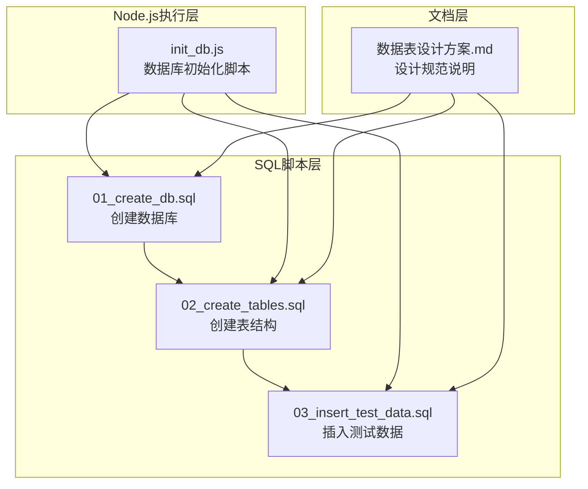
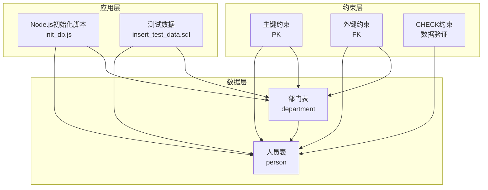
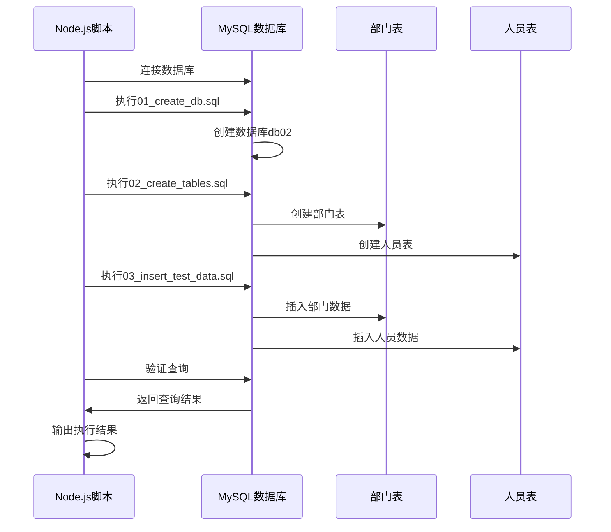
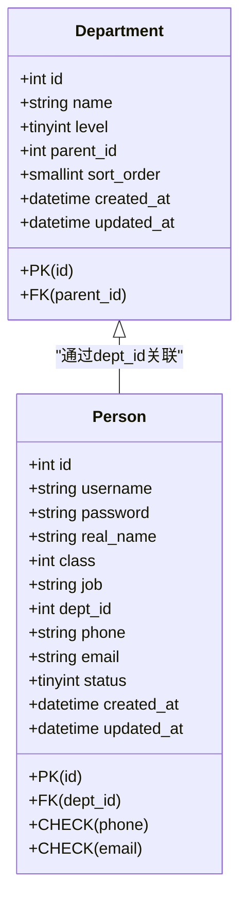
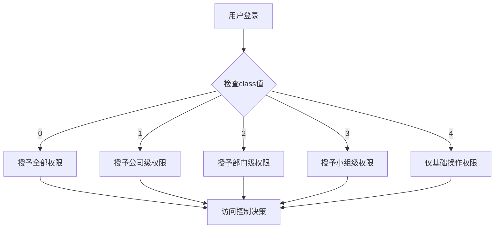
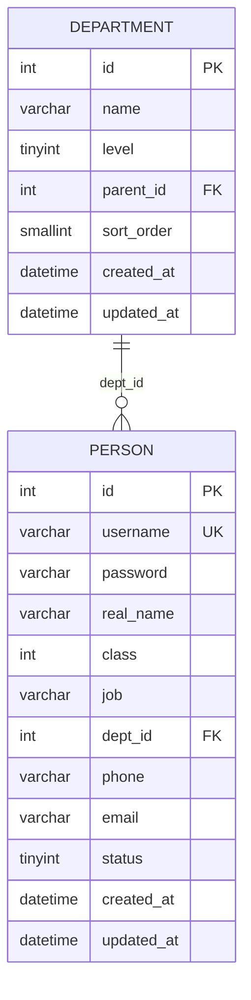
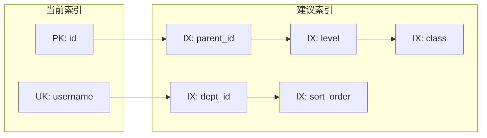
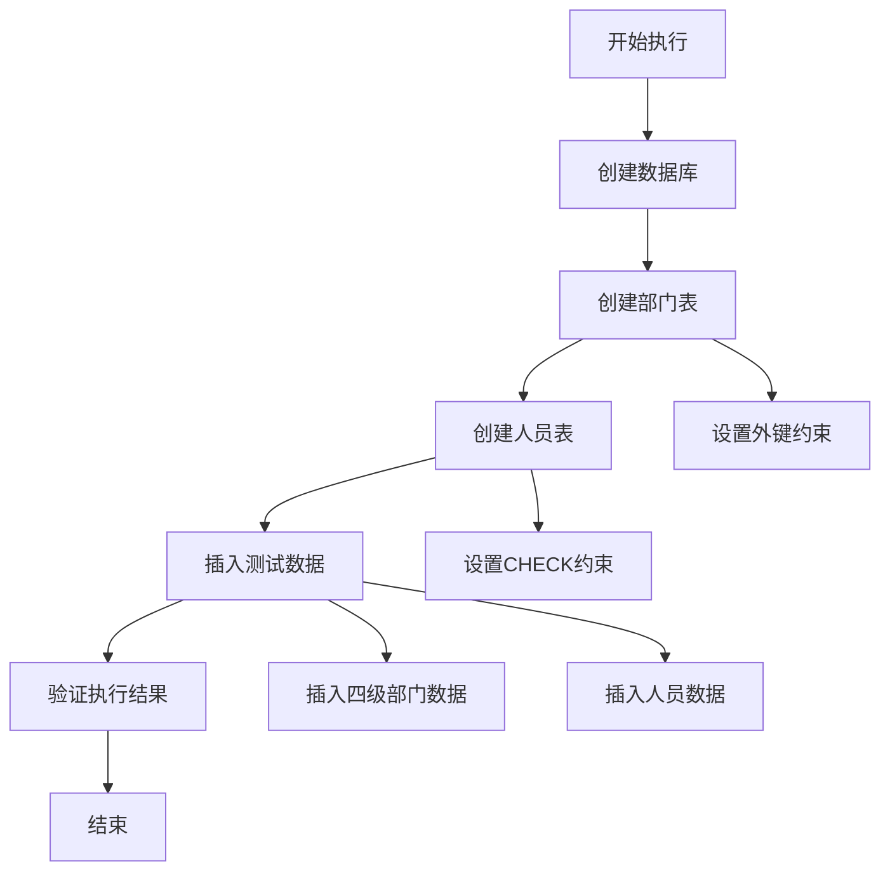

# 02_create_tables.sql 表结构创建脚本

<cite>
**本文档引用的文件**
- [02_create_tables.sql](file://sql/02_create_tables.sql)
- [数据表设计方案.md](file://数据表设计方案.md)
- [01_create_db.sql](file://sql/01_create_db.sql)
- [03_insert_test_data.sql](file://sql/03_insert_test_data.sql)
- [init_db.js](file://scripts/init_db.js)
</cite>

## 目录
1. [简介](#简介)
2. [项目结构](#项目结构)
3. [核心组件](#核心组件)
4. [架构概览](#架构概览)
5. [详细组件分析](#详细组件分析)
6. [依赖分析](#依赖分析)
7. [性能考虑](#性能考虑)
8. [故障排除指南](#故障排除指南)
9. [结论](#结论)
10. [附录](#附录)

## 简介

本文档是对 `02_create_tables.sql` 脚本的综合技术分析，重点解析部门表和人员表的完整结构设计。该脚本实现了基于邻接表模式的组织架构管理，通过精心设计的主键外键约束和CHECK约束，确保了数据的完整性和一致性。文档将深入说明部门层级关系的数据库实现原理、人员权限级别的数据模型设计，以及表间关系的完整性保证机制。

## 项目结构

该项目采用分层的SQL脚本组织方式，按照功能模块进行分离：

**图表来源**
- [01_create_db.sql:1-7](file://sql/01_create_db.sql#L1-L7)
- [02_create_tables.sql:1-43](file://sql/02_create_tables.sql#L1-L43)
- [03_insert_test_data.sql:1-45](file://sql/03_insert_test_data.sql#L1-L45)
- [init_db.js:1-67](file://scripts/init_db.js#L1-L67)

**章节来源**
- [01_create_db.sql:1-7](file://sql/01_create_db.sql#L1-L7)
- [02_create_tables.sql:1-43](file://sql/02_create_tables.sql#L1-L43)
- [03_insert_test_data.sql:1-45](file://sql/03_insert_test_data.sql#L1-L45)
- [init_db.js:1-67](file://scripts/init_db.js#L1-L67)

## 核心组件

### 部门表（department）

部门表是整个组织架构的核心，采用了邻接表模式来实现四级树形结构：

**表结构特征：**
- 主键：自增整数ID
- 层级标识：TINYINT类型的level字段，支持1-4级
- 父子关系：parent_id指向父部门，NULL表示顶级公司
- 排序控制：sort_order用于同级部门的排序
- 时间戳：自动维护创建和更新时间

**关键约束：**
- 自引用外键约束，确保父子关系的有效性
- ON DELETE RESTRICT防止误删有子部门的父节点
- 层级与父ID双重验证机制

### 人员表（person）

人员表负责存储员工信息，并与部门表建立关联关系：

**表结构特征：**
- 用户认证：username唯一标识，password存储明文
- 权限等级：class字段定义用户级别，数字越小级别越高
- 组织归属：dept_id关联到具体部门
- 联系信息：phone和email字段支持NULL值
- 状态管理：status字段区分在职和离职状态

**业务约束：**
- 手机号格式验证（中国手机号）
- 邮箱格式标准验证
- 唯一用户名约束

**章节来源**
- [02_create_tables.sql:6-16](file://sql/02_create_tables.sql#L6-L16)
- [02_create_tables.sql:21-42](file://sql/02_create_tables.sql#L21-L42)

## 架构概览

整个系统采用三层架构设计，从底层的数据存储到上层的应用逻辑：

**图表来源**
- [02_create_tables.sql:6-42](file://sql/02_create_tables.sql#L6-L42)
- [init_db.js:20-67](file://scripts/init_db.js#L20-L67)

### 数据流分析

系统启动时的数据流遵循严格的执行顺序：

**图表来源**
- [init_db.js:20-67](file://scripts/init_db.js#L20-L67)
- [01_create_db.sql:1-7](file://sql/01_create_db.sql#L1-L7)
- [02_create_tables.sql:1-43](file://sql/02_create_tables.sql#L1-L43)
- [03_insert_test_data.sql:1-45](file://sql/03_insert_test_data.sql#L1-L45)

## 详细组件分析

### 邻接表模式实现

邻接表模式是实现树形结构的经典方法，通过在每个节点中存储父节点ID来构建层次关系。

#### 核心设计原理

**图表来源**
- [02_create_tables.sql:6-42](file://sql/02_create_tables.sql#L6-L42)

#### 层级关系验证机制

系统通过双重机制确保层级关系的正确性：

1. **level字段验证**：明确标识当前节点的层级位置
2. **parent_id自引用**：通过外键约束防止非法的父子关系

这种设计避免了递归查询时可能出现的层级迷失问题。

**章节来源**
- [数据表设计方案.md:5-27](file://数据表设计方案.md#L5-L27)
- [02_create_tables.sql:6-16](file://sql/02_create_tables.sql#L6-L16)

### 权限级别数据模型

人员表的权限设计采用了数字越小级别越高的理念，形成了清晰的权限层次结构。

#### 权限等级映射

| 数字值 | 权限级别 | 描述 |
|--------|----------|------|
| 0 | admin | 系统管理员，最高权限 |
| 1 | 总经理 | 公司最高管理者 |
| 2 | 一级部门经理 | 各部门负责人 |
| 3 | 二级部门主管 | 二级部门负责人 |
| 4 | 普通员工 | 基础员工 |

#### 数据模型优势

**图表来源**
- [02_create_tables.sql:26](file://sql/02_create_tables.sql#L26)
- [数据表设计方案.md:53-57](file://数据表设计方案.md#L53-L57)

**章节来源**
- [数据表设计方案.md:30-57](file://数据表设计方案.md#L30-L57)
- [02_create_tables.sql:21-42](file://sql/02_create_tables.sql#L21-L42)

### 完整性约束设计

系统通过多种约束机制确保数据的完整性和一致性。

#### 主键约束
- 部门表：以id为主键，确保每个部门的唯一标识
- 人员表：以id为主键，确保每个用户的唯一标识

#### 外键约束
- 部门表：parent_id自引用，防止无效的父子关系
- 人员表：dept_id关联到部门表，确保人员归属的正确性

#### CHECK约束
- 手机号验证：使用正则表达式确保中国手机号格式
- 邮箱验证：使用正则表达式确保标准邮箱格式

**章节来源**
- [02_create_tables.sql:14-16](file://sql/02_create_tables.sql#L14-L16)
- [02_create_tables.sql:34-35](file://sql/02_create_tables.sql#L34-L35)
- [02_create_tables.sql:36-41](file://sql/02_create_tables.sql#L36-L41)

## 依赖分析

### 表间依赖关系

**图表来源**
- [02_create_tables.sql:6-42](file://sql/02_create_tables.sql#L6-L42)

### 执行依赖链

系统执行具有严格的依赖顺序：

1. **数据库创建**：必须先创建数据库
2. **表结构创建**：在数据库存在的前提下创建表
3. **数据插入**：在表结构就绪后插入测试数据
4. **验证执行**：最后验证所有操作的正确性

**章节来源**
- [init_db.js:20-67](file://scripts/init_db.js#L20-L67)
- [01_create_db.sql:1-7](file://sql/01_create_db.sql#L1-L7)
- [02_create_tables.sql:1-43](file://sql/02_create_tables.sql#L1-L43)
- [03_insert_test_data.sql:1-45](file://sql/03_insert_test_data.sql#L1-L45)

## 性能考虑

### 数据类型选择依据

系统在数据类型选择上体现了对性能和存储效率的考量：

#### 整数类型优化
- **部门ID**：使用INT UNSIGNED，范围足够大且占用空间适中
- **层级标识**：使用TINYINT，仅1字节存储，满足1-4级需求
- **排序字段**：使用SMALLINT，支持合理的排序需求

#### 字符串类型设计
- **部门名称**：VARCHAR(100)，满足常见部门命名长度
- **用户名**：VARCHAR(50)，平衡唯一性和存储效率
- **密码字段**：VARCHAR(100)，支持各种加密算法输出

#### 时间戳字段
- 使用DATETIME类型，提供精确的时间记录
- 自动维护功能减少应用层代码复杂度

### 索引设计策略

虽然当前脚本未显式创建索引，但基于表结构可以提出优化建议：

#### 建议索引方案

**潜在索引优化：**
- 在parent_id上创建索引，加速层级查询
- 在dept_id上创建索引，提升人员查询性能
- 在level字段上创建索引，支持层级过滤
- 在class字段上创建索引，优化权限查询

### 查询性能分析

#### 常见查询场景

1. **获取部门树结构**：需要递归查询，建议使用存储过程或应用层递归
2. **按权限级别查询**：class字段查询，建议创建索引
3. **按部门查询人员**：dept_id字段查询，当前已具备主键索引
4. **层级权限判断**：需要多表关联，建议优化查询计划

**章节来源**
- [数据表设计方案.md:61-72](file://数据表设计方案.md#L61-L72)
- [02_create_tables.sql:6-42](file://sql/02_create_tables.sql#L6-L42)

## 故障排除指南

### 常见错误及解决方案

#### 数据库连接问题
- **症状**：无法连接MySQL服务器
- **原因**：连接参数配置错误
- **解决**：检查.env文件中的数据库连接配置

#### 表创建失败
- **症状**：执行02_create_tables.sql时报错
- **可能原因**：
  - 数据库不存在
  - 权限不足
  - 字段定义冲突
- **解决**：先执行01_create_db.sql创建数据库

#### 数据插入异常
- **症状**：插入测试数据时报错
- **可能原因**：
  - 外键约束违反
  - 唯一约束冲突
  - 数据格式不正确
- **解决**：检查数据依赖关系和格式规范

#### 约束验证失败
- **症状**：CHECK约束触发错误
- **可能原因**：
  - 手机号格式不正确
  - 邮箱格式不符合标准
- **解决**：修正数据格式或调整验证规则

**章节来源**
- [init_db.js:63-67](file://scripts/init_db.js#L63-L67)
- [02_create_tables.sql:36-41](file://sql/02_create_tables.sql#L36-L41)

## 结论

02_create_tables.sql脚本成功实现了基于邻接表模式的组织架构管理系统。通过精心设计的表结构、约束机制和数据模型，系统在保证数据完整性的同时，提供了清晰的层级关系管理和灵活的权限控制能力。

### 主要优势

1. **结构清晰**：邻接表模式简单直观，易于理解和维护
2. **约束完善**：多重约束确保数据质量和业务规则
3. **扩展性强**：支持四级树形结构，便于未来扩展
4. **性能合理**：数据类型选择兼顾存储效率和查询性能

### 改进建议

1. **索引优化**：为常用查询字段添加索引
2. **安全增强**：密码字段建议使用加密存储
3. **监控完善**：增加审计日志功能
4. **接口设计**：提供标准化的数据访问接口

## 附录

### 执行流程总结

**图表来源**
- [init_db.js:20-67](file://scripts/init_db.js#L20-L67)
- [01_create_db.sql:1-7](file://sql/01_create_db.sql#L1-L7)
- [02_create_tables.sql:1-43](file://sql/02_create_tables.sql#L1-L43)
- [03_insert_test_data.sql:1-45](file://sql/03_insert_test_data.sql#L1-L45)

### 数据模型最佳实践

1. **字段命名**：采用描述性命名，提高可读性
2. **约束设计**：在数据库层面强制业务规则
3. **索引策略**：根据查询模式优化索引设计
4. **数据类型**：选择合适的数据类型平衡精度和性能
5. **版本管理**：通过脚本化管理数据库变更