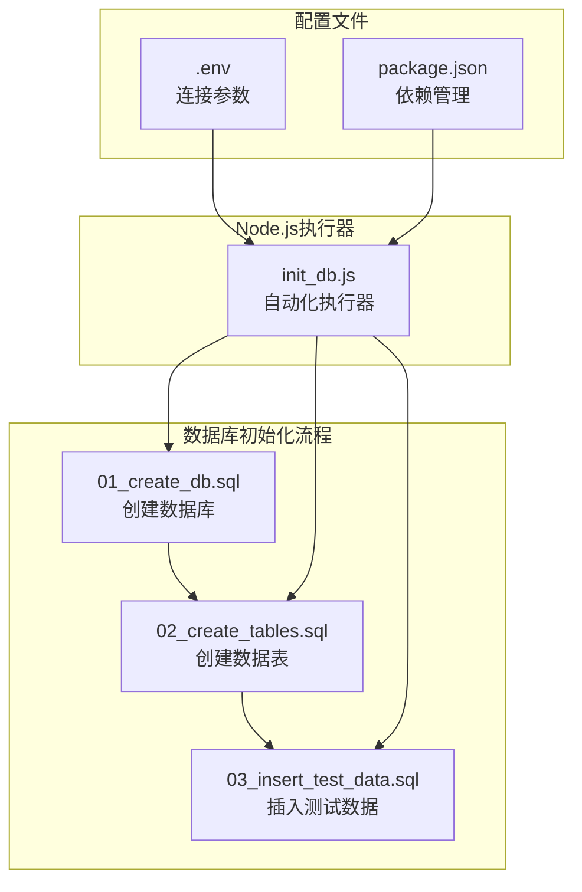
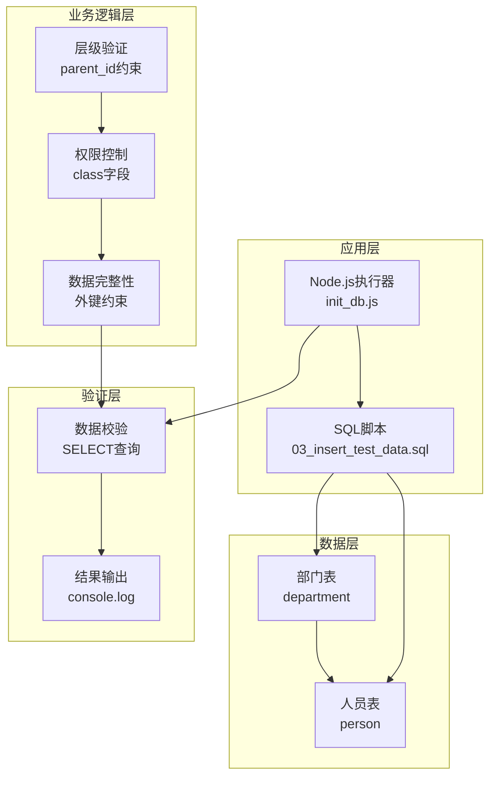
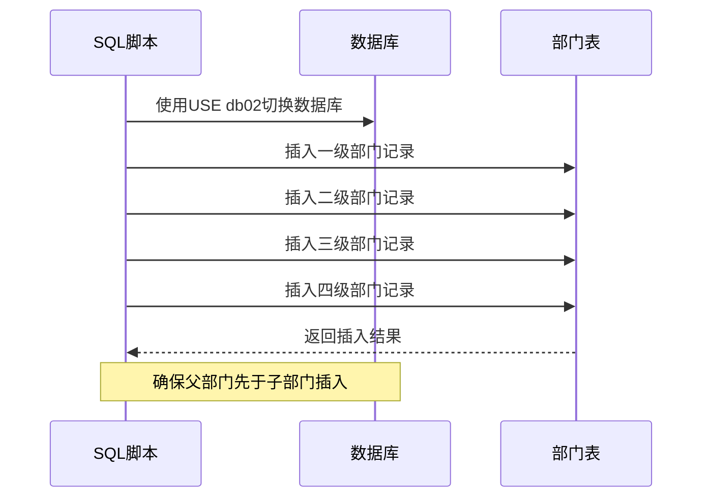
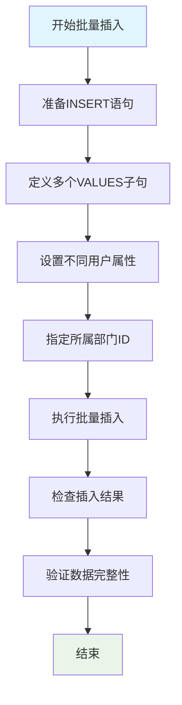
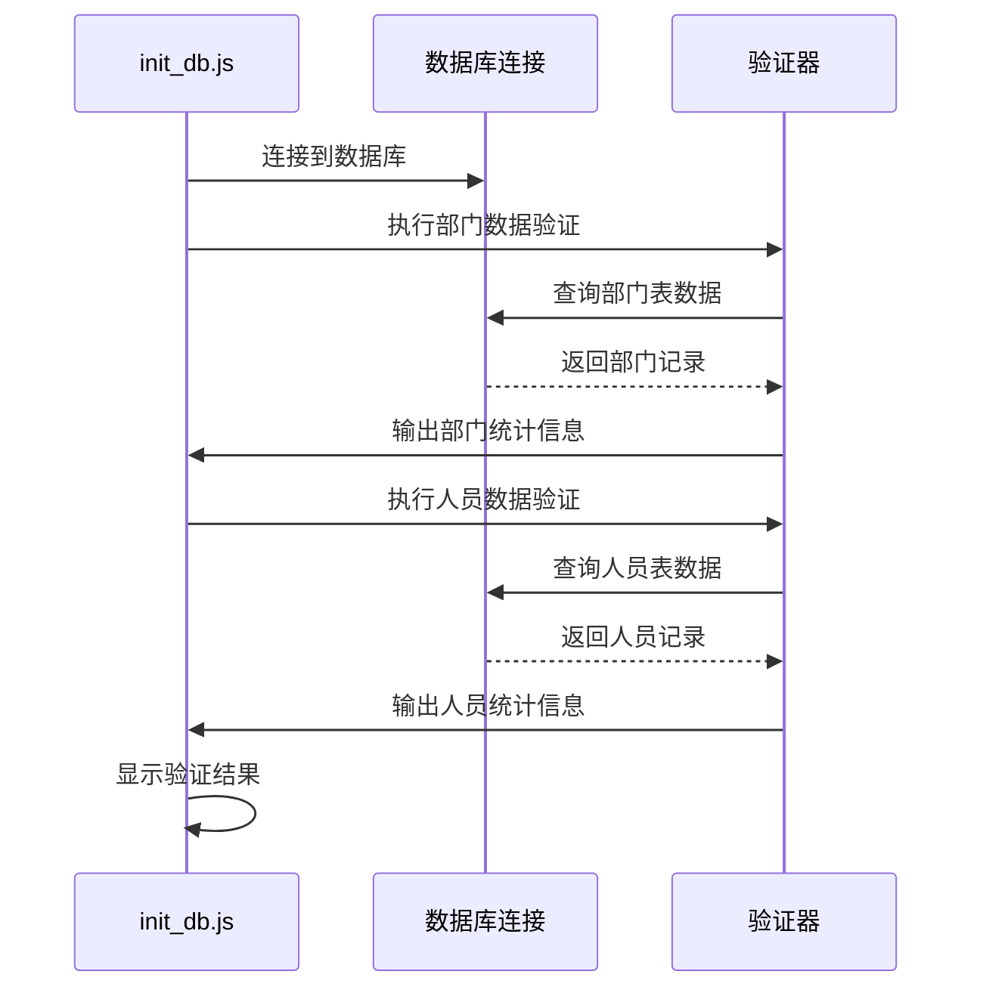

# 03_insert_test_data.sql 测试数据插入脚本

<cite>
**本文档引用的文件**
- [03_insert_test_data.sql](file://sql/03_insert_test_data.sql)
- [02_create_tables.sql](file://sql/02_create_tables.sql)
- [数据表设计方案.md](file://数据表设计方案.md)
- [init_db.js](file://scripts/init_db.js)
- [package.json](file://package.json)
</cite>

## 目录
1. [简介](#简介)
2. [项目结构](#项目结构)
3. [核心组件](#核心组件)
4. [架构概览](#架构概览)
5. [详细组件分析](#详细组件分析)
6. [依赖分析](#依赖分析)
7. [性能考虑](#性能考虑)
8. [故障排除指南](#故障排除指南)
9. [结论](#结论)
10. [附录](#附录)

## 简介

03_insert_test_data.sql 是一个专门用于向数据库插入虚拟测试数据的SQL脚本。该脚本遵循了完整的四级部门组织结构，包含了从公司层面到三级部门的完整层级关系，并配套了具有代表性的人员数据。这个脚本是整个数据库初始化流程的重要组成部分，为后续的功能测试和系统验证提供了基础数据支撑。

## 项目结构

该项目采用模块化的设计方式，将数据库相关的操作分为三个独立的阶段：



**图表来源**
- [init_db.js:20-61](file://scripts/init_db.js#L20-L61)
- [package.json:13-16](file://package.json#L13-L16)

**章节来源**
- [init_db.js:20-61](file://scripts/init_db.js#L20-L61)
- [package.json:1-18](file://package.json#L1-L18)

## 核心组件

### 部门层级结构设计

该脚本实现了严格的四级部门组织结构，采用邻接表模式存储层级关系：

| 层级 | 数字标识 | 描述 | 示例 |
|------|----------|------|------|
| 一级 | 1 | 公司主体 | 某某科技有限公司 |
| 二级 | 2 | 一级部门 | 市场部、设计部、技术部、行政部 |
| 三级 | 3 | 二级部门 | 华东市场组、UI设计组、前端开发组等 |
| 四级 | 4 | 三级部门 | 上海小组 |

### 人员分级体系

人员按照职责级别进行分类，数字越小级别越高：

| 级别 | 数字标识 | 职责描述 | 示例 |
|------|----------|----------|------|
| 管理员 | 0 | 系统管理员 | admin |
| 总经理 | 1 | 公司最高管理者 | 张建 |
| 部门经理 | 2 | 一级部门负责人 | 李华、王芳 |
| 主管 | 3 | 二级部门负责人 | 张三 |
| 普通员工 | 4 | 基层员工 | 李四、王五 |

**章节来源**
- [03_insert_test_data.sql:8-27](file://sql/03_insert_test_data.sql#L8-L27)
- [03_insert_test_data.sql:32-44](file://sql/03_insert_test_data.sql#L32-L44)
- [数据表设计方案.md:76-103](file://数据表设计方案.md#L76-L103)

## 架构概览

整个测试数据插入架构采用了分层设计，确保数据的一致性和可维护性：



**图表来源**
- [init_db.js:46-58](file://scripts/init_db.js#L46-L58)
- [02_create_tables.sql:15](file://sql/02_create_tables.sql#L15)
- [02_create_tables.sql:35](file://sql/02_create_tables.sql#L35)

**章节来源**
- [init_db.js:46-58](file://scripts/init_db.js#L46-L58)
- [02_create_tables.sql:15-35](file://sql/02_create_tables.sql#L15-L35)

## 详细组件分析

### 部门数据插入策略

#### 递归层级插入方法

脚本采用了自上而下的递归插入策略，严格按照层级顺序进行数据插入：



**图表来源**
- [03_insert_test_data.sql:8-27](file://sql/03_insert_test_data.sql#L8-L27)

#### 数据组织结构

部门数据的组织遵循以下原则：

1. **层级明确性**：每个部门都明确标注了level字段
2. **父子关系**：通过parent_id建立清晰的父子关系链
3. **排序规则**：使用sort_order字段控制同级部门的显示顺序
4. **完整性**：覆盖从公司到三级部门的完整层级结构

**章节来源**
- [03_insert_test_data.sql:8-27](file://sql/03_insert_test_data.sql#L8-L27)
- [数据表设计方案.md:63-72](file://数据表设计方案.md#L63-L72)

### 人员数据批量插入技巧

#### 批量插入实现

脚本采用了单个INSERT语句批量插入多条人员记录的方式：



**图表来源**
- [03_insert_test_data.sql:32-44](file://sql/03_insert_test_data.sql#L32-L44)

#### 用户角色分配策略

人员数据的分配体现了完整的组织架构：

| 角色类型 | 数量 | 分配原则 | 示例 |
|----------|------|----------|------|
| 系统管理员 | 1 | 最高权限，挂靠公司顶层 | admin |
| 高层管理者 | 1 | 总经理职位，公司层面 | 张建 |
| 中层管理者 | 2 | 一级部门经理，对应二级部门 | 李华、王芳 |
| 基层主管 | 1 | 二级部门主管，对应三级部门 | 张三 |
| 普通员工 | 2 | 基层岗位，对应具体工作组 | 李四、王五 |

**章节来源**
- [03_insert_test_data.sql:32-44](file://sql/03_insert_test_data.sql#L32-L44)
- [数据表设计方案.md:93-103](file://数据表设计方案.md#L93-L103)

### 数据完整性验证机制

#### 自动化验证流程

Node.js执行器实现了完整的数据验证机制：



**图表来源**
- [init_db.js:50-57](file://scripts/init_db.js#L50-L57)

#### 验证内容

验证过程包括两个主要方面：

1. **部门结构验证**：检查层级关系的正确性和完整性
2. **人员权限验证**：确认用户级别的分配符合预期

**章节来源**
- [init_db.js:50-57](file://scripts/init_db.js#L50-L57)

## 依赖分析

### 外部依赖关系

该脚本与数据库表结构存在直接的依赖关系：

```mermaid
graph LR
A[03_insert_test_data.sql] --> B[department表]
A --> C[person表]
B --> D[department表结构定义]
C --> E[person表结构定义]
F[init_db.js] --> A
F --> G[.env配置文件]
F --> H[mysql2包]
F --> I dotenv包
```

**图表来源**
- [init_db.js:1-67](file://scripts/init_db.js#L1-L67)
- [package.json:13-16](file://package.json#L13-L16)

### 内部依赖关系

脚本内部遵循严格的执行顺序：

1. **数据库选择**：必须先选择目标数据库
2. **表结构依赖**：部门表必须先于人员表插入
3. **层级依赖**：父部门必须先于子部门插入

**章节来源**
- [init_db.js:34-47](file://scripts/init_db.js#L34-L47)
- [03_insert_test_data.sql:1-45](file://sql/03_insert_test_data.sql#L1-L45)

## 性能考虑

### 插入性能优化

1. **批量插入**：使用单个INSERT语句插入多条记录，减少网络往返
2. **顺序插入**：按照层级顺序插入，避免重复的外键检查
3. **事务处理**：在实际生产环境中建议使用事务包装

### 数据量扩展建议

对于大规模数据场景，建议采用以下策略：

1. **分批插入**：将大量数据分成多个批次插入
2. **索引优化**：在插入前考虑临时禁用非必要的索引
3. **并发控制**：合理控制并发插入的数量

## 故障排除指南

### 常见错误及解决方案

#### 外键约束错误

**问题现象**：插入人员数据时报错，提示无法找到对应的部门ID

**解决方案**：
1. 确认部门数据已正确插入
2. 检查部门ID是否正确
3. 验证部门层级关系

#### 数据类型错误

**问题现象**：插入数据时报错，提示数据类型不匹配

**解决方案**：
1. 检查字段的数据类型定义
2. 确认插入值的格式正确
3. 验证字符集设置

#### 重复键错误

**问题现象**：插入用户名或邮箱时报错，提示唯一约束冲突

**解决方案**：
1. 检查是否存在重复的用户名
2. 修改用户名或邮箱地址
3. 清理现有数据后重新插入

**章节来源**
- [init_db.js:63-66](file://scripts/init_db.js#L63-L66)

### 调试方法

1. **分步执行**：将脚本分成多个小片段分别执行
2. **中间验证**：在关键步骤后执行SELECT查询验证数据
3. **日志记录**：使用Node.js执行器的详细输出信息

## 结论

03_insert_test_data.sql脚本成功实现了以下目标：

1. **完整的组织架构**：建立了从公司到三级部门的完整层级结构
2. **合理的人员配置**：涵盖了从系统管理员到普通员工的完整角色层次
3. **严格的数据完整性**：通过外键约束和验证机制确保数据一致性
4. **良好的可维护性**：采用清晰的层级结构和标准化的数据格式

该脚本为后续的功能测试、性能测试和集成测试提供了坚实的基础数据支持，是整个数据库初始化流程中不可或缺的重要组成部分。

## 附录

### 维护策略和更新最佳实践

#### 数据更新策略

1. **版本控制**：将测试数据变更纳入版本控制系统
2. **备份机制**：在修改前备份现有数据
3. **增量更新**：优先考虑新增而非删除现有数据

#### 数据扩展建议

1. **标准化格式**：保持数据格式的一致性
2. **注释规范**：为重要数据添加详细的注释说明
3. **测试验证**：每次更新后都要进行完整的功能测试

#### 性能监控

1. **定期检查**：监控数据表的大小和查询性能
2. **索引优化**：根据查询模式优化索引设计
3. **清理策略**：定期清理过期或冗余的测试数据