# 数据库脚本详解

<cite>
**本文档引用的文件**
- [01_create_db.sql](file://sql/01_create_db.sql)
- [02_create_tables.sql](file://sql/02_create_tables.sql)
- [03_insert_test_data.sql](file://sql/03_insert_test_data.sql)
- [04_create_files_table.sql](file://sql/04_create_files_table.sql)
- [init_db.js](file://scripts/init_db.js)
- [create_files_table.js](file://scripts/create_files_table.js)
- [server.js](file://server.js)
- [package.json](file://package.json)
- [数据表设计方案.md](file://数据表设计方案.md)
</cite>

## 目录
1. [简介](#简介)
2. [项目结构](#项目结构)
3. [核心组件](#核心组件)
4. [架构概览](#架构概览)
5. [详细组件分析](#详细组件分析)
6. [文件管理系统增强](#文件管理系统增强)
7. [依赖分析](#依赖分析)
8. [性能考虑](#性能考虑)
9. [故障排除指南](#故障排除指南)
10. [结论](#结论)
11. [附录](#附录)

## 简介

本项目是一个完整的数据库初始化脚本集合，提供了企业级组织架构管理和文件管理系统。该系统采用邻接表模式实现四级部门层级结构，通过严格的约束设计确保数据完整性，并提供了完整的测试数据集。**新增的文件管理系统**支持完整的文件元数据管理，包括上传时间戳、文件大小、S3存储集成等功能。

系统的核心特点包括：
- **邻接表模式**：使用parent_id字段实现部门层级关系
- **严格约束**：外键约束、CHECK约束确保数据一致性
- **完整生命周期**：从数据库创建到数据初始化的全流程自动化
- **文件元数据管理**：支持文件大小、上传时间戳、存储路径等完整元数据
- **S3云存储集成**：完整的云端文件存储解决方案
- **可扩展性**：支持未来功能扩展和自定义配置

## 项目结构

项目采用模块化组织方式，主要包含以下目录和文件：

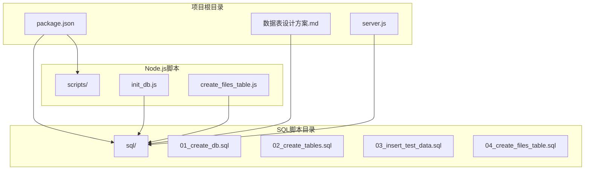

**图表来源**
- [package.json:1-18](file://package.json#L1-L18)
- [数据表设计方案.md:1-115](file://数据表设计方案.md#L1-L115)
- [server.js:1-290](file://server.js#L1-L290)

**章节来源**
- [package.json:1-18](file://package.json#L1-L18)
- [数据表设计方案.md:1-115](file://数据表设计方案.md#L1-L115)
- [server.js:1-290](file://server.js#L1-L290)

## 核心组件

### 数据库创建组件 (01_create_db.sql)

该组件负责创建数据库实例，采用UTF8MB4字符集以支持完整的Unicode字符集。

**关键特性**：
- 使用IF NOT EXISTS确保幂等性
- 设置默认字符集和排序规则
- 自动切换到新创建的数据库

### 表结构设计组件 (02_create_tables.sql)

该组件包含两个核心表的设计，采用邻接表模式实现复杂的层级关系。

**核心表结构**：
- **department表**：存储部门信息和层级关系
- **person表**：存储人员信息和关联关系

### 文件管理系统组件 (04_create_files_table.sql)

**新增组件**：该组件创建文件表，支持完整的文件元数据管理。

**核心字段**：
- **基础信息**：filename、original_name、file_type、file_ext
- **元数据**：file_size、description、status
- **存储信息**：s3_key、s3_url
- **关联信息**：uploader_id、dept_id
- **时间戳**：created_at、updated_at

### 数据初始化组件 (03_insert_test_data.sql)

该组件提供完整的测试数据集，涵盖四级部门结构和典型人员角色。

**数据覆盖范围**：
- 四级部门结构（公司→一级部门→二级部门→三级部门）
- 不同级别的管理人员和普通员工
- 完整的组织架构示例

**章节来源**
- [01_create_db.sql:1-7](file://sql/01_create_db.sql#L1-L7)
- [02_create_tables.sql:1-43](file://sql/02_create_tables.sql#L1-L43)
- [04_create_files_table.sql:1-29](file://sql/04_create_files_table.sql#L1-L29)
- [03_insert_test_data.sql:1-45](file://sql/03_insert_test_data.sql#L1-L45)

## 架构概览

整个系统采用三层架构设计，从底层的数据库层到上层的应用层形成完整的数据流：

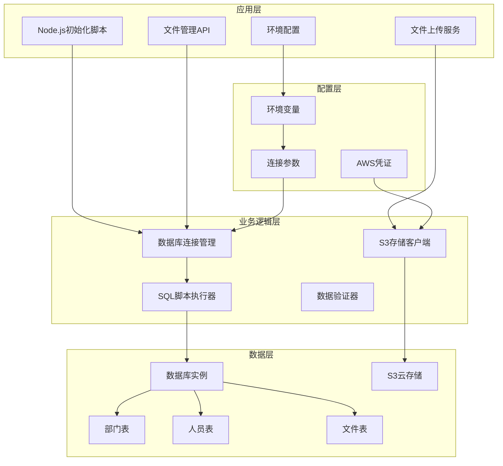

**图表来源**
- [init_db.js:20-61](file://scripts/init_db.js#L20-L61)
- [create_files_table.js:1-44](file://scripts/create_files_table.js#L1-L44)
- [server.js:17-26](file://server.js#L17-L26)
- [package.json:13-16](file://package.json#L13-L16)

## 详细组件分析

### 数据库创建组件深度分析

#### 执行流程

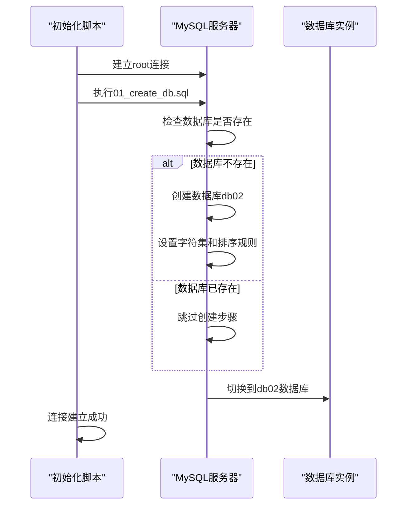

**图表来源**
- [init_db.js:20-31](file://scripts/init_db.js#L20-L31)
- [01_create_db.sql:1-7](file://sql/01_create_db.sql#L1-L7)

#### 关键设计决策

1. **字符集选择**：UTF8MB4支持完整的Unicode字符，满足国际化需求
2. **幂等性设计**：使用IF NOT EXISTS避免重复执行错误
3. **自动切换**：创建完成后自动切换到目标数据库

**章节来源**
- [01_create_db.sql:1-7](file://sql/01_create_db.sql#L1-L7)
- [init_db.js:20-31](file://scripts/init_db.js#L20-L31)

### 邻接表模式深度解析

#### 部门表设计原理

邻接表模式是本系统的核心设计理念，通过parent_id字段实现树形结构的存储：

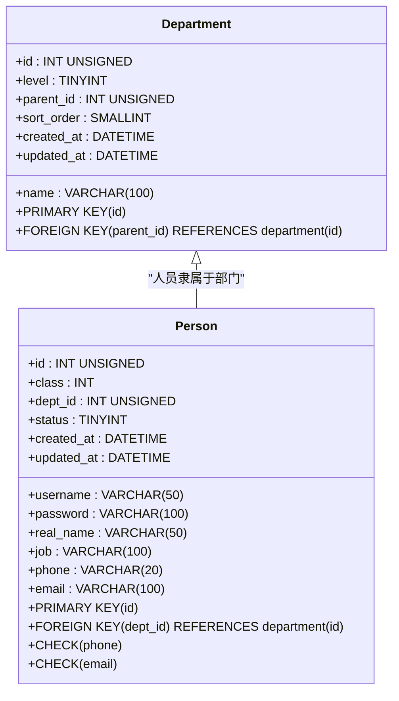

**图表来源**
- [02_create_tables.sql:6-16](file://sql/02_create_tables.sql#L6-L16)
- [02_create_tables.sql:21-42](file://sql/02_create_tables.sql#L21-L42)

#### 层级关系实现机制

邻接表模式通过以下机制实现复杂的层级关系：

1. **层级标识**：level字段明确标注当前记录的层级位置
2. **父子关系**：parent_id字段建立父子节点关系
3. **排序控制**：sort_order字段控制同级部门的显示顺序
4. **完整性约束**：外键约束确保层级关系的有效性

#### 四级结构示例

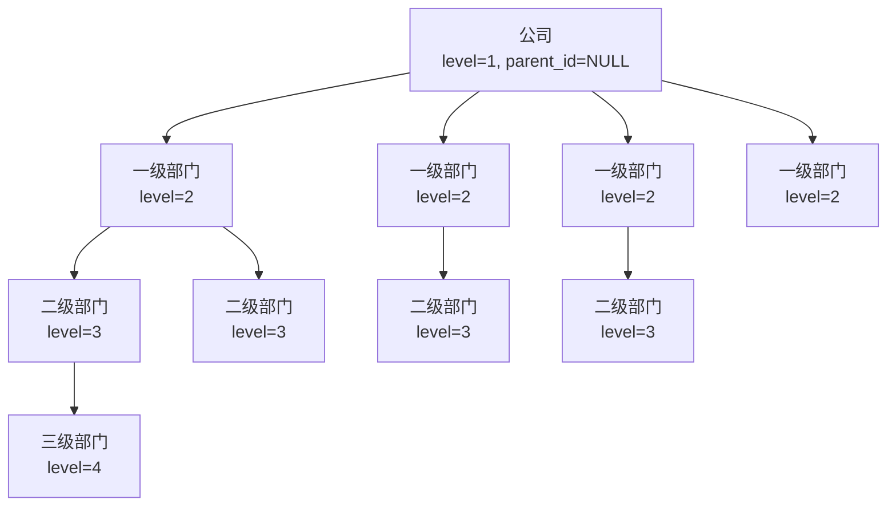

**图表来源**
- [数据表设计方案.md:61-72](file://数据表设计方案.md#L61-L72)

**章节来源**
- [数据表设计方案.md:5-26](file://数据表设计方案.md#L5-L26)
- [02_create_tables.sql:6-16](file://sql/02_create_tables.sql#L6-L16)

### 外键约束设计分析

#### 约束类型与作用

系统采用了多种约束来确保数据完整性：

1. **主键约束**：确保每条记录的唯一性
2. **外键约束**：维护表间引用关系
3. **CHECK约束**：验证数据格式和业务规则

#### 外键约束实现

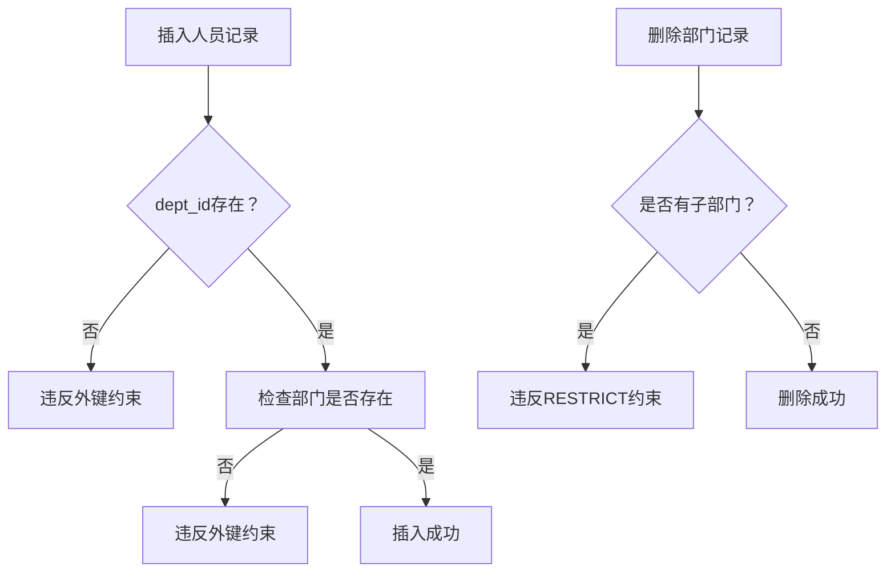

**图表来源**
- [02_create_tables.sql:15](file://sql/02_create_tables.sql#L15)
- [02_create_tables.sql:35](file://sql/02_create_tables.sql#L35)

#### 约束设计原则

1. **数据完整性**：防止孤儿记录和无效引用
2. **业务规则**：确保符合组织架构的实际需求
3. **性能平衡**：在约束强度和查询性能之间找到平衡点

**章节来源**
- [02_create_tables.sql:15](file://sql/02_create_tables.sql#L15)
- [02_create_tables.sql:35](file://sql/02_create_tables.sql#L35)

### CHECK约束验证机制

#### 约束规则设计

系统实现了两个重要的CHECK约束来验证数据质量：

1. **手机号格式验证**：国内手机号码格式校验
2. **邮箱格式验证**：标准邮箱地址格式校验

#### 验证逻辑分析

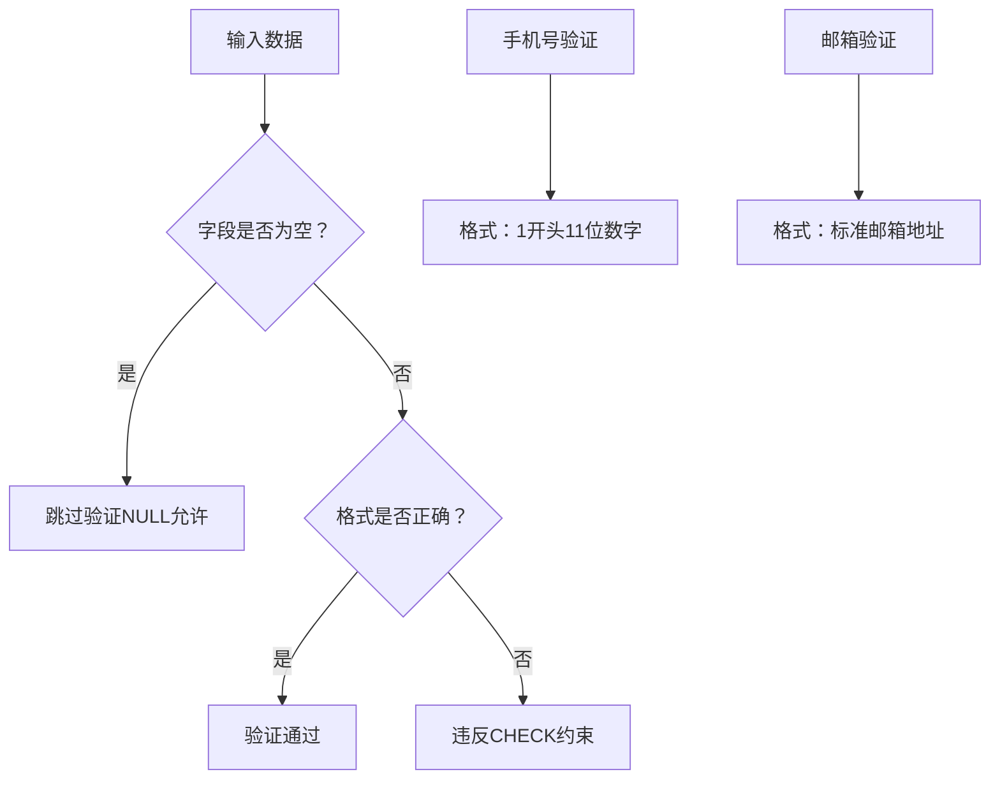

**图表来源**
- [02_create_tables.sql:36-41](file://sql/02_create_tables.sql#L36-L41)

#### 约束实现细节

1. **NULL处理**：允许空值存在，不触发验证
2. **正则表达式**：使用精确的正则表达式匹配
3. **性能考虑**：CHECK约束在插入和更新时自动执行

**章节来源**
- [02_create_tables.sql:36-41](file://sql/02_create_tables.sql#L36-L41)

### 数据初始化策略

#### 测试数据设计原则

数据初始化组件提供了完整的测试场景，涵盖了各种业务场景：

1. **层级完整性**：确保四级结构完整
2. **角色多样性**：包含不同级别的管理人员
3. **业务代表性**：覆盖典型的组织架构

#### 数据插入顺序

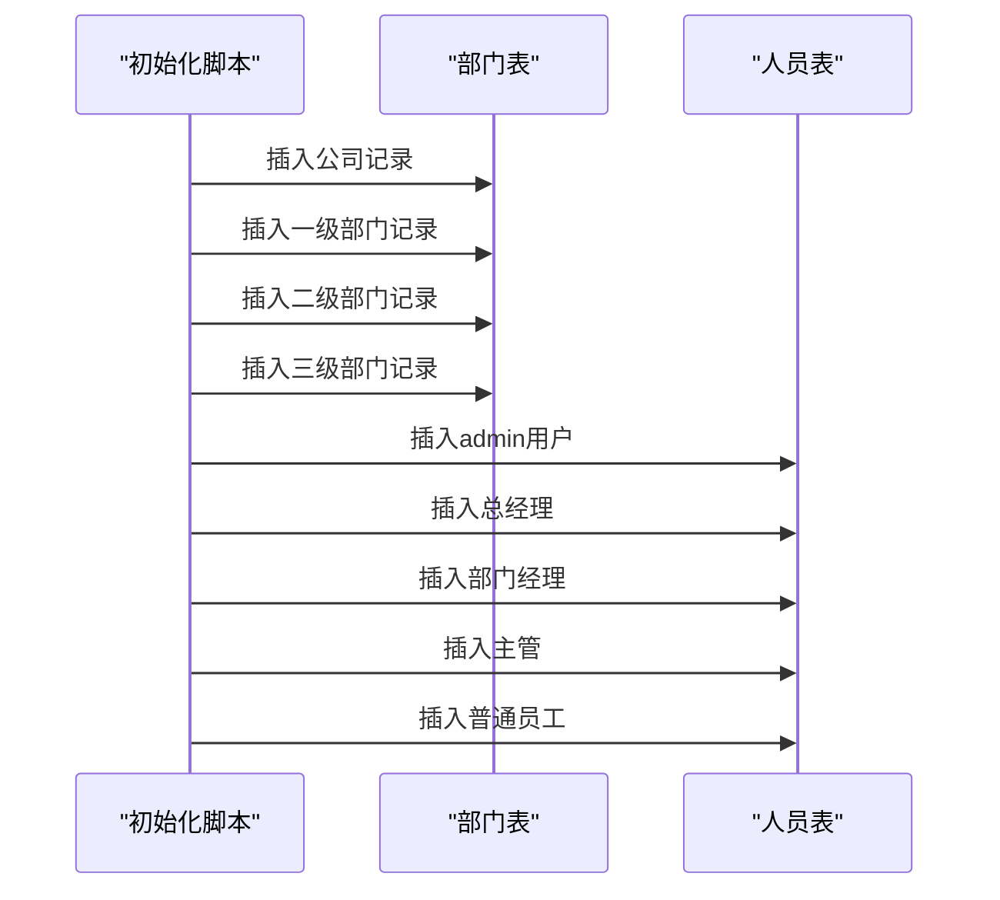

**图表来源**
- [init_db.js:46-47](file://scripts/init_db.js#L46-L47)
- [03_insert_test_data.sql:8-27](file://sql/03_insert_test_data.sql#L8-L27)

#### 数据验证机制

初始化脚本包含了完整的数据验证流程：

1. **部门数据验证**：检查层级关系和数量
2. **人员数据验证**：检查角色分配和部门归属
3. **一致性检查**：确保数据间的逻辑关系正确

**章节来源**
- [03_insert_test_data.sql:1-45](file://sql/03_insert_test_data.sql#L1-L45)
- [init_db.js:49-58](file://scripts/init_db.js#L49-L58)

## 文件管理系统增强

### 文件表设计原理

**新增组件**：文件表支持完整的文件元数据管理，为文件上传和下载提供完整的数据支撑。

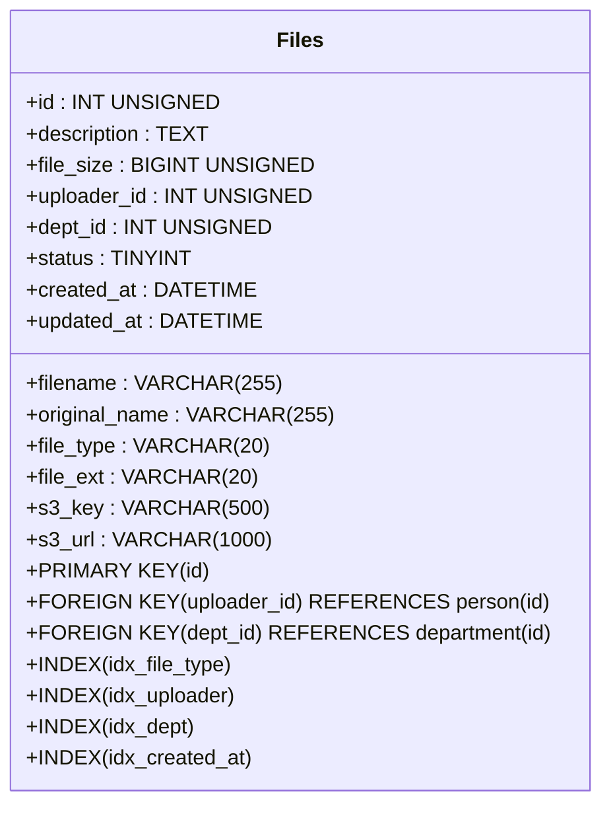

**图表来源**
- [04_create_files_table.sql:6-28](file://sql/04_create_files_table.sql#L6-L28)

### 文件元数据管理特性

#### 核心字段设计

1. **文件标识**：filename、original_name区分处理后的文件名和原始文件名
2. **类型分类**：file_type、file_ext支持文件类型识别和扩展名管理
3. **元数据存储**：description提供文件描述信息
4. **大小管理**：file_size使用BIGINT UNSIGNED支持大文件存储
5. **存储集成**：s3_key、s3_url完整集成AWS S3云存储
6. **状态控制**：status字段支持软删除机制
7. **时间追踪**：created_at、updated_at自动管理时间戳

#### 索引优化策略

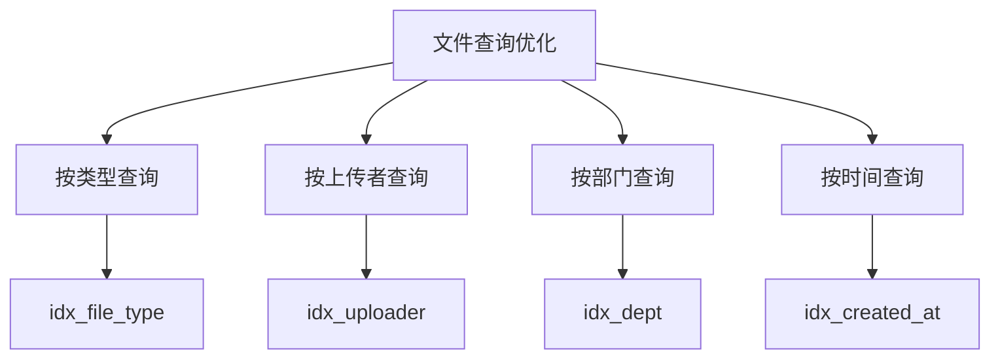

**图表来源**
- [04_create_files_table.sql:24-27](file://sql/04_create_files_table.sql#L24-L27)

#### 外键关联设计

1. **上传者关联**：uploader_id强制关联到person表，确保上传者身份
2. **部门关联**：dept_id关联到department表，支持按部门管理文件
3. **约束保护**：ON DELETE RESTRICT防止删除仍在使用的关联记录

**章节来源**
- [04_create_files_table.sql:1-29](file://sql/04_create_files_table.sql#L1-L29)

### S3云存储集成

#### 存储架构设计

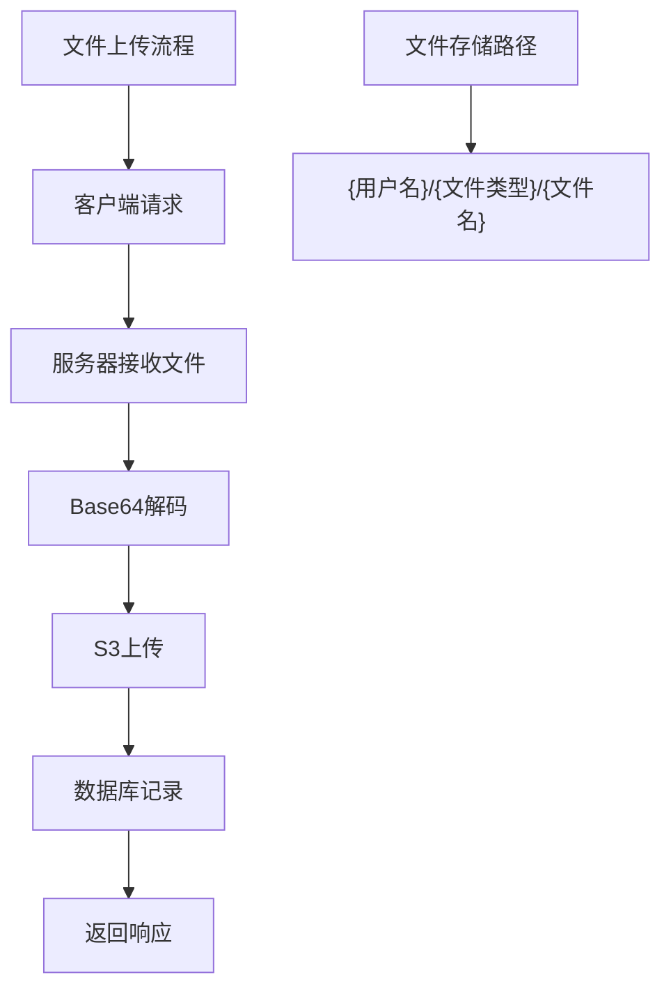

**图表来源**
- [server.js:114-189](file://server.js#L114-L189)

#### 存储策略实现

1. **路径组织**：采用用户名→文件类型→文件名的层次化存储结构
2. **URL生成**：动态生成可访问的S3对象URL
3. **类型映射**：支持多种文件类型的自动识别和分类
4. **大小限制**：支持大文件上传，最大50MB
5. **内容类型**：自动设置正确的HTTP Content-Type

#### API接口设计

**文件上传接口**：
- POST `/api/upload`：批量文件上传
- 支持Base64编码文件数据
- 自动检测文件类型和扩展名
- 返回上传成功信息和访问URL

**文件管理接口**：
- GET `/api/files`：获取文件列表（支持分页和类型筛选）
- DELETE `/api/files/:id`：删除文件（软删除）
- 支持按文件类型、上传时间等条件查询

**章节来源**
- [server.js:114-285](file://server.js#L114-L285)

## 依赖分析

### 外部依赖关系

系统依赖于以下外部组件：

```mermaid
graph LR
A[init_db.js] --> B[mysql2]
A --> C[dotenv]
D[create_files_table.js] --> B
D --> C
E[server.js] --> B
E --> F[@aws-sdk/client-s3]
E --> G[@aws-sdk/lib-storage]
B --> H[MySQL驱动]
C --> I[环境变量管理]
F --> J[AWS SDK]
G --> F
subgraph "运行时依赖"
K[Node.js运行时]
L[MySQL服务器]
M[AWS S3服务]
end
A --> K
D --> K
E --> K
H --> L
J --> M
```

**图表来源**
- [package.json:13-16](file://package.json#L13-L16)
- [init_db.js:1-4](file://scripts/init_db.js#L1-L4)
- [create_files_table.js:1-2](file://scripts/create_files_table.js#L1-L2)
- [server.js:5-6](file://server.js#L5-L6)

### 内部模块依赖

系统内部模块之间的依赖关系相对简单，主要体现在脚本执行顺序上：

1. **init_db.js**：协调所有SQL脚本的执行
2. **create_files_table.js**：独立的文件表创建脚本
3. **SQL脚本**：按依赖关系顺序执行
4. **数据验证**：最后执行验证查询

**章节来源**
- [package.json:13-16](file://package.json#L13-L16)
- [init_db.js:1-4](file://scripts/init_db.js#L1-L4)
- [create_files_table.js:1-44](file://scripts/create_files_table.js#L1-L44)

## 性能考虑

### 查询优化建议

1. **索引策略**：文件表已建立多处索引，可根据实际查询模式进一步优化
2. **查询模式**：针对常见的文件类型查询、按上传者查询等模式进行优化
3. **缓存机制**：对于频繁访问的文件元数据考虑缓存
4. **分页策略**：文件列表查询已支持分页，建议合理设置页面大小

### 存储优化

1. **字符集选择**：UTF8MB4虽然支持完整Unicode，但会增加存储空间
2. **字段长度**：合理设置VARCHAR字段长度，避免过度占用空间
3. **索引优化**：根据实际查询需求建立合适的索引
4. **S3成本优化**：考虑使用S3的生命周期管理策略

### 文件存储优化

1. **文件大小**：BIGINT UNSIGNED支持大文件存储，但需考虑数据库性能
2. **索引策略**：文件表的索引设计已考虑常见查询模式
3. **并发处理**：S3上传支持并发，但需注意网络带宽限制

## 故障排除指南

### 常见问题及解决方案

#### 数据库连接问题

**问题症状**：初始化脚本无法连接到MySQL服务器
**可能原因**：
- 网络连接问题
- 认证信息错误
- MySQL服务未启动

**解决步骤**：
1. 检查.env文件中的连接参数
2. 验证MySQL服务状态
3. 测试基本的数据库连接

#### 权限不足问题

**问题症状**：执行SQL脚本时出现权限错误
**可能原因**：
- 用户权限不足
- 数据库不存在
- 字符集不兼容

**解决步骤**：
1. 确认数据库用户具有足够的权限
2. 检查数据库是否存在
3. 验证字符集设置

#### 数据约束冲突

**问题症状**：插入数据时出现约束错误
**可能原因**：
- 外键约束冲突
- CHECK约束失败
- 主键冲突

**解决步骤**：
1. 检查相关表的数据完整性
2. 验证数据格式是否符合约束要求
3. 确认插入顺序是否正确

#### S3存储问题

**问题症状**：文件上传失败或无法访问
**可能原因**：
- AWS凭证配置错误
- S3桶权限不足
- 网络连接问题

**解决步骤**：
1. 验证AWS区域、访问密钥配置
2. 检查S3桶的读写权限
3. 确认网络连接正常
4. 验证S3桶名称正确性

**章节来源**
- [init_db.js:63-66](file://scripts/init_db.js#L63-L66)
- [server.js:185-188](file://server.js#L185-L188)

## 结论

本数据库脚本集合提供了一个完整的企业级组织架构管理和文件管理系统的基础框架。通过邻接表模式的巧妙运用，系统能够高效地管理复杂的层级关系，同时通过严格的约束设计确保了数据的完整性和一致性。

**新增的文件管理系统**进一步增强了系统的实用性，提供了完整的文件元数据管理能力，包括：
- **完整的文件元数据**：支持文件大小、上传时间戳、存储路径等
- **S3云存储集成**：完整的云端文件存储解决方案
- **灵活的文件分类**：支持多种文件类型的自动识别和分类
- **完善的API接口**：支持文件上传、下载、删除等完整操作

系统的主要优势包括：
- **设计简洁**：邻接表模式易于理解和维护
- **约束完善**：多层次的约束确保数据质量
- **自动化程度高**：完整的初始化流程减少人工干预
- **扩展性强**：为未来的功能扩展预留了空间
- **云原生支持**：完整的S3集成支持现代化部署

## 附录

### 脚本执行完整流程

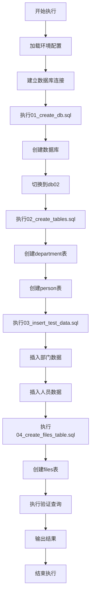

**图表来源**
- [init_db.js:20-61](file://scripts/init_db.js#L20-L61)

### 自定义扩展指南

#### 功能扩展建议

1. **添加新的业务实体**：按照现有表的设计模式创建新表
2. **修改约束规则**：根据业务需求调整CHECK约束
3. **性能优化**：根据实际使用情况添加索引
4. **安全增强**：考虑密码加密存储等安全措施
5. **文件类型扩展**：根据需要添加新的文件类型支持

#### 文件系统扩展

1. **文件版本管理**：添加文件版本控制功能
2. **权限控制**：实现更精细的文件访问权限控制
3. **文件预览**：支持在线文件预览功能
4. **批量操作**：支持文件的批量上传、下载、删除
5. **搜索功能**：添加基于文件名、描述的全文搜索

#### 最佳实践

1. **保持幂等性**：确保脚本可以安全地重复执行
2. **版本控制**：对SQL脚本进行版本管理
3. **文档同步**：及时更新相关文档
4. **测试覆盖**：为新功能编写相应的测试数据
5. **监控告警**：为文件系统添加监控和告警机制

**章节来源**
- [04_create_files_table.sql:1-29](file://sql/04_create_files_table.sql#L1-L29)
- [server.js:94-111](file://server.js#L94-L111)
- [server.js:210-268](file://server.js#L210-L268)