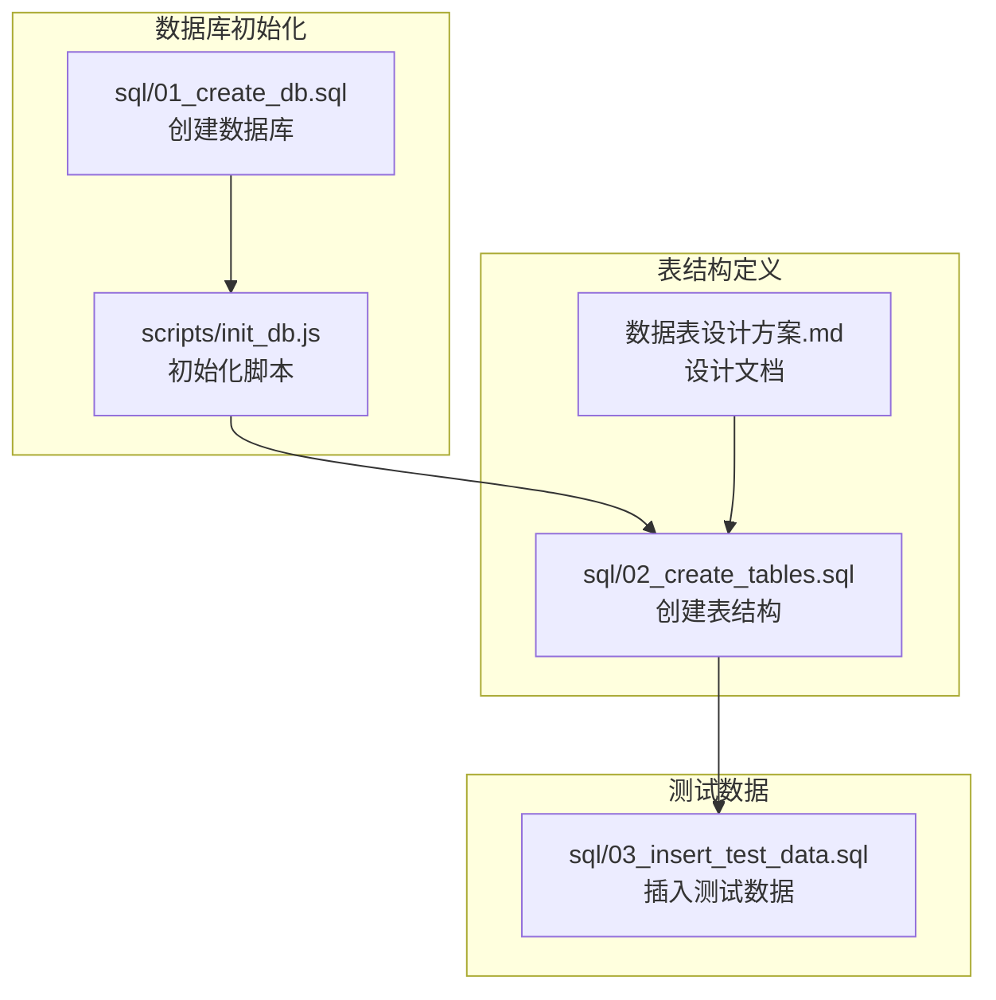
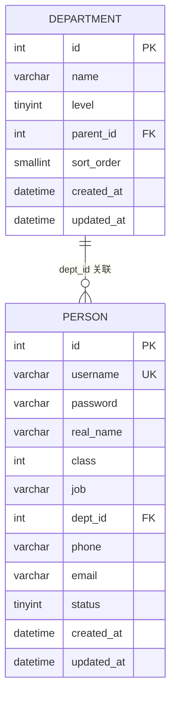
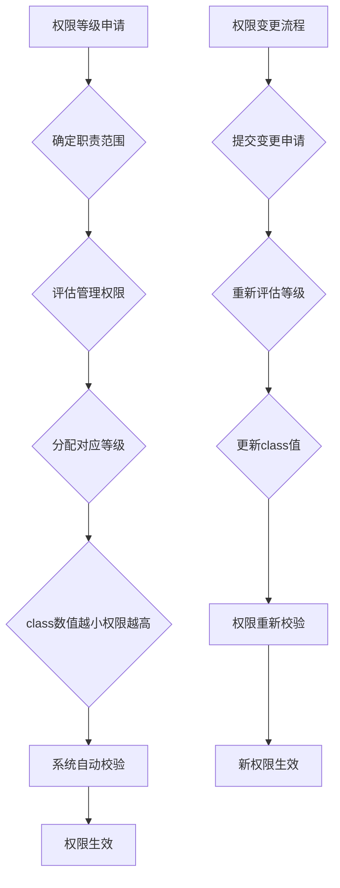
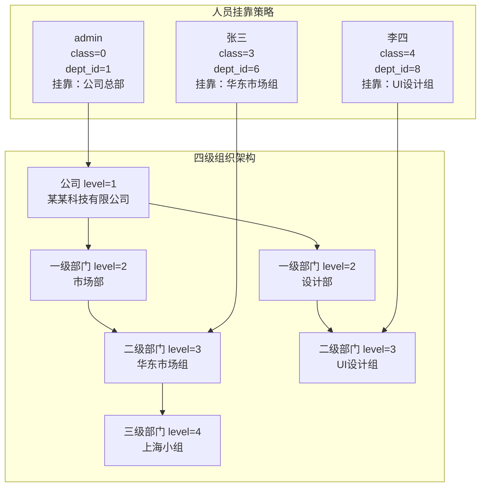
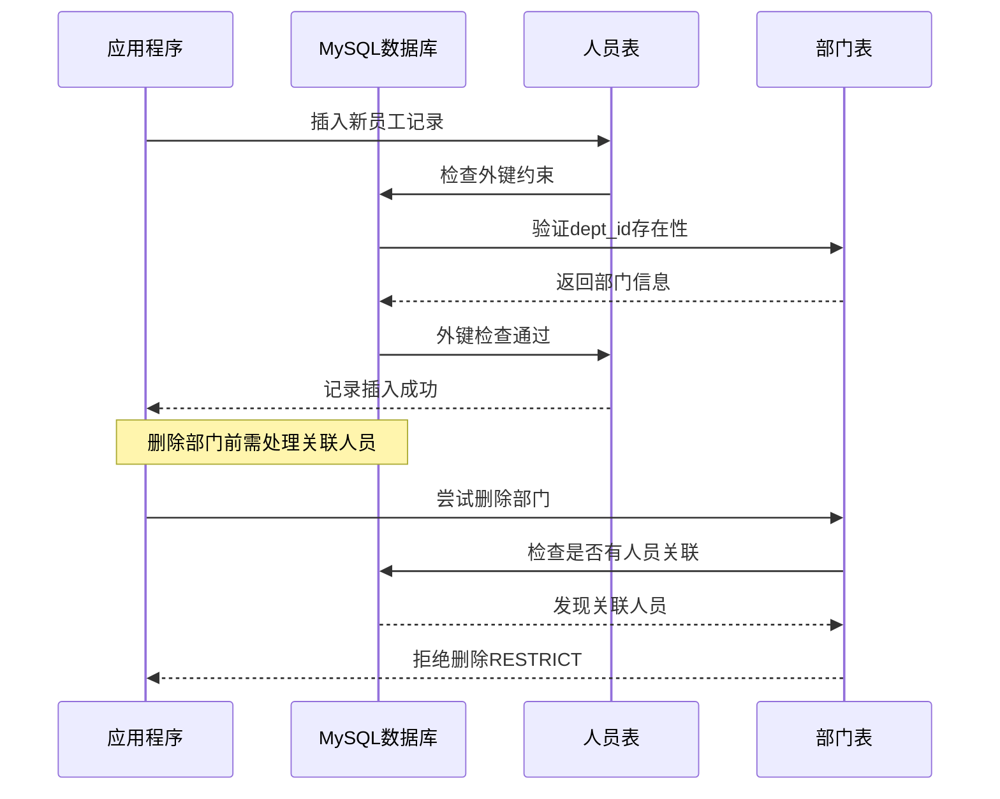
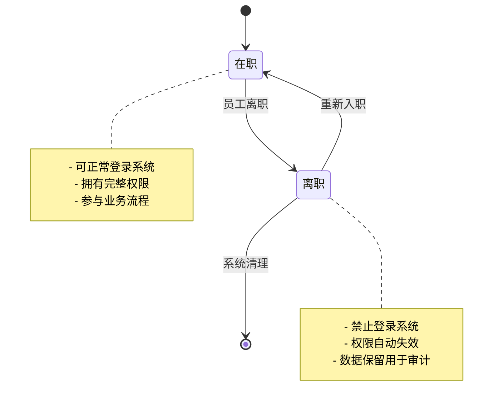
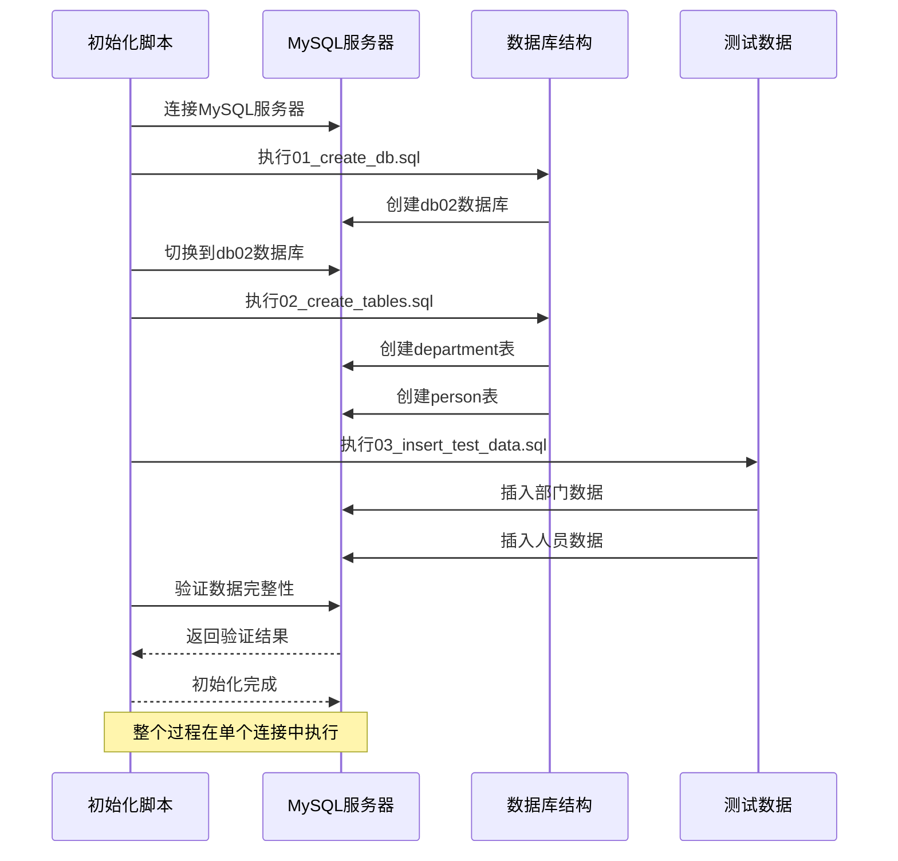
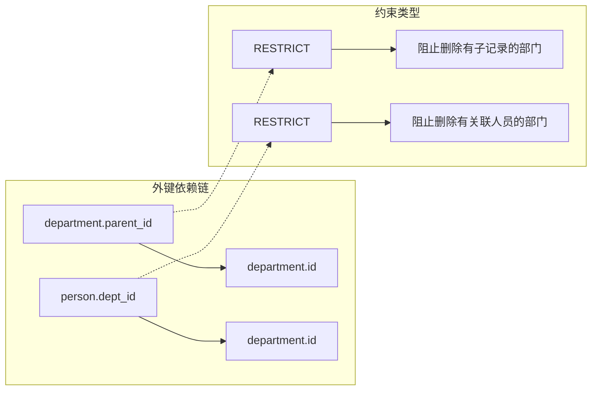

# 人员表设计

<cite>
**本文档引用的文件**
- [sql/02_create_tables.sql](file://sql/02_create_tables.sql)
- [sql/03_insert_test_data.sql](file://sql/03_insert_test_data.sql)
- [数据表设计方案.md](file://数据表设计方案.md)
- [scripts/init_db.js](file://scripts/init_db.js)
- [sql/01_create_db.sql](file://sql/01_create_db.sql)
</cite>

## 目录
1. [简介](#简介)
2. [项目结构](#项目结构)
3. [核心组件](#核心组件)
4. [架构概览](#架构概览)
5. [详细组件分析](#详细组件分析)
6. [依赖分析](#依赖分析)
7. [性能考虑](#性能考虑)
8. [故障排除指南](#故障排除指南)
9. [结论](#结论)
10. [附录](#附录)

## 简介

本文档提供了人员表设计的全面技术文档，重点阐述九级权限体系（class字段）的设计理念、部门外键关联策略以及数据完整性约束。该设计采用邻接表模式构建四级组织架构，通过数字越小级别越高的权限模型实现清晰的管理层级控制。

## 项目结构

该项目采用模块化设计，包含数据库初始化、表结构定义和测试数据三个主要部分：



**图表来源**
- [sql/01_create_db.sql:1-7](file://sql/01_create_db.sql#L1-L7)
- [scripts/init_db.js:20-61](file://scripts/init_db.js#L20-L61)
- [sql/02_create_tables.sql:1-43](file://sql/02_create_tables.sql#L1-L43)

**章节来源**
- [sql/01_create_db.sql:1-7](file://sql/01_create_db.sql#L1-L7)
- [scripts/init_db.js:20-61](file://scripts/init_db.js#L20-L61)
- [数据表设计方案.md:107-115](file://数据表设计方案.md#L107-L115)

## 核心组件

### 人员表（person）核心字段定义

人员表是整个权限体系的核心载体，包含以下关键字段：

| 字段名 | 数据类型 | 约束条件 | 业务含义 |
|--------|----------|----------|----------|
| id | INT UNSIGNED | 主键，自增 | 人员唯一标识符 |
| username | VARCHAR(50) | NOT NULL, UNIQUE | 登录用户名，唯一性约束 |
| password | VARCHAR(100) | NOT NULL | 登录密码（明文存储） |
| real_name | VARCHAR(50) | NOT NULL | 真实姓名 |
| class | INT | NOT NULL, DEFAULT 9 | 用户级别，数字越小级别越高 |
| job | VARCHAR(100) | NOT NULL | 工作岗位 |
| dept_id | INT UNSIGNED | NOT NULL | 所属部门ID（最细粒度部门） |
| phone | VARCHAR(20) | NULL | 手机号 |
| email | VARCHAR(100) | NULL | 电子邮箱 |
| status | TINYINT | NOT NULL, DEFAULT 1 | 状态：1=在职 0=离职 |

**章节来源**
- [sql/02_create_tables.sql:21-42](file://sql/02_create_tables.sql#L21-L42)
- [数据表设计方案.md:32-51](file://数据表设计方案.md#L32-L51)

## 架构概览

人员表与部门表采用严格的外键关联关系，形成完整的组织架构管理体系：



**图表来源**
- [sql/02_create_tables.sql:6-16](file://sql/02_create_tables.sql#L6-L16)
- [sql/02_create_tables.sql:21-42](file://sql/02_create_tables.sql#L21-L42)

### 权限等级体系设计

九级权限体系采用数字越小级别越高的设计理念，具体分级如下：

| 等级值 | 权限级别 | 业务含义 | 示例用户 |
|--------|----------|----------|----------|
| 0 | 最高权限 | 系统管理员 | admin |
| 1 | 高层管理 | 总经理 | 张建 |
| 2 | 一级部门经理 | 各部门负责人 | 李华、王芳 |
| 3 | 二级部门主管 | 组长/主管 | 张三 |
| 4 | 普通员工 | 基层员工 | 李四、王五 |
| 5-9 | 低级权限 | 其他角色 | - |

**章节来源**
- [数据表设计方案.md:54-57](file://数据表设计方案.md#L54-L57)
- [sql/02_create_tables.sql:26](file://sql/02_create_tables.sql#L26)

## 详细组件分析

### 九级权限体系（class字段）

#### 设计理念

权限体系采用"数字越小级别越高"的设计原则，这种反直觉的命名方式实际上体现了权限管理的最佳实践：



**图表来源**
- [数据表设计方案.md:54-57](file://数据表设计方案.md#L54-L57)
- [sql/02_create_tables.sql:26](file://sql/02_create_tables.sql#L26)

#### 业务含义

- **0级（admin）**：系统最高管理员，拥有数据库完全控制权
- **1级（总经理）**：公司最高管理者，负责整体运营
- **2级（部门经理）**：一级部门负责人，管理整个部门
- **3级（主管）**：二级部门负责人，管理具体团队
- **4级及以下**：普通员工，按层级逐级递减

**章节来源**
- [数据表设计方案.md:95-103](file://数据表设计方案.md#L95-L103)
- [sql/03_insert_test_data.sql:32-44](file://sql/03_insert_test_data.sql#L32-L44)

### 部门外键关联策略

#### 最细粒度部门挂靠原则

人员表的dept_id字段采用"最细粒度部门挂靠"策略，即每个员工直接关联到其所在的最小组织单元：



**图表来源**
- [数据表设计方案.md:54](file://数据表设计方案.md#L54)
- [sql/03_insert_test_data.sql:26-27](file://sql/03_insert_test_data.sql#L26-L27)

#### 外键约束设计



**图表来源**
- [sql/02_create_tables.sql:35](file://sql/02_create_tables.sql#L35)
- [sql/02_create_tables.sql:15](file://sql/02_create_tables.sql#L15)

**章节来源**
- [sql/02_create_tables.sql:35](file://sql/02_create_tables.sql#L35)
- [sql/03_insert_test_data.sql:32-44](file://sql/03_insert_test_data.sql#L32-L44)

### 数据完整性约束

#### 手机号格式验证

手机号采用中国手机号标准格式验证，规则如下：

```mermaid
flowchart TD
A[输入手机号] --> B{是否为空?}
B --> |是| C[跳过验证]
B --> |否| D{长度为11位?}
D --> |否| E[验证失败]
D --> |是| F{第一位为1?}
F --> |否| E
F --> |是| G{第二位为3-9?}
G --> |否| E
G --> |是| H[验证通过]
I[正则表达式] --> J[^1[3-9][0-9]{9}$]
```

**图表来源**
- [sql/02_create_tables.sql:36-38](file://sql/02_create_tables.sql#L36-L38)

#### 邮箱格式验证

邮箱采用标准邮箱格式验证，支持常见字符组合：

```mermaid
flowchart TD
A[输入邮箱地址] --> B{是否为空?}
B --> |是| C[跳过验证]
B --> |否| D{包含@符号?}
D --> |否| E[验证失败]
D --> |是| F{@符号前后都有内容?}
F --> |否| E
F --> |是| G{域名后缀至少2位字母?}
G --> |否| E
G --> |是| H[验证通过]
I[正则表达式] --> J[^[A-Za-z0-9._%+\-]+@[A-Za-z0-9.\-]+\.[A-Za-z]{2,}$]
```

**图表来源**
- [sql/02_create_tables.sql:39-41](file://sql/02_create_tables.sql#L39-L41)

**章节来源**
- [sql/02_create_tables.sql:36-41](file://sql/02_create_tables.sql#L36-L41)

### 状态管理机制

#### 在职状态控制

status字段采用TINYINT类型实现简单而高效的状态管理：

| 状态值 | 状态名称 | 业务含义 | 系统行为 |
|--------|----------|----------|----------|
| 1 | 在职 | 员工正常工作状态 | 可登录系统，享有全部权限 |
| 0 | 离职 | 员工已离开公司 | 禁止登录，权限自动失效 |



**图表来源**
- [sql/02_create_tables.sql:31](file://sql/02_create_tables.sql#L31)

**章节来源**
- [sql/02_create_tables.sql:31](file://sql/02_create_tables.sql#L31)
- [sql/03_insert_test_data.sql:32-44](file://sql/03_insert_test_data.sql#L32-L44)

## 依赖分析

### 数据库初始化流程

系统采用顺序化的数据库初始化策略，确保依赖关系得到正确处理：



**图表来源**
- [scripts/init_db.js:20-61](file://scripts/init_db.js#L20-L61)
- [sql/01_create_db.sql:1-7](file://sql/01_create_db.sql#L1-L7)
- [sql/02_create_tables.sql:1-43](file://sql/02_create_tables.sql#L1-L43)

### 外键依赖关系



**图表来源**
- [sql/02_create_tables.sql:15](file://sql/02_create_tables.sql#L15)
- [sql/02_create_tables.sql:35](file://sql/02_create_tables.sql#L35)

**章节来源**
- [scripts/init_db.js:20-61](file://scripts/init_db.js#L20-L61)
- [sql/02_create_tables.sql:15](file://sql/02_create_tables.sql#L15)
- [sql/02_create_tables.sql:35](file://sql/02_create_tables.sql#L35)

## 性能考虑

### 索引优化建议

虽然当前设计已经包含了必要的主键和外键索引，但在高并发场景下可考虑以下优化：

1. **class字段索引**：对于频繁的权限查询，可在class字段上建立索引
2. **dept_id字段索引**：人员统计和部门查询需要高效的dept_id索引
3. **username字段索引**：登录验证需要快速的username索引

### 查询性能优化

```sql
-- 建议的索引创建语句
CREATE INDEX idx_person_class ON person(class);
CREATE INDEX idx_person_dept_status ON person(dept_id, status);
CREATE INDEX idx_person_username ON person(username);
```

### 内存和存储优化

- 使用合适的字符集（utf8mb4）确保emoji等特殊字符支持
- 合理的数据类型选择减少存储空间占用
- 定期进行数据库维护和统计信息更新

## 故障排除指南

### 常见错误及解决方案

#### 外键约束错误

**错误现象**：插入或更新人员记录时报外键约束错误

**可能原因**：
- dept_id指向的部门不存在
- 删除有人员关联的部门

**解决方法**：
1. 验证部门ID的有效性
2. 先处理关联的人员再删除部门
3. 检查部门层级关系的正确性

#### 权限级别冲突

**错误现象**：权限级别设置不合理导致系统异常

**解决方法**：
- 确保class值在0-9范围内
- 遵循"数字越小级别越高"的原则
- 验证权限分配的合理性

#### 数据格式验证失败

**错误现象**：手机号或邮箱格式验证失败

**解决方法**：
- 检查手机号是否为11位数字且以1开头
- 验证邮箱格式是否符合标准
- 确认NULL值不会触发不必要的验证

**章节来源**
- [sql/02_create_tables.sql:36-41](file://sql/02_create_tables.sql#L36-L41)
- [scripts/init_db.js:63-66](file://scripts/init_db.js#L63-L66)

## 结论

该人员表设计通过九级权限体系、最细粒度部门挂靠策略和严格的数据完整性约束，构建了一个清晰、高效且易于维护的组织架构管理系统。设计特点包括：

1. **层次清晰**：通过数字越小级别越高的权限模型，实现了直观的管理层级控制
2. **关联准确**：人员直接挂靠到最细粒度部门，确保组织关系的精确性
3. **约束完善**：通过外键和CHECK约束保证了数据的完整性和一致性
4. **扩展性强**：基于邻接表的部门结构支持灵活的组织架构变化

该设计为后续的权限管理、报表统计和系统集成奠定了坚实的基础。

## 附录

### 实际使用示例

#### 基础查询示例

```sql
-- 查询所有在职员工及其部门信息
SELECT p.username, p.real_name, p.job, d.name as department_name
FROM person p
JOIN department d ON p.dept_id = d.id
WHERE p.status = 1
ORDER BY p.class, p.real_name;

-- 按权限级别统计员工数量
SELECT class, COUNT(*) as employee_count
FROM person
GROUP BY class
ORDER BY class;
```

#### 权限验证示例

```sql
-- 验证用户权限级别的SQL逻辑
SELECT 
    CASE 
        WHEN class = 0 THEN '系统管理员'
        WHEN class = 1 THEN '总经理'
        WHEN class <= 3 THEN '部门负责人'
        ELSE '普通员工'
    END as role_level
FROM person 
WHERE username = ? AND status = 1;
```

### 权限级别对照表

| 等级值 | 角色名称 | 权限描述 | 典型职责 |
|--------|----------|----------|----------|
| 0 | 系统管理员 | 最高权限 | 系统配置、用户管理、数据备份 |
| 1 | 总经理 | 公司级权限 | 战略决策、预算审批 |
| 2 | 部门经理 | 部门级权限 | 团队管理、绩效考核 |
| 3 | 主管 | 团队级权限 | 项目协调、日常管理 |
| 4 | 员工 | 基础权限 | 日常工作、流程执行 |
| 5-9 | 其他角色 | 有限权限 | 特定功能访问 |

**章节来源**
- [数据表设计方案.md:95-103](file://数据表设计方案.md#L95-L103)
- [sql/03_insert_test_data.sql:32-44](file://sql/03_insert_test_data.sql#L32-L44)