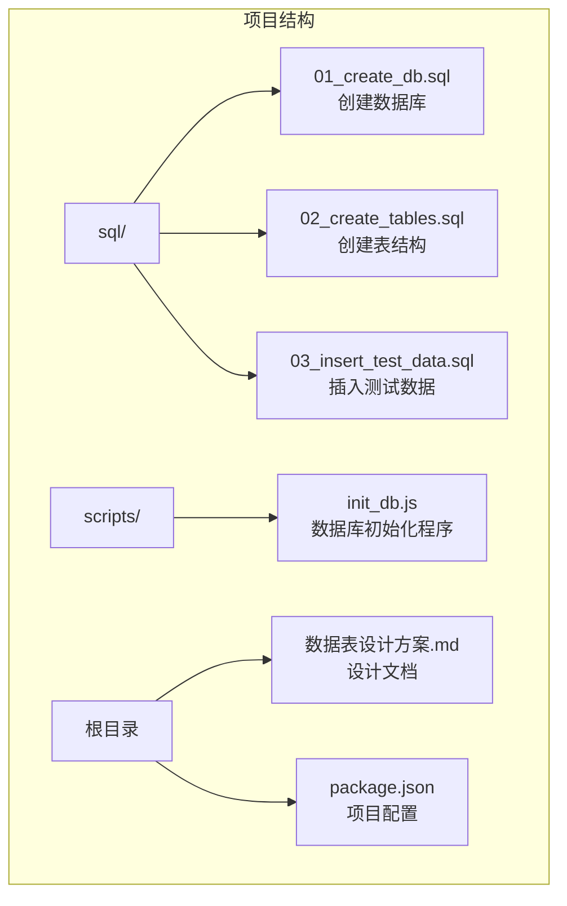
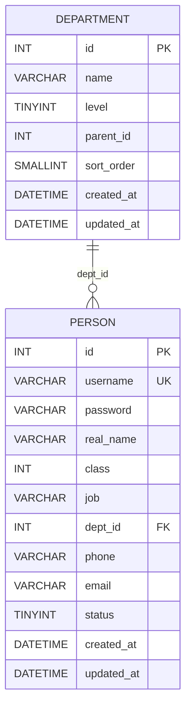
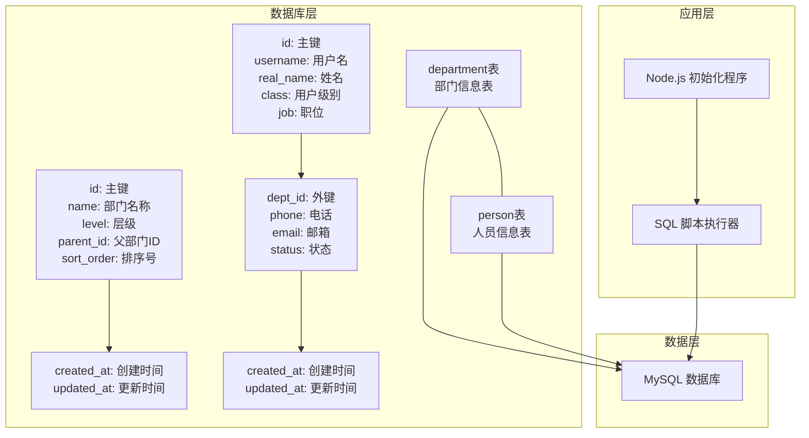
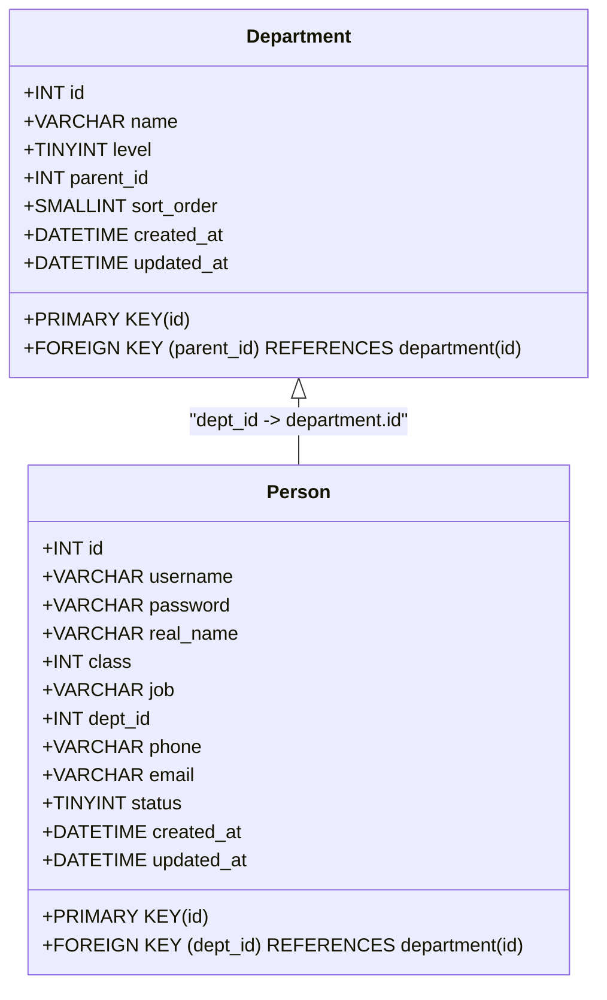
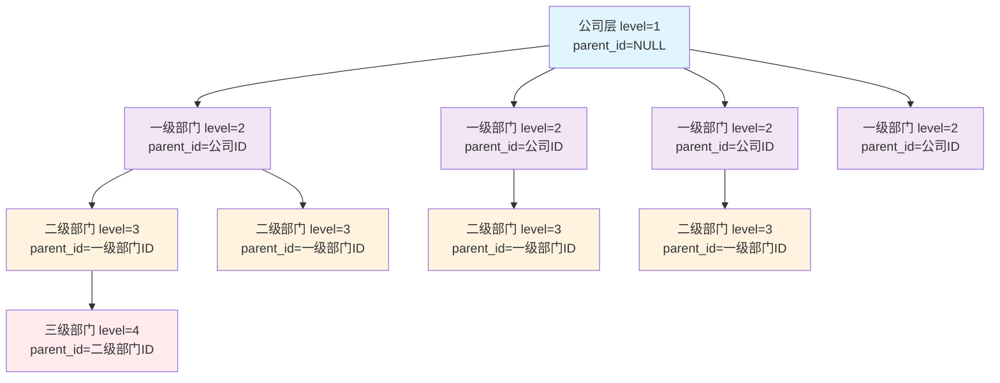
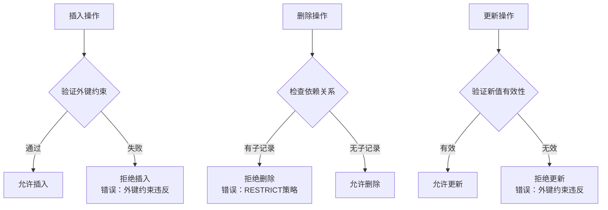
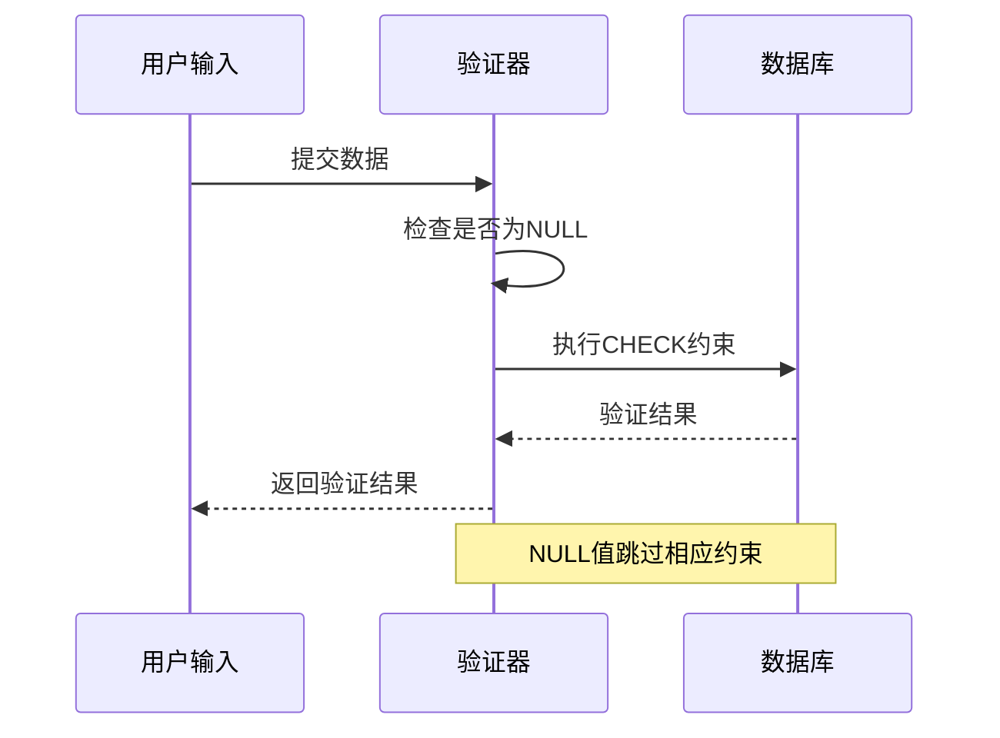
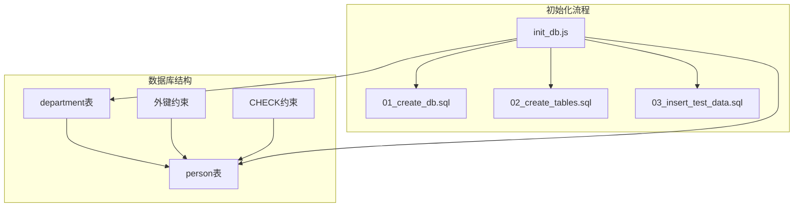
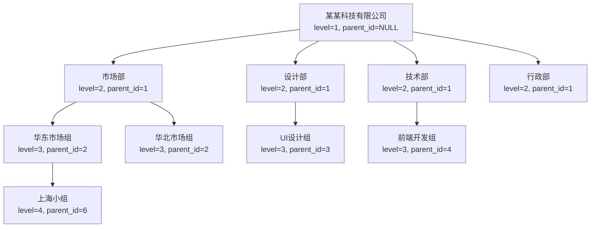
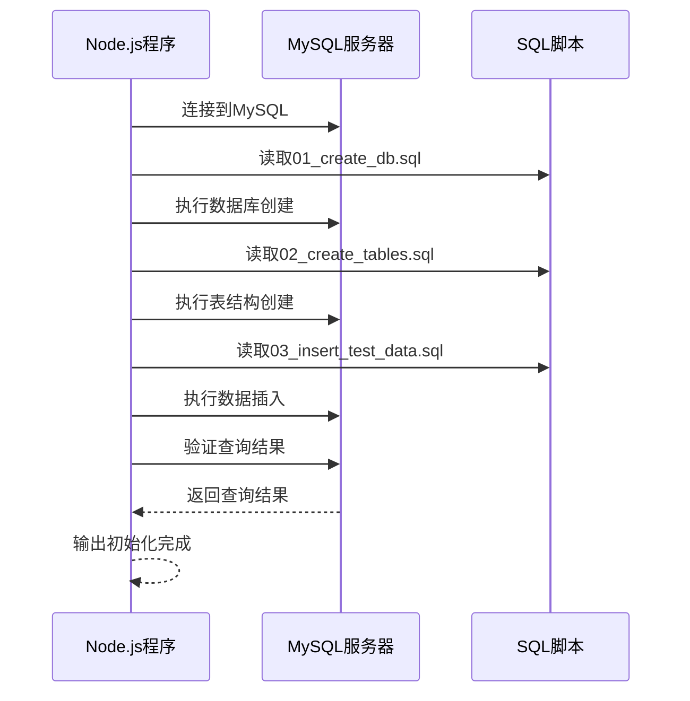

# 关系映射说明

<cite>
**本文档引用的文件**
- [01_create_db.sql](file://sql/01_create_db.sql)
- [02_create_tables.sql](file://sql/02_create_tables.sql)
- [03_insert_test_data.sql](file://sql/03_insert_test_data.sql)
- [init_db.js](file://scripts/init_db.js)
- [数据表设计方案.md](file://数据表设计方案.md)
- [package.json](file://package.json)
</cite>

## 目录
1. [简介](#简介)
2. [项目结构](#项目结构)
3. [核心组件](#核心组件)
4. [架构概览](#架构概览)
5. [详细组件分析](#详细组件分析)
6. [依赖关系分析](#依赖关系分析)
7. [性能考虑](#性能考虑)
8. [故障排除指南](#故障排除指南)
9. [结论](#结论)
10. [附录](#附录)

## 简介

本文件详细说明了数据库中department表和person表之间的关系映射设计。该设计采用邻接表模式实现四级组织架构，通过department.parent_id字段建立层级关系，通过person.dept_id字段实现人员与部门的关联。本文档将深入分析外键关系设计、多对一映射关系、层级关系的传递性、数据完整性约束机制，并提供ER图和关系图来展示表间的数据流向和依赖关系。

## 项目结构

该项目采用模块化结构，包含数据库初始化脚本、表结构定义、测试数据以及Node.js初始化程序：



**图表来源**
- [01_create_db.sql:1-7](file://sql/01_create_db.sql#L1-L7)
- [02_create_tables.sql:1-43](file://sql/02_create_tables.sql#L1-L43)
- [init_db.js:1-67](file://scripts/init_db.js#L1-L67)

**章节来源**
- [01_create_db.sql:1-7](file://sql/01_create_db.sql#L1-L7)
- [02_create_tables.sql:1-43](file://sql/02_create_tables.sql#L1-L43)
- [init_db.js:1-67](file://scripts/init_db.js#L1-L67)
- [数据表设计方案.md:1-115](file://数据表设计方案.md#L1-L115)

## 核心组件

### 数据库设计概述

系统采用邻接表模式实现组织架构管理，支持四级部门层级结构：

- **公司层（level=1）**：顶级部门，parent_id为NULL
- **一级部门（level=2）**：直接隶属于公司层
- **二级部门（level=3）**：隶属于一级部门
- **三级部门（level=4）**：隶属于二级部门

### 表结构设计



**图表来源**
- [02_create_tables.sql:6-16](file://sql/02_create_tables.sql#L6-L16)
- [02_create_tables.sql:21-42](file://sql/02_create_tables.sql#L21-L42)

**章节来源**
- [02_create_tables.sql:6-42](file://sql/02_create_tables.sql#L6-L42)
- [数据表设计方案.md:5-51](file://数据表设计方案.md#L5-L51)

## 架构概览

系统采用三层架构设计，通过外键约束确保数据完整性：



**图表来源**
- [02_create_tables.sql:6-42](file://sql/02_create_tables.sql#L6-L42)
- [init_db.js:20-67](file://scripts/init_db.js#L20-L67)

## 详细组件分析

### 外键关系设计

#### department表设计

department表采用自引用外键设计，通过parent_id字段指向自身的id字段：



**图表来源**
- [02_create_tables.sql:6-16](file://sql/02_create_tables.sql#L6-L16)
- [02_create_tables.sql:21-42](file://sql/02_create_tables.sql#L21-L42)

#### 多对一映射关系

person表与department表之间建立了一对多关系：
- **多的一方**：person表中的每个记录
- **一的一方**：department表中的每个记录
- **映射方式**：通过person.dept_id外键关联到department.id

这种设计确保了：
1. 每个员工只能属于一个具体部门
2. 部门可以包含多个员工
3. 通过dept_id字段实现快速查询和关联

**章节来源**
- [02_create_tables.sql:15-16](file://sql/02_create_tables.sql#L15-L16)
- [02_create_tables.sql:35-36](file://sql/02_create_tables.sql#L35-L36)

### 层级关系传递性分析

#### 邻接表模式实现

系统采用邻接表模式实现层级关系，通过parent_id字段建立父子关系：



**图表来源**
- [数据表设计方案.md:63-72](file://数据表设计方案.md#L63-L72)
- [03_insert_test_data.sql:8-27](file://sql/03_insert_test_data.sql#L8-L27)

#### 层级追溯机制

通过department.parent_id链路可以追溯完整的组织架构：

1. **直接上级**：`person.dept_id` → `department.id` → `department.parent_id`
2. **多级上级**：通过递归查询或多次连接实现
3. **组织边界**：当parent_id为NULL时表示到达公司层

**章节来源**
- [数据表设计方案.md:61-72](file://数据表设计方案.md#L61-L72)
- [03_insert_test_data.sql:8-27](file://sql/03_insert_test_data.sql#L8-L27)

### 数据完整性约束

#### 外键约束机制

系统实现了双重外键约束：

1. **department表自引用约束**：
   - `parent_id` → `department.id`
   - 限制：不允许引用不存在的父部门
   - 删除策略：RESTRICT（有子部门时禁止删除）

2. **person表外键约束**：
   - `dept_id` → `department.id`
   - 限制：不允许引用不存在的部门
   - 删除策略：RESTRICT（有人员时禁止删除部门）



**图表来源**
- [02_create_tables.sql:15-16](file://sql/02_create_tables.sql#L15-L16)
- [02_create_tables.sql:35-36](file://sql/02_create_tables.sql#L35-L36)

#### 级联删除策略

系统采用RESTRICT策略，确保数据完整性：

- **部门删除限制**：当部门下存在子部门或人员时，禁止删除
- **人员删除限制**：当部门下存在人员时，禁止删除
- **保护机制**：防止意外删除导致的数据不一致

**章节来源**
- [02_create_tables.sql:15-16](file://sql/02_create_tables.sql#L15-L16)
- [02_create_tables.sql:35-36](file://sql/02_create_tables.sql#L35-L36)

### 约束验证机制

#### CHECK约束设计

person表实现了数据格式验证：

1. **手机号格式验证**：
   - 规则：1开头的11位数字
   - 特殊处理：NULL值跳过验证

2. **邮箱格式验证**：
   - 规则：标准邮箱格式
   - 特殊处理：NULL值跳过验证



**图表来源**
- [02_create_tables.sql:36-41](file://sql/02_create_tables.sql#L36-L41)

**章节来源**
- [02_create_tables.sql:36-41](file://sql/02_create_tables.sql#L36-L41)

## 依赖关系分析

### 外部依赖

项目依赖以下关键包：

```mermaid
graph LR
A[主项目] --> B[mysql2@^3.20.0<br/>MySQL数据库驱动]
A --> C[dotenv@^17.3.1<br/>.env文件加载]
A --> D[express@^5.2.1<br/>Web框架]
B --> E[Node.js运行时]
C --> E
D --> E
```

**图表来源**
- [package.json:13-17](file://package.json#L13-L17)

### 内部依赖关系



**图表来源**
- [init_db.js:20-47](file://scripts/init_db.js#L20-L47)
- [02_create_tables.sql:6-42](file://sql/02_create_tables.sql#L6-L42)

**章节来源**
- [package.json:13-17](file://package.json#L13-L17)
- [init_db.js:20-47](file://scripts/init_db.js#L20-L47)

## 性能考虑

### 查询优化建议

1. **索引策略**：
   - 在`department.parent_id`上建立索引
   - 在`person.dept_id`上建立索引
   - 在`person.username`上建立唯一索引

2. **查询模式优化**：
   - 使用JOIN查询减少往返次数
   - 避免SELECT *，只选择需要的列
   - 合理使用LIMIT限制结果集

3. **层级查询优化**：
   - 对于深度层级查询，考虑使用存储过程
   - 缓存常用的组织架构查询结果

### 数据完整性维护

- 定期检查外键约束的有效性
- 监控数据一致性
- 实施适当的备份策略

## 故障排除指南

### 常见问题及解决方案

#### 外键约束错误

**问题**：插入或更新时出现外键约束错误
**原因**：引用了不存在的部门ID
**解决**：
1. 验证目标部门是否存在
2. 检查部门ID的正确性
3. 确保先创建父部门再创建子部门

#### 删除限制错误

**问题**：删除部门时报错"RESTRICT策略"
**原因**：部门下仍有子部门或人员
**解决**：
1. 先删除子部门
2. 或者先删除部门下的所有人员
3. 再执行删除操作

#### 数据格式错误

**问题**：手机号或邮箱格式验证失败
**解决**：
1. 检查手机号格式是否为11位数字且以1开头
2. 检查邮箱格式是否符合标准格式
3. 确保NULL值不会触发不必要的验证

**章节来源**
- [init_db.js:63-67](file://scripts/init_db.js#L63-L67)

## 结论

本关系映射设计成功实现了四级组织架构的完整管理。通过邻接表模式和外键约束，系统确保了数据的完整性和一致性。关键设计要点包括：

1. **清晰的层级结构**：通过level字段和parent_id字段明确标识组织层级
2. **强外键约束**：防止数据不一致和孤儿记录
3. **RESTRICT删除策略**：保护重要业务数据
4. **格式验证约束**：确保数据质量
5. **灵活的查询能力**：支持多种组织架构查询需求

该设计为后续的功能扩展提供了良好的基础，包括权限管理、工作流审批等高级功能。

## 附录

### 测试数据结构

系统包含完整的测试数据，涵盖四级组织架构：



**图表来源**
- [03_insert_test_data.sql:8-27](file://sql/03_insert_test_data.sql#L8-L27)

### 初始化流程

系统提供完整的数据库初始化流程：



**图表来源**
- [init_db.js:20-61](file://scripts/init_db.js#L20-L61)