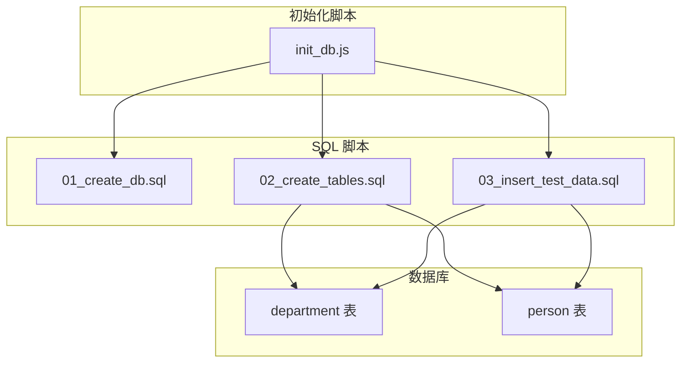
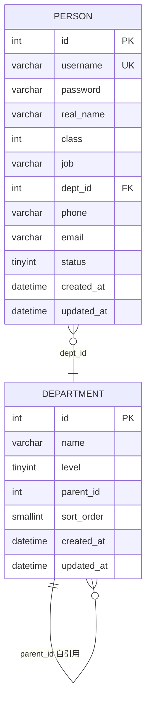
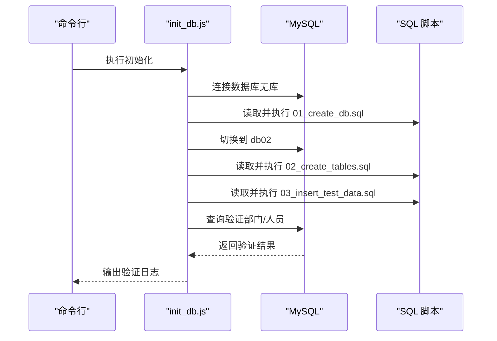
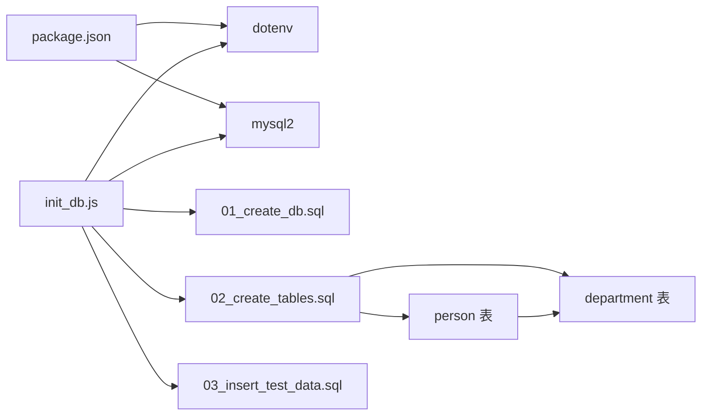

# 数据模型设计

<cite>
**本文档引用的文件**
- [01_create_db.sql](file://sql/01_create_db.sql)
- [02_create_tables.sql](file://sql/02_create_tables.sql)
- [03_insert_test_data.sql](file://sql/03_insert_test_data.sql)
- [init_db.js](file://scripts/init_db.js)
- [数据表设计方案.md](file://数据表设计方案.md)
- [package.json](file://package.json)
</cite>

## 目录
1. [简介](#简介)
2. [项目结构](#项目结构)
3. [核心组件](#核心组件)
4. [架构总览](#架构总览)
5. [详细组件分析](#详细组件分析)
6. [依赖关系分析](#依赖关系分析)
7. [性能考量](#性能考量)
8. [故障排除指南](#故障排除指南)
9. [结论](#结论)
10. [附录](#附录)

## 简介
本文件系统化阐述该组织架构与人员管理系统的数据模型设计，重点包括：
- 邻接表模式的设计理念与实现方式
- 通过 parent_id 字段实现四级部门树形结构
- department 表与 person 表的字段定义、数据类型与约束
- 九级权限体系（class 字段）的设计思路与业务含义
- 外键关系、索引策略与性能考虑
- 数据验证规则、业务规则与完整性约束
- ER 图与数据字典，说明表间关系映射

## 项目结构
该项目采用脚本驱动的数据库初始化流程，包含数据库创建、表结构定义与测试数据插入三个阶段，并提供 Node.js 初始化脚本自动执行这些步骤。

图表来源
- [init_db.js:20-61](file://scripts/init_db.js#L20-L61)
- [01_create_db.sql:1-7](file://sql/01_create_db.sql#L1-L7)
- [02_create_tables.sql:6-42](file://sql/02_create_tables.sql#L6-L42)
- [03_insert_test_data.sql:8-27](file://sql/03_insert_test_data.sql#L8-L27)

章节来源
- [init_db.js:20-61](file://scripts/init_db.js#L20-L61)
- [01_create_db.sql:1-7](file://sql/01_create_db.sql#L1-L7)
- [02_create_tables.sql:6-42](file://sql/02_create_tables.sql#L6-L42)
- [03_insert_test_data.sql:8-27](file://sql/03_insert_test_data.sql#L8-L27)

## 核心组件
本系统由两个核心表组成：department（部门表）与 person（人员表）。它们通过外键关系建立紧密联系，共同支撑组织架构与权限控制。

- department 表
  - 主键：id
  - 关键字段：name、level、parent_id、sort_order
  - 约束：自引用外键 parent_id -> department(id)，删除限制（RESTRICT）
  - 用途：存储四级部门树（公司、一级部门、二级部门、三级部门）

- person 表
  - 主键：id
  - 关键字段：username（唯一）、class、job、dept_id、phone、email、status
  - 约束：dept_id -> department(id)，CHECK(phone/email 正则校验)
  - 用途：存储人员信息与权限等级，挂靠到最细粒度部门

章节来源
- [02_create_tables.sql:6-16](file://sql/02_create_tables.sql#L6-L16)
- [02_create_tables.sql:21-42](file://sql/02_create_tables.sql#L21-L42)
- [数据表设计方案.md:5-27](file://数据表设计方案.md#L5-L27)
- [数据表设计方案.md:30-58](file://数据表设计方案.md#L30-L58)

## 架构总览
邻接表模式通过每个节点记录其父节点 ID 实现树形结构，结合 level 字段与 parent_id 的双重约束，确保层级清晰且可追溯。人员表通过 dept_id 指向最细粒度部门，权限等级通过 class 字段体现。

图表来源
- [02_create_tables.sql:6-16](file://sql/02_create_tables.sql#L6-L16)
- [02_create_tables.sql:21-42](file://sql/02_create_tables.sql#L21-L42)

## 详细组件分析

### 部门表（department）设计
- 字段与类型
  - id：整型自增主键
  - name：部门名称，长度上限 100
  - level：层级标识（1=公司，2=一级部门，3=二级部门，4=三级部门）
  - parent_id：父部门 ID，NULL 表示顶层公司
  - sort_order：同级排序号，默认 0
  - created_at/updated_at：时间戳，默认当前时间，更新时自动刷新

- 约束与关系
  - 主键：id
  - 外键：parent_id 引用 department(id)，删除限制（RESTRICT）
  - 删除限制的作用：当存在子部门时禁止删除父部门，保证树结构完整性

- 设计要点
  - 通过 level + parent_id 双重保障层级关系清晰，避免递归查询时迷失层级
  - parent_id 自引用外键防止非法父部门 ID
  - 叶节点无子部门但自身记录存在，子部门是否存在通过查询子记录判断

- 四级部门树形结构
  - 顶层：level=1，parent_id=NULL（公司）
  - 一级部门：level=2，parent_id 指向公司
  - 二级部门：level=3，parent_id 指向一级部门
  - 三级部门：level=4，parent_id 指向二级部门

章节来源
- [02_create_tables.sql:6-16](file://sql/02_create_tables.sql#L6-L16)
- [数据表设计方案.md:5-27](file://数据表设计方案.md#L5-L27)
- [03_insert_test_data.sql:8-27](file://sql/03_insert_test_data.sql#L8-L27)

### 人员表（person）设计
- 字段与类型
  - id：整型自增主键
  - username：登录用户名，唯一
  - password：登录密码（明文）
  - real_name：真实姓名
  - class：用户级别，数字越小级别越高（0=admin，1=总经理，2=一级部门经理，依此类推）
  - job：工作岗位
  - dept_id：所属部门 ID（关联最细粒度部门）
  - phone：手机号，允许为空
  - email：电子邮箱，允许为空
  - status：状态（1=在职，0=离职）
  - created_at/updated_at：时间戳，默认当前时间，更新时自动刷新

- 约束与关系
  - 主键：id
  - 外键：dept_id 引用 department(id)，删除限制（RESTRICT）
  - 唯一性：username 唯一
  - CHECK 约束：
    - phone：国内手机号格式（1 开头 11 位）
    - email：标准邮箱格式
  - 值为 NULL 时不触发 CHECK 约束

- 设计要点
  - 人员挂靠到最细粒度部门，层级关系通过 department.parent_id 链路追溯
  - class 字段支持九级权限体系（class=0~8），数字越小级别越高
  - password 存储明文（安全建议：生产环境应加密存储）

- 九级权限体系（class 字段）
  - 0：系统管理员（最高权限）
  - 1：总经理
  - 2：一级部门经理
  - 3：二级部门主管
  - 4：普通员工
  - 5~8：预留扩展级别（可根据业务需要继续细分）

章节来源
- [02_create_tables.sql:21-42](file://sql/02_create_tables.sql#L21-L42)
- [数据表设计方案.md:30-58](file://数据表设计方案.md#L30-L58)
- [03_insert_test_data.sql:32-44](file://sql/03_insert_test_data.sql#L32-L44)

### 初始化流程与数据验证
- 初始化流程
  - 步骤 1：创建数据库 db02
  - 步骤 2：创建数据表（department、person）
  - 步骤 3：插入虚拟测试数据
  - 步骤 4：验证结果（输出部门与人员列表）

- 数据验证
  - 部门表：按 level 与 sort_order 排序输出，确认四级结构正确
  - 人员表：按 class 排序输出，确认权限等级与挂靠部门正确

图表来源
- [init_db.js:20-61](file://scripts/init_db.js#L20-L61)
- [01_create_db.sql:1-7](file://sql/01_create_db.sql#L1-L7)
- [02_create_tables.sql:6-42](file://sql/02_create_tables.sql#L6-L42)
- [03_insert_test_data.sql:8-44](file://sql/03_insert_test_data.sql#L8-L44)

章节来源
- [init_db.js:20-61](file://scripts/init_db.js#L20-L61)

## 依赖关系分析
- 外部依赖
  - dotenv：用于从 .env 文件读取数据库连接参数
  - mysql2：用于 Node.js 与 MySQL 的异步连接与查询

- 内部依赖
  - init_db.js 顺序依赖三个 SQL 脚本：先创建数据库，再创建表，最后插入测试数据
  - person 表依赖 department 表（外键约束）
  - department 表依赖自身（parent_id 自引用）

图表来源
- [package.json:13-16](file://package.json#L13-L16)
- [init_db.js:1-67](file://scripts/init_db.js#L1-L67)
- [02_create_tables.sql:6-42](file://sql/02_create_tables.sql#L6-L42)

章节来源
- [package.json:13-16](file://package.json#L13-L16)
- [init_db.js:1-67](file://scripts/init_db.js#L1-L67)

## 性能考量
- 索引策略
  - department 表
    - 主键 id：默认聚簇索引，查询与更新高效
    - parent_id：建议添加索引以优化父子查询与层级遍历
    - level：可用于快速筛选特定层级
    - sort_order：配合 level 使用，支持同级排序查询
  - person 表
    - 主键 id：默认聚簇索引
    - username：唯一索引，支持登录名快速查找
    - dept_id：建议添加索引以优化按部门统计与关联查询
    - class：可用于权限相关的快速筛选

- 查询优化建议
  - 层级查询：使用 JOIN 或递归 CTE（如 MySQL 8.0+）实现多级上溯或下探
  - 排序：利用 sort_order 与 level 组合索引提升排序效率
  - 权限控制：按 class 过滤时优先使用索引列

- 存储与字符集
  - 使用 utf8mb4 字符集，支持完整的 Unicode 与表情符号
  - InnoDB 引擎提供事务与外键支持，适合高并发场景

[本节为通用性能指导，不直接分析具体文件]

## 故障排除指南
- 初始化失败
  - 检查 .env 中数据库连接参数是否正确
  - 确认 MySQL 服务运行正常且具备创建数据库与表的权限
  - 查看 init_db.js 的错误输出定位具体 SQL 语句

- 外键约束错误
  - 插入或更新时出现外键冲突：确认被引用的 parent_id 或 dept_id 是否存在
  - 删除受限：若存在子部门或人员关联，请先清理子节点或解除关联

- 数据校验失败
  - phone/email 格式不匹配：检查正则表达式与输入值
  - username 重复：确保唯一性约束满足

- 数据验证
  - 使用 init_db.js 的验证输出核对部门与人员数据是否符合预期

章节来源
- [init_db.js:63-66](file://scripts/init_db.js#L63-L66)
- [02_create_tables.sql:15](file://sql/02_create_tables.sql#L15)
- [02_create_tables.sql:35](file://sql/02_create_tables.sql#L35)
- [02_create_tables.sql:36-41](file://sql/02_create_tables.sql#L36-L41)

## 结论
该数据模型以邻接表为核心，通过 parent_id 与 level 字段清晰表达四级部门树形结构；通过 class 字段构建九级权限体系，结合外键与 CHECK 约束保障数据完整性与一致性。初始化脚本自动化执行数据库创建、表结构定义与测试数据插入，便于快速部署与验证。建议在生产环境中为关键查询列添加索引，并将密码改为加密存储以提升安全性。

[本节为总结性内容，不直接分析具体文件]

## 附录

### 数据字典
- department 表
  - id：整型自增主键
  - name：部门名称（VARCHAR(100)）
  - level：层级（TINYINT，1~4）
  - parent_id：父部门 ID（INT，可为空）
  - sort_order：同级排序号（SMALLINT，默认 0）
  - created_at/updated_at：时间戳

- person 表
  - id：整型自增主键
  - username：登录用户名（VARCHAR(50)，唯一）
  - password：登录密码（VARCHAR(100)）
  - real_name：真实姓名（VARCHAR(50)）
  - class：用户级别（INT，默认 9，数字越小级别越高）
  - job：工作岗位（VARCHAR(100)）
  - dept_id：所属部门 ID（INT）
  - phone：手机号（VARCHAR(20)，可为空）
  - email：电子邮箱（VARCHAR(100)，可为空）
  - status：状态（TINYINT，默认 1，1=在职，0=离职）
  - created_at/updated_at：时间戳

章节来源
- [02_create_tables.sql:6-16](file://sql/02_create_tables.sql#L6-L16)
- [02_create_tables.sql:21-42](file://sql/02_create_tables.sql#L21-L42)

### 测试数据示例（部门与人员）
- 部门数据（四级结构）
  - level 1：公司（parent_id=NULL）
  - level 2：市场部、设计部、技术部、行政部
  - level 3：华东市场组、华北市场组、UI设计组、前端开发组
  - level 4：上海小组

- 人员数据
  - admin：class=0，挂靠公司顶层
  - zhangjian：class=1，总经理，挂靠公司
  - lihua/wangfang：class=2，一级部门经理，分别挂靠市场部/设计部
  - zhangsan：class=3，二级部门主管，挂靠华东市场组
  - lisi/wangwu：class=4，普通员工，分别挂靠 UI设计组/前端开发组

章节来源
- [03_insert_test_data.sql:8-27](file://sql/03_insert_test_data.sql#L8-L27)
- [03_insert_test_data.sql:32-44](file://sql/03_insert_test_data.sql#L32-L44)