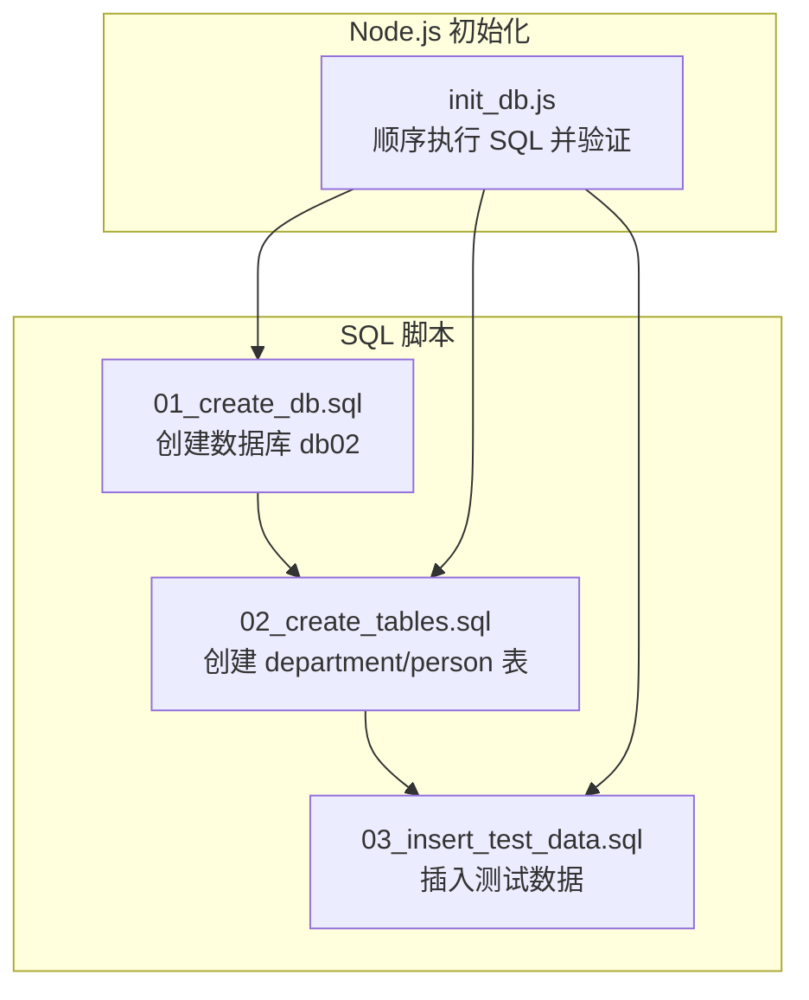
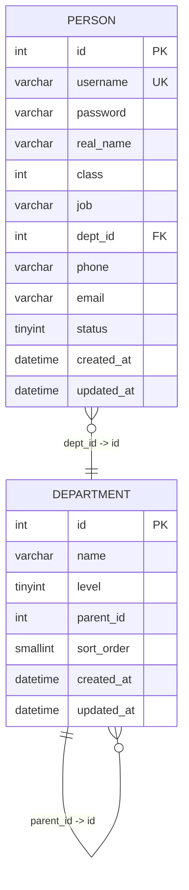
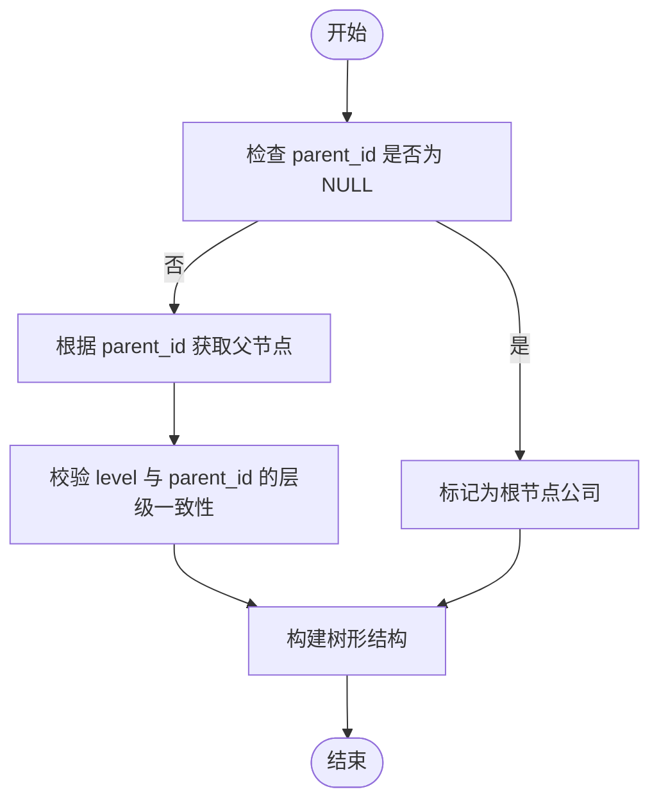
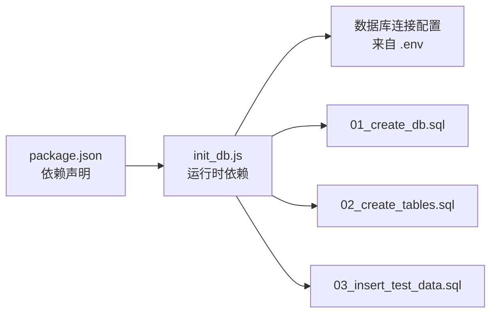

# 部门表设计

<cite>
**本文档引用的文件**
- [sql/02_create_tables.sql](file://sql/02_create_tables.sql)
- [sql/03_insert_test_data.sql](file://sql/03_insert_test_data.sql)
- [数据表设计方案.md](file://数据表设计方案.md)
- [scripts/init_db.js](file://scripts/init_db.js)
- [sql/01_create_db.sql](file://sql/01_create_db.sql)
- [package.json](file://package.json)
</cite>

## 目录
1. [简介](#简介)
2. [项目结构](#项目结构)
3. [核心组件](#核心组件)
4. [架构总览](#架构总览)
5. [详细组件分析](#详细组件分析)
6. [依赖分析](#依赖分析)
7. [性能考虑](#性能考虑)
8. [故障排查指南](#故障排查指南)
9. [结论](#结论)
10. [附录](#附录)

## 简介
本设计文档围绕“部门表”展开，重点阐述邻接表模式在组织架构中的实现方式，详解 parent_id 如何建立父子部门关系，level 字段的层级标识机制，以及 sort_order 的排序控制。同时说明外键约束与 ON DELETE RESTRICT 的保护作用，并给出字段定义、数据类型选择、索引策略与性能优化建议。最后通过实际的部门层级示例与查询场景，展示如何利用 parent_id 链路实现树形结构遍历。

## 项目结构
该项目采用“SQL 脚本 + Node.js 初始化脚本”的结构：
- SQL 脚本按顺序创建数据库、表结构与测试数据
- Node.js 脚本负责自动化执行 SQL 并输出验证结果

图表来源
- [sql/01_create_db.sql:1-7](file://sql/01_create_db.sql#L1-L7)
- [sql/02_create_tables.sql:1-43](file://sql/02_create_tables.sql#L1-L43)
- [sql/03_insert_test_data.sql:1-45](file://sql/03_insert_test_data.sql#L1-L45)
- [scripts/init_db.js:20-61](file://scripts/init_db.js#L20-L61)

章节来源
- [sql/01_create_db.sql:1-7](file://sql/01_create_db.sql#L1-L7)
- [sql/02_create_tables.sql:1-43](file://sql/02_create_tables.sql#L1-L43)
- [sql/03_insert_test_data.sql:1-45](file://sql/03_insert_test_data.sql#L1-L45)
- [scripts/init_db.js:1-67](file://scripts/init_db.js#L1-L67)
- [数据表设计方案.md:1-115](file://数据表设计方案.md#L1-L115)

## 核心组件
- 部门表（department）
  - 主键：id（自增）
  - 关键字段：name、level、parent_id、sort_order
  - 外键：parent_id 引用 department.id，ON DELETE RESTRICT
  - 时间戳：created_at、updated_at
- 人员表（person）
  - 主键：id（自增）
  - 关联字段：dept_id 引用 department.id，ON DELETE RESTRICT
  - 其他业务字段：username、password、real_name、class、job、phone、email、status
  - 约束：phone/email 的正则校验

章节来源
- [sql/02_create_tables.sql:6-16](file://sql/02_create_tables.sql#L6-L16)
- [sql/02_create_tables.sql:21-42](file://sql/02_create_tables.sql#L21-L42)
- [数据表设计方案.md:5-21](file://数据表设计方案.md#L5-L21)
- [数据表设计方案.md:30-51](file://数据表设计方案.md#L30-L51)

## 架构总览
邻接表模式通过每个节点保存父节点引用 parent_id 实现树形结构。level 字段用于明确层级，sort_order 用于同级排序。外键约束保证 parent_id 的合法性与删除保护。

图表来源
- [sql/02_create_tables.sql:6-16](file://sql/02_create_tables.sql#L6-L16)
- [sql/02_create_tables.sql:21-42](file://sql/02_create_tables.sql#L21-L42)

## 详细组件分析

### 邻接表模式与父子关系
- parent_id 指向父部门的 id，形成自引用关系
- 根节点（公司）parent_id 为 NULL
- 通过 parent_id 链路可向上追溯到根节点，向下遍历子树
- level 字段与 parent_id 双重保障层级关系清晰，避免递归查询时迷失层级

图表来源
- [数据表设计方案.md:7-7](file://数据表设计方案.md#L7-L7)
- [sql/02_create_tables.sql:9-10](file://sql/02_create_tables.sql#L9-L10)

章节来源
- [数据表设计方案.md:7-7](file://数据表设计方案.md#L7-L7)
- [sql/02_create_tables.sql:9-10](file://sql/02_create_tables.sql#L9-L10)

### level 字段的层级标识机制
- level 明确标注所在层级，1=公司，2=一级部门，3=二级部门，4=三级部门
- 与 parent_id 配合，确保树形结构的层级约束
- 在查询时可用于快速筛选特定层级或进行层级范围查询

章节来源
- [数据表设计方案.md:7-7](file://数据表设计方案.md#L7-L7)
- [sql/02_create_tables.sql:9-9](file://sql/02_create_tables.sql#L9-L9)

### sort_order 字段的排序功能
- 同级排序号，数值越小排序越前
- 与 level 组合，可在同一层级内按 sort_order 排序
- 插入测试数据中体现了 sort_order 的使用

章节来源
- [数据表设计方案.md:7-7](file://数据表设计方案.md#L7-L7)
- [sql/02_create_tables.sql:11-11](file://sql/02_create_tables.sql#L11-L11)
- [sql/03_insert_test_data.sql:8-27](file://sql/03_insert_test_data.sql#L8-L27)

### 外键约束与 ON DELETE RESTRICT 的保护作用
- department.parent_id 引用 department.id，防止非法父部门 ID
- department.dept_id 引用 department.id，防止非法部门 ID
- ON DELETE RESTRICT：当存在子部门或关联人员时，禁止删除父部门，保护数据完整性

章节来源
- [sql/02_create_tables.sql:15-15](file://sql/02_create_tables.sql#L15-L15)
- [sql/02_create_tables.sql:35-35](file://sql/02_create_tables.sql#L35-L35)
- [数据表设计方案.md:26-26](file://数据表设计方案.md#L26-L26)

### 字段定义与数据类型选择
- id：整型自增主键，适合高并发下的索引与连接
- name：VARCHAR(100)，满足部门名称长度需求
- level：TINYINT，层级有限（1-4），节省存储空间
- parent_id：INT UNSIGNED，NULL 表示根节点
- sort_order：SMALLINT，支持同级排序
- created_at/updated_at：DATETIME，默认时间戳，便于审计与同步
- dept_id：INT UNSIGNED，人员归属部门的外键

章节来源
- [sql/02_create_tables.sql:7-13](file://sql/02_create_tables.sql#L7-L13)
- [sql/02_create_tables.sql:22-33](file://sql/02_create_tables.sql#L22-L33)

### 索引策略与性能优化
- 主键索引：department.id、person.id（自动创建）
- 建议索引：
  - department(parent_id)：加速向上遍历与子节点查询
  - department(level, sort_order)：加速层级与排序查询
  - person(dept_id)：加速按部门统计与人员查询
- 查询优化：
  - 使用 LIMIT 控制树形遍历深度
  - 使用 EXPLAIN 分析查询计划
  - 对高频查询字段建立复合索引

章节来源
- [sql/02_create_tables.sql:14-14](file://sql/02_create_tables.sql#L14-L14)
- [sql/02_create_tables.sql:34-34](file://sql/02_create_tables.sql#L34-L34)
- [数据表设计方案.md:26-26](file://数据表设计方案.md#L26-L26)

### 实际部门层级示例与查询场景
- 四级结构示例：公司 -> 一级部门 -> 二级部门 -> 三级部门
- 示例数据展示了从公司到三级部门的完整链路
- 查询场景：
  - 获取某部门的所有子部门：以 parent_id 连接
  - 获取某部门的上级部门链：沿 parent_id 向上遍历
  - 获取某部门的同级排序列表：按 level 与 sort_order 排序
  - 删除保护：当存在子部门或人员时，禁止删除父部门

章节来源
- [数据表设计方案.md:61-72](file://数据表设计方案.md#L61-L72)
- [sql/03_insert_test_data.sql:8-27](file://sql/03_insert_test_data.sql#L8-L27)
- [scripts/init_db.js:51-57](file://scripts/init_db.js#L51-L57)

## 依赖分析
- Node.js 初始化脚本依赖 mysql2 与 dotenv
- 初始化流程依次执行数据库创建、表创建、数据插入
- 验证阶段对部门与人员表进行查询与打印

图表来源
- [package.json:13-16](file://package.json#L13-L16)
- [scripts/init_db.js:1-67](file://scripts/init_db.js#L1-L67)
- [sql/01_create_db.sql:1-7](file://sql/01_create_db.sql#L1-L7)
- [sql/02_create_tables.sql:1-43](file://sql/02_create_tables.sql#L1-L43)
- [sql/03_insert_test_data.sql:1-45](file://sql/03_insert_test_data.sql#L1-L45)

章节来源
- [package.json:1-18](file://package.json#L1-L18)
- [scripts/init_db.js:1-67](file://scripts/init_db.js#L1-L67)

## 性能考虑
- 邻接表查询复杂度：单层查询 O(1)，树形遍历 O(n)
- 建议：
  - 限制树形遍历深度，避免全量扫描
  - 使用缓存（如 Redis）缓存热点部门树
  - 对高频查询字段建立复合索引
  - 定期分析慢查询日志，优化查询计划
- 删除操作：由于 ON DELETE RESTRICT，需先处理子部门与人员再删除

章节来源
- [数据表设计方案.md:26-26](file://数据表设计方案.md#L26-L26)
- [sql/02_create_tables.sql:15-15](file://sql/02_create_tables.sql#L15-L15)

## 故障排查指南
- 删除失败（父部门仍有子部门或人员）：先删除子部门或人员，再删除父部门
- 查询异常（层级错乱）：检查 level 与 parent_id 的一致性
- 排序异常（同级顺序错误）：检查 sort_order 的赋值逻辑
- 初始化失败：确认 .env 中数据库连接参数正确，数据库已创建

章节来源
- [scripts/init_db.js:63-66](file://scripts/init_db.js#L63-L66)
- [sql/02_create_tables.sql:15-15](file://sql/02_create_tables.sql#L15-L15)
- [sql/02_create_tables.sql:35-35](file://sql/02_create_tables.sql#L35-L35)

## 结论
该部门表设计采用邻接表模式，通过 parent_id 与 level 双重机制清晰表达层级关系，配合 sort_order 实现同级排序。外键约束与 ON DELETE RESTRICT 有效保护数据完整性。结合合理的索引策略与查询优化，可在中小规模组织架构中高效支撑树形结构的查询与维护。

## 附录
- 初始化步骤
  - 创建数据库：执行 01_create_db.sql
  - 创建表：执行 02_create_tables.sql
  - 插入测试数据：执行 03_insert_test_data.sql
  - 验证结果：Node.js 脚本会输出部门与人员的验证信息

章节来源
- [数据表设计方案.md:107-115](file://数据表设计方案.md#L107-L115)
- [scripts/init_db.js:20-61](file://scripts/init_db.js#L20-L61)