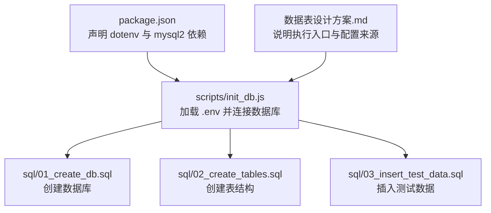
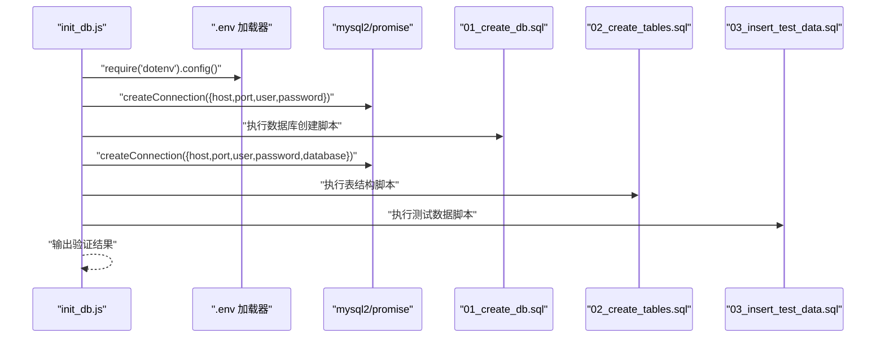
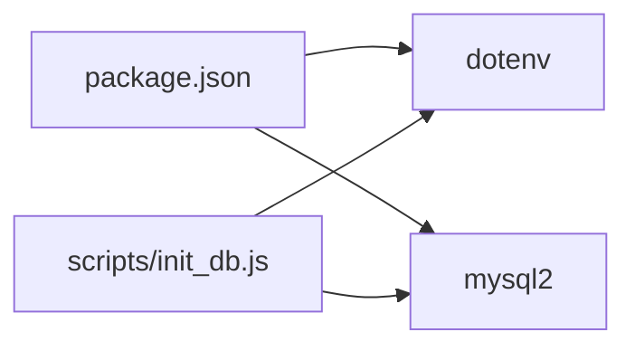

# 配置管理

<cite>
**本文档引用的文件**
- [package.json](file://package.json)
- [init_db.js](file://scripts/init_db.js)
- [01_create_db.sql](file://sql/01_create_db.sql)
- [02_create_tables.sql](file://sql/02_create_tables.sql)
- [03_insert_test_data.sql](file://sql/03_insert_test_data.sql)
- [数据表设计方案.md](file://数据表设计方案.md)
</cite>

## 目录
1. [引言](#引言)
2. [项目结构](#项目结构)
3. [核心组件](#核心组件)
4. [架构总览](#架构总览)
5. [详细组件分析](#详细组件分析)
6. [依赖分析](#依赖分析)
7. [性能考虑](#性能考虑)
8. [故障排除指南](#故障排除指南)
9. [结论](#结论)
10. [附录](#附录)

## 引言
本文件围绕项目中的配置管理进行系统化说明，重点覆盖 dotenv 环境变量系统的使用方式、数据库连接配置与安全注意事项、不同运行环境下的配置差异与最佳实践、配置验证方法与故障排除流程，并给出扩展新配置项与保护敏感信息的建议。由于当前仓库中未包含 .env 文件，本文档将基于现有脚本与依赖对配置项进行规范性梳理，并提供可直接落地的实施步骤。

## 项目结构
该项目采用 Node.js + MySQL 的最小化配置方案，核心配置由 dotenv 加载的环境变量驱动，数据库初始化脚本通过这些变量建立连接并执行 SQL 脚本。

**图表来源**
- [package.json:1-18](file://package.json#L1-L18)
- [init_db.js:1-67](file://scripts/init_db.js#L1-L67)
- [01_create_db.sql:1-7](file://sql/01_create_db.sql#L1-L7)
- [02_create_tables.sql:1-43](file://sql/02_create_tables.sql#L1-L43)
- [03_insert_test_data.sql:1-45](file://sql/03_insert_test_data.sql#L1-L45)
- [数据表设计方案.md:107-115](file://数据表设计方案.md#L107-L115)

**章节来源**
- [package.json:1-18](file://package.json#L1-L18)
- [init_db.js:1-67](file://scripts/init_db.js#L1-L67)
- [数据表设计方案.md:107-115](file://数据表设计方案.md#L107-L115)

## 核心组件
- dotenv 环境变量加载器：在脚本启动时加载 .env 中的键值对，供后续模块通过 process.env 访问。
- 数据库连接模块：使用 mysql2/promise 连接 MySQL，连接参数来自 dotenv 提供的环境变量。
- SQL 初始化脚本：按顺序执行数据库创建、表结构创建与测试数据插入。

关键点
- dotenv 在脚本顶部被显式调用，确保 process.env 在模块导入前可用。
- 数据库连接参数包括主机、端口、用户名、密码以及目标数据库名等。
- 脚本对端口进行了类型转换处理，确保数值类型正确传入连接函数。

**章节来源**
- [init_db.js:1-67](file://scripts/init_db.js#L1-L67)

## 架构总览
下图展示了从 dotenv 加载到数据库初始化的整体流程：

**图表来源**
- [init_db.js:1-67](file://scripts/init_db.js#L1-L67)
- [01_create_db.sql:1-7](file://sql/01_create_db.sql#L1-L7)
- [02_create_tables.sql:1-43](file://sql/02_create_tables.sql#L1-L43)
- [03_insert_test_data.sql:1-45](file://sql/03_insert_test_data.sql#L1-L45)

## 详细组件分析

### dotenv 环境变量系统
- 加载时机：脚本入口处显式调用 dotenv.config()，保证 process.env 在后续模块导入前已填充。
- 配置来源：.env 文件位于项目根目录，键值对形式定义运行所需参数。
- 作用范围：仅在当前进程有效，适合本地开发与 CI 环境隔离。

最佳实践
- 将 .env 作为机密文件纳入版本控制忽略列表，避免泄露。
- 为不同环境准备独立的 .env 文件（如 .env.development、.env.production），并通过启动命令切换。
- 对于必须提交的默认示例，提供 .env.example 并标注占位符。

**章节来源**
- [init_db.js:1](file://scripts/init_db.js#L1)
- [数据表设计方案.md:114-115](file://数据表设计方案.md#L114-L115)

### 数据库连接配置
- 必需参数
  - 主机地址：用于定位数据库服务器。
  - 端口：MySQL 默认端口通常为 3306，脚本中对端口进行了数值转换。
  - 用户名与密码：用于认证。
  - 目标数据库名：在第二阶段连接中指定，用于后续操作。
- 连接策略
  - 首次连接：不指定数据库名，用于执行数据库创建脚本。
  - 第二次连接：指定数据库名，执行表结构与数据初始化。
- 安全建议
  - 密码与敏感信息应存储在受控环境变量中，不在代码库中硬编码。
  - 使用专用低权限账户执行初始化脚本，避免授予不必要的权限。
  - 在生产环境启用 TLS 连接与强密码策略。

**章节来源**
- [init_db.js:20-41](file://scripts/init_db.js#L20-L41)

### 超时设置与错误处理
- 当前脚本未显式设置连接超时或查询超时参数。
- 建议在生产环境中为连接与查询分别设置合理的超时时间，以避免长时间阻塞。
- 错误处理：脚本在主流程外捕获异常并退出，建议在连接与 SQL 执行处增加更细粒度的 try/catch 与日志记录。

**章节来源**
- [init_db.js:63-66](file://scripts/init_db.js#L63-L66)

### 不同环境的配置差异与最佳实践
- 开发环境
  - 使用本地 MySQL 实例，允许弱密码与调试日志。
  - .env.development 中可包含本地数据库凭据与调试开关。
- 测试环境
  - 使用独立数据库实例或容器化服务，确保与开发隔离。
  - .env.test 中配置测试专用凭据与较小的数据集。
- 生产环境
  - 使用只读或受限权限账户，启用 TLS 与强密码。
  - .env.production 中仅包含必要参数，避免暴露内部路径与密钥。
  - 通过 CI/CD 注入环境变量，不在仓库中保留 .env 文件。

[本节为通用实践说明，不直接分析具体文件]

### 配置验证方法
- 启动后输出验证：脚本在初始化完成后查询部门与人员表，打印记录数量与部分字段，便于快速确认初始化是否成功。
- 建议补充
  - 结构校验：检查表是否存在、索引是否完整。
  - 权限校验：确认连接账户具备执行 DDL/DML 的权限。
  - 连接健康检查：尝试执行一条简单查询（如 SELECT 1）验证连通性。

**章节来源**
- [init_db.js:50-58](file://scripts/init_db.js#L50-L58)

### 故障排除指南
- 症状：无法连接数据库
  - 排查：确认 .env 中主机、端口、用户名、密码是否正确；网络连通性；防火墙规则。
- 症状：初始化失败
  - 排查：查看 SQL 文件语法与字符集设置；确认数据库已创建且可访问；检查连接参数是否一致。
- 症状：权限不足
  - 排查：确认连接账户具备 CREATE、ALTER、INSERT 等权限；在生产环境使用最小权限原则。
- 症状：中文乱码
  - 排查：确认数据库与表的字符集为 utf8mb4；客户端连接参数中设置正确的字符集。

**章节来源**
- [init_db.js:63-66](file://scripts/init_db.js#L63-L66)
- [01_create_db.sql:1-7](file://sql/01_create_db.sql#L1-L7)
- [02_create_tables.sql:1-43](file://sql/02_create_tables.sql#L1-L43)

### 扩展配置选项与新增环境变量
- 新增变量
  - 在 .env 中添加键值对，例如数据库连接池大小、日志级别、调试开关等。
  - 在脚本中通过 process.env 读取并进行必要的类型转换与默认值处理。
- 环境区分
  - 通过启动命令选择不同 .env 文件（如使用 cross-env 或 shell 区分），或在 CI/CD 中注入对应变量。
- 参数校验
  - 对必填项进行非空校验，对数值型参数进行范围校验，对布尔型参数进行格式校验。

**章节来源**
- [init_db.js:20-41](file://scripts/init_db.js#L20-L41)

### 配置安全性与敏感信息保护
- 机密文件管理
  - .env 不纳入版本控制，使用 .gitignore 或等效机制屏蔽。
  - 提供 .env.example 作为模板，标注占位符与用途。
- 最小权限原则
  - 初始化脚本使用具备 DDL 权限的账户；运行时服务使用只读或受限账户。
- 传输与存储安全
  - 生产环境启用 TLS；对静态密钥进行加密存储与轮换。
- 审计与监控
  - 记录关键配置变更；对异常连接与失败操作进行告警。

**章节来源**
- [数据表设计方案.md:114-115](file://数据表设计方案.md#L114-L115)

## 依赖分析
- dotenv：负责从 .env 文件加载环境变量，供全局 process.env 使用。
- mysql2：提供 Promise 化的 MySQL 客户端，支持连接、查询与事务。

**图表来源**
- [package.json:13-16](file://package.json#L13-L16)
- [init_db.js:1-2](file://scripts/init_db.js#L1-L2)

**章节来源**
- [package.json:13-16](file://package.json#L13-L16)
- [init_db.js:1-2](file://scripts/init_db.js#L1-L2)

## 性能考虑
- 连接池：在高并发场景建议引入连接池，减少频繁创建/销毁连接的开销。
- 查询优化：批量插入与事务包裹可显著提升初始化性能。
- 超时与重试：为连接与查询设置合理超时与指数退避重试，避免雪崩效应。
- 字符集与排序规则：统一使用 utf8mb4 与合适的排序规则，减少转换成本。

[本节提供通用指导，不直接分析具体文件]

## 故障排除指南
- 症状：脚本报错“找不到 .env”
  - 排查：确认 .env 是否存在于项目根目录；检查工作目录是否正确；确认 Node.js 启动命令是否在项目根目录执行。
- 症状：连接超时或拒绝
  - 排查：确认数据库服务状态、网络连通性、防火墙与安全组规则。
- 症状：SQL 语法错误
  - 排查：逐条执行 SQL 文件，定位具体语句；检查字符集与分隔符。
- 症状：初始化后数据不完整
  - 排查：检查多语句执行标志与分号分割逻辑；确认数据库与表已正确创建。

**章节来源**
- [init_db.js:63-66](file://scripts/init_db.js#L63-L66)
- [01_create_db.sql:1-7](file://sql/01_create_db.sql#L1-L7)
- [02_create_tables.sql:1-43](file://sql/02_create_tables.sql#L1-L43)
- [03_insert_test_data.sql:1-45](file://sql/03_insert_test_data.sql#L1-L45)

## 结论
本项目通过 dotenv 与 mysql2 实现了简洁而可控的配置与数据库初始化流程。建议在现有基础上完善 .env 管理、增加超时与错误处理、区分不同环境的配置文件，并强化安全与审计机制。通过标准化的配置与严格的验证流程，可显著提升项目的可维护性与安全性。

## 附录
- .env 示例字段清单（建议）
  - DB_HOST：数据库主机地址
  - DB_PORT：数据库端口（默认 3306）
  - DB_USER：数据库用户名
  - DB_PASSWORD：数据库密码
  - DB_DATABASE：目标数据库名
  - NODE_ENV：运行环境（development/test/production）
  - LOG_LEVEL：日志级别（info/warn/error/debug）
- 初始化脚本执行顺序
  1) 创建数据库
  2) 切换到目标数据库并创建表结构
  3) 插入测试数据
  4) 输出验证结果

**章节来源**
- [init_db.js:20-58](file://scripts/init_db.js#L20-L58)
- [数据表设计方案.md:107-115](file://数据表设计方案.md#L107-L115)