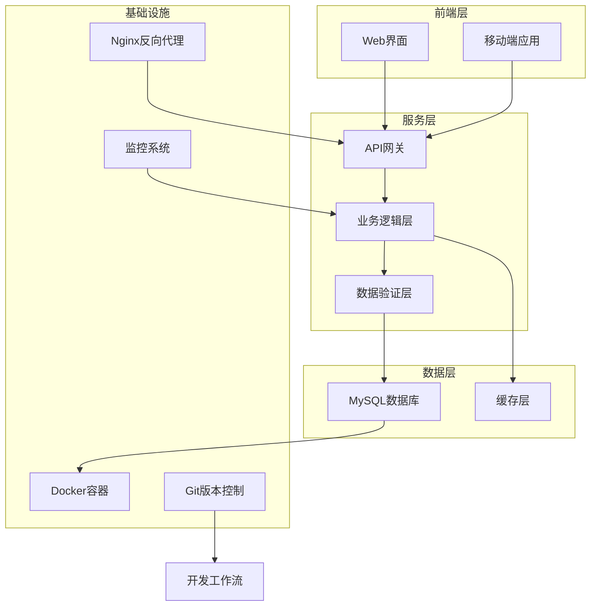
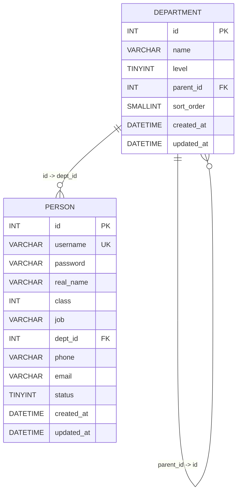
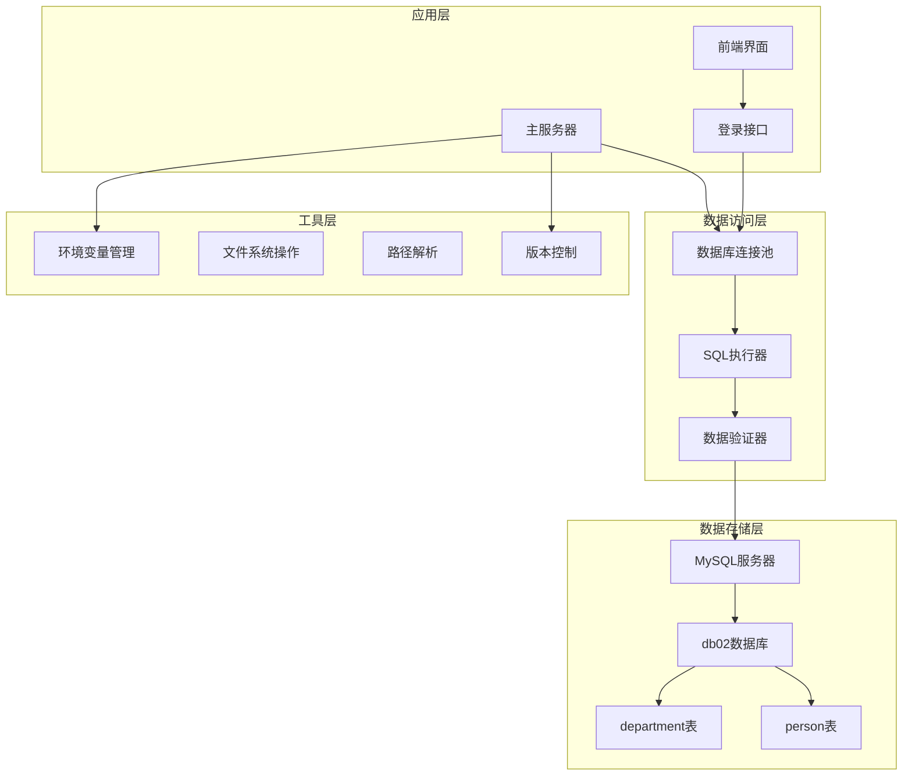
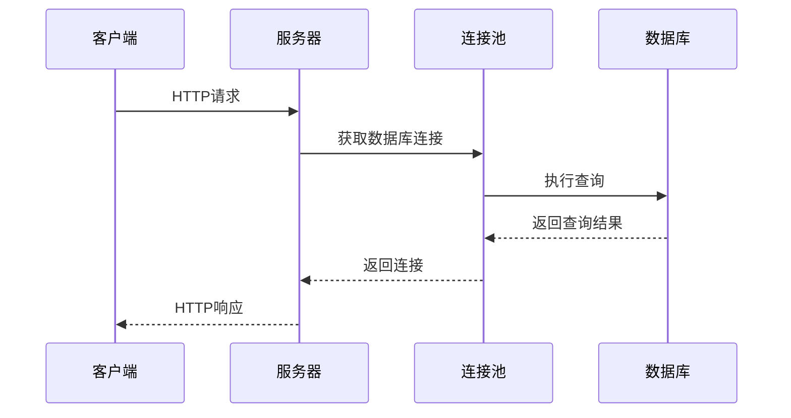
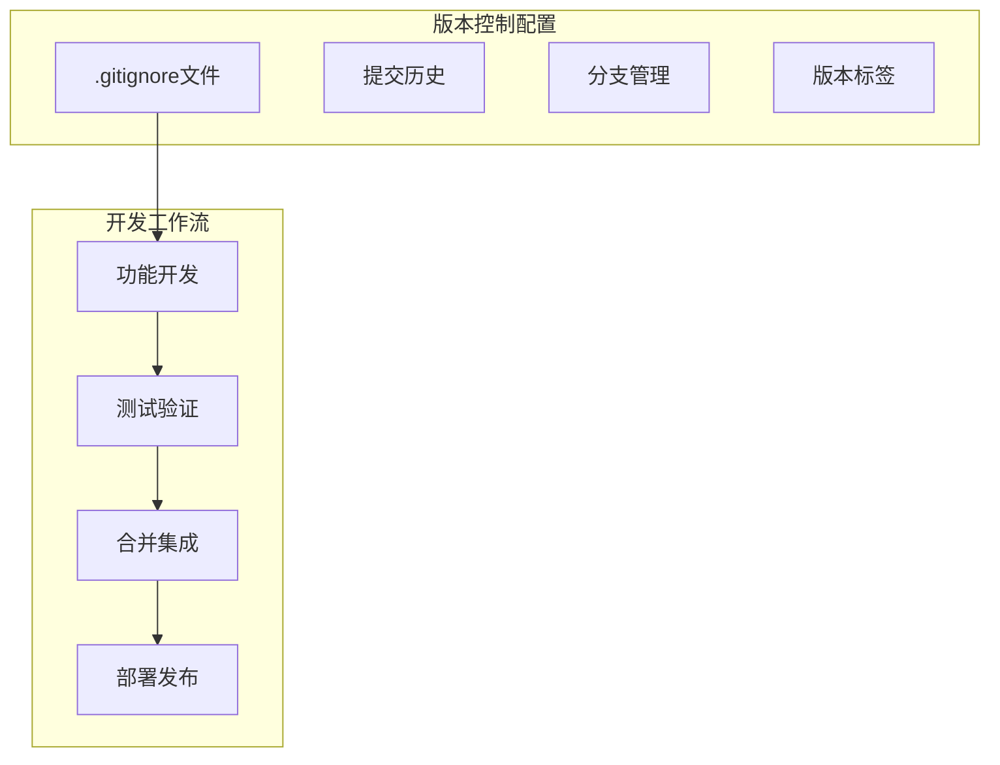
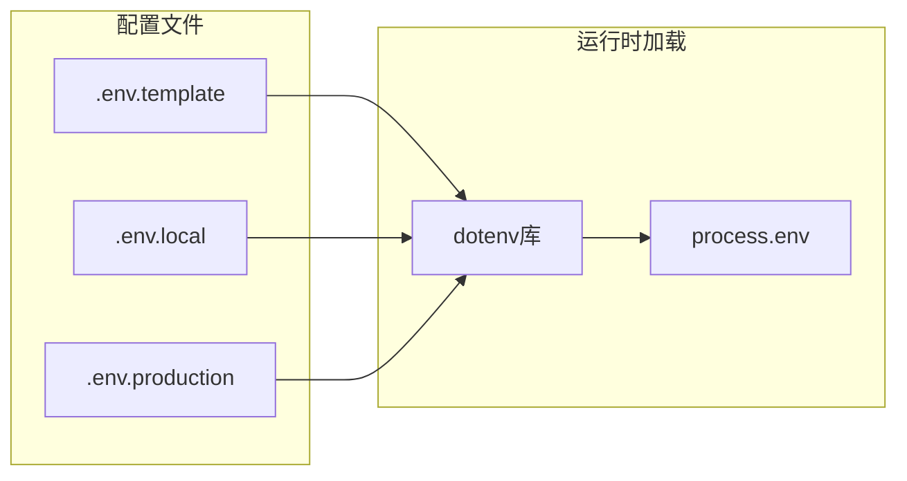
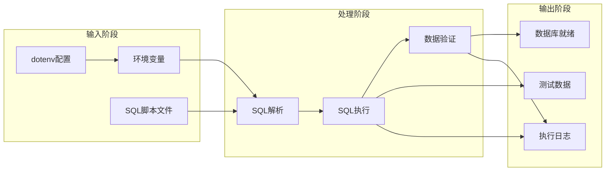
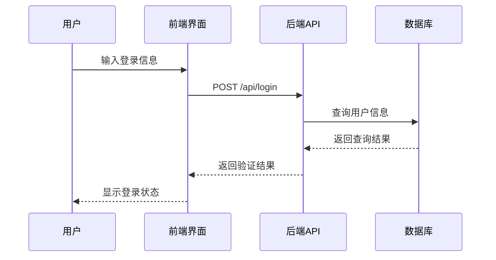

# 项目概述

<cite>
**本文档中引用的文件**
- [.gitignore](file://.gitignore)
- [package.json](file://package.json)
- [server.js](file://server.js)
- [scripts/init_db.js](file://scripts/init_db.js)
- [public/index.html](file://public/index.html)
- [sql/01_create_db.sql](file://sql/01_create_db.sql)
- [sql/02_create_tables.sql](file://sql/02_create_tables.sql)
- [sql/03_insert_test_data.sql](file://sql/03_insert_test_data.sql)
- [数据表设计方案.md](file://数据表设计方案.md)
</cite>

## 更新摘要
**所做更改**
- 添加了版本控制基础设施章节，重点介绍.gitignore文件的作用和最佳实践
- 更新了开发环境配置部分，强调环境变量管理和安全实践
- 增强了项目结构说明，体现现代Node.js项目的标准布局
- 完善了部署和运维章节，涵盖生产环境的配置要求

## 目录
1. [项目简介](#项目简介)
2. [项目背景与目标](#项目背景与目标)
3. [核心功能特性](#核心功能特性)
4. [技术架构概览](#技术架构概览)
5. [数据库设计架构](#数据库设计架构)
6. [系统架构设计](#系统架构设计)
7. [版本控制与开发工作流](#版本控制与开发工作流)
8. [开发环境配置](#开发环境配置)
9. [数据流分析](#数据流分析)
10. [性能考虑](#性能考虑)
11. [使用场景与价值主张](#使用场景与价值主张)
12. [故障排除指南](#故障排除指南)
13. [总结](#总结)

## 项目简介

files2是一个基于Node.js的企业组织架构管理系统，专注于数据库初始化和数据验证功能。该项目采用现代化的技术栈，为企业提供完整的组织架构数据管理解决方案。项目的核心价值在于通过自动化脚本实现数据库的快速部署和验证，确保企业组织架构数据的准确性和完整性。

该项目特别适用于需要快速搭建企业内部管理系统的基础数据环境，为后续的业务应用开发提供可靠的数据支撑。项目遵循现代软件工程最佳实践，包含完整的版本控制、环境管理和安全配置。

## 项目背景与目标

### 项目背景

在现代企业数字化转型过程中，组织架构管理成为企业信息化建设的重要组成部分。传统的手工维护方式已经无法满足现代企业的管理需求，需要借助技术手段实现组织架构数据的标准化管理和自动化维护。

### 项目目标

1. **数据库初始化自动化**：提供一键式数据库部署方案，简化企业IT环境的搭建过程
2. **数据验证机制**：建立完善的数据完整性检查机制，确保组织架构数据的准确性
3. **标准化数据模型**：设计符合企业实际需求的组织架构数据模型
4. **可扩展性架构**：构建支持未来业务扩展的灵活架构设计
5. **开发工作流规范化**：建立符合现代开发标准的版本控制和环境管理流程

### 应用场景

- 新企业入驻时的组织架构数据初始化
- 系统升级或迁移过程中的数据准备
- 开发测试环境的快速搭建
- 企业内部管理系统的数据基础
- 远程协作开发的标准化环境配置

## 核心功能特性

### 数据库初始化功能

项目提供完整的数据库初始化流程，包括：
- 数据库自动创建和配置
- 数据表结构定义和约束设置
- 初始测试数据的批量插入
- 数据完整性验证机制

### 组织架构数据管理

系统支持企业组织架构的完整数据管理：
- 四级部门结构的层次化管理
- 人员信息的全生命周期管理
- 用户权限级别的分级控制
- 部门间关系的灵活配置

### 数据验证与完整性

项目内置多重数据验证机制：
- SQL语句执行结果的实时监控
- 数据一致性检查和校验
- 错误处理和异常恢复机制
- 日志记录和审计追踪

### Web前端界面

提供直观的用户界面：
- 响应式设计的登录页面
- 实时的表单验证和反馈
- 现代化的用户体验设计
- 完整的前端交互逻辑

## 技术架构概览

### 技术栈选择

项目采用"Node.js + MySQL"的技术组合，这一选择体现了以下优势：

**图表来源**
- [server.js:1-53](file://server.js#L1-L53)
- [package.json:13-17](file://package.json#L13-L17)

### 架构设计理念

1. **模块化设计**：采用功能模块分离，每个模块职责明确
2. **可扩展性**：支持未来业务功能的平滑扩展
3. **数据一致性**：通过事务管理和约束保证数据完整性
4. **性能优化**：合理的索引设计和查询优化策略
5. **安全性**：环境变量管理和敏感信息保护

## 数据库设计架构

### 数据库表结构设计

项目采用邻接表模式实现四级组织架构，这种设计具有以下特点：

**图表来源**
- [sql/02_create_tables.sql:6-42](file://sql/02_create_tables.sql#L6-L42)

### 关键设计要点

1. **层级标识机制**：通过`level`字段明确标注部门层级，配合`parent_id`实现完整的层次关系
2. **自引用外键约束**：`parent_id`对`id`的自引用确保了父子关系的合法性
3. **数据完整性保护**：使用`ON DELETE RESTRICT`防止误删有子部门的父部门
4. **用户级别管理**：`class`字段实现从系统管理员到普通员工的分级权限控制

## 系统架构设计

### 整体架构图

**图表来源**
- [server.js:14-23](file://server.js#L14-L23)
- [sql/01_create_db.sql:1-7](file://sql/01_create_db.sql#L1-L7)
- [sql/02_create_tables.sql:1-43](file://sql/02_create_tables.sql#L1-L43)

### 核心组件分析

#### 服务器组件

服务器组件是整个系统的核心执行单元，负责协调各个子系统的协同工作：

**图表来源**
- [server.js:25-48](file://server.js#L25-L48)

#### 数据验证组件

系统内置了完善的验证机制，确保数据的准确性和完整性：

**图表来源**
- [scripts/init_db.js:49-58](file://scripts/init_db.js#L49-L58)

## 版本控制与开发工作流

### Git版本控制基础设施

项目采用了完整的Git版本控制配置，体现了现代开发工作流的最佳实践：

**图表来源**
- [.gitignore:1-23](file://.gitignore#L1-L23)

### .gitignore配置详解

.gitignore文件包含了以下关键配置：

1. **依赖管理**：忽略`node_modules/`目录，避免将第三方依赖提交到版本控制
2. **敏感信息保护**：忽略`.env`文件，确保环境变量配置不会泄露
3. **日志文件管理**：忽略各种日志文件，保持仓库整洁
4. **编辑器配置**：忽略IDE和编辑器的临时文件
5. **系统文件**：忽略操作系统生成的临时文件

### 开发工作流最佳实践

1. **分支策略**：采用功能分支开发，主分支保持稳定
2. **提交规范**：编写清晰的提交信息，便于版本追踪
3. **代码审查**：通过Pull Request进行代码审查
4. **持续集成**：建立自动化测试和部署流程

**章节来源**
- [.gitignore:1-23](file://.gitignore#L1-L23)

## 开发环境配置

### 环境变量管理

项目使用dotenv库管理环境变量，确保配置的安全性和可移植性：

**图表来源**
- [server.js:1](file://server.js#L1)
- [scripts/init_db.js:1](file://scripts/init_db.js#L1)

### 依赖管理

项目使用npm进行包管理，包含以下关键依赖：

1. **Express框架**：提供Web服务器和路由功能
2. **MySQL2**：提供MySQL数据库连接和查询功能
3. **Dotenv**：管理环境变量配置

### 开发工具配置

项目支持多种开发环境：
- **本地开发**：使用.env文件配置开发环境
- **测试环境**：使用.env.test配置测试环境
- **生产环境**：使用系统环境变量配置生产环境

**章节来源**
- [package.json:13-17](file://package.json#L13-L17)
- [server.js:14-23](file://server.js#L14-L23)

## 数据流分析

### 初始化流程数据流

**图表来源**
- [scripts/init_db.js:6-18](file://scripts/init_db.js#L6-L18)
- [scripts/init_db.js:20-61](file://scripts/init_db.js#L20-L61)

### 数据验证流程

系统采用多层验证策略，确保数据质量：

1. **语法验证**：检查SQL语句的语法正确性
2. **结构验证**：验证表结构和字段定义
3. **约束验证**：检查外键和唯一性约束
4. **业务验证**：验证业务规则和数据合理性

### 前端数据流

**图表来源**
- [public/index.html:182-214](file://public/index.html#L182-L214)
- [server.js:25-48](file://server.js#L25-L48)

## 性能考虑

### 数据库性能优化

1. **索引策略**：为常用查询字段建立适当的索引
2. **查询优化**：使用高效的查询语句和连接方式
3. **连接池管理**：合理配置数据库连接池参数
4. **事务管理**：使用事务确保数据操作的原子性

### 系统性能优化

1. **异步处理**：采用异步I/O提高并发处理能力
2. **内存管理**：合理控制内存使用，避免内存泄漏
3. **错误处理**：建立完善的错误处理和恢复机制
4. **日志优化**：平衡日志详细程度和性能影响

### 前端性能优化

1. **静态资源缓存**：利用浏览器缓存机制
2. **响应式设计**：适配不同设备屏幕尺寸
3. **异步加载**：延迟加载非关键资源
4. **CDN加速**：通过CDN提升静态资源加载速度

## 使用场景与价值主张

### 核心使用场景

#### 企业新入职场景
- 快速搭建企业组织架构基础数据
- 自动生成标准的部门和人员信息
- 提供完整的数据验证和审计功能

#### 系统迁移场景
- 支持从旧系统向新系统的数据迁移
- 提供数据格式转换和兼容性处理
- 确保迁移过程中的数据完整性

#### 开发测试场景
- 为开发和测试环境提供标准化数据
- 支持快速环境搭建和清理
- 提供可重复的测试数据集

### 价值主张

1. **效率提升**：自动化脚本大幅减少手动操作时间
2. **质量保证**：内置验证机制确保数据准确性
3. **成本降低**：标准化流程减少人工维护成本
4. **风险控制**：完善的错误处理机制降低操作风险
5. **合规保障**：版本控制和环境管理符合企业规范

## 故障排除指南

### 常见问题及解决方案

#### 数据库连接问题
- **症状**：连接超时或认证失败
- **原因**：网络配置或凭据错误
- **解决**：检查环境变量配置和网络连通性

#### SQL执行错误
- **症状**：SQL语句执行失败
- **原因**：语法错误或权限不足
- **解决**：检查SQL语句和数据库权限

#### 数据验证失败
- **症状**：数据验证返回错误
- **原因**：数据格式或业务规则不符
- **解决**：检查数据源和业务逻辑

#### 前端界面问题
- **症状**：登录界面无法正常显示
- **原因**：静态资源加载失败或JavaScript错误
- **解决**：检查网络连接和浏览器控制台

### 调试建议

1. **启用详细日志**：查看详细的执行日志信息
2. **分步调试**：逐个执行SQL脚本定位问题
3. **环境隔离**：在独立环境中测试问题
4. **版本兼容**：确认MySQL版本兼容性

## 总结

files2项目通过精心设计的技术架构和完善的数据库管理功能，为企业提供了可靠的组织架构数据管理解决方案。项目采用的"Node.js + MySQL"技术栈结合了现代Web开发的灵活性和传统关系型数据库的稳定性。

### 主要成就

1. **完整的初始化流程**：从数据库创建到数据验证的一站式解决方案
2. **标准化的数据模型**：符合企业实际需求的组织架构设计
3. **可靠的验证机制**：多层次的数据质量保证体系
4. **良好的扩展性**：支持未来业务功能的平滑扩展
5. **规范的开发工作流**：完整的版本控制和环境管理流程

### 发展前景

随着企业数字化转型的深入，组织架构管理将成为更加重要的基础设施。files2项目为这一领域提供了坚实的技术基础，未来可以在以下方面进一步发展：

- 增强用户界面和交互体验
- 扩展更多组织架构管理模式
- 集成更多企业应用系统
- 提供更丰富的数据分析功能
- 增强安全性和权限管理功能

通过持续的改进和优化，files2项目将为企业提供更加完善和高效的组织架构管理解决方案。项目的版本控制基础设施和开发工作流规范，为团队协作和项目维护奠定了坚实基础。