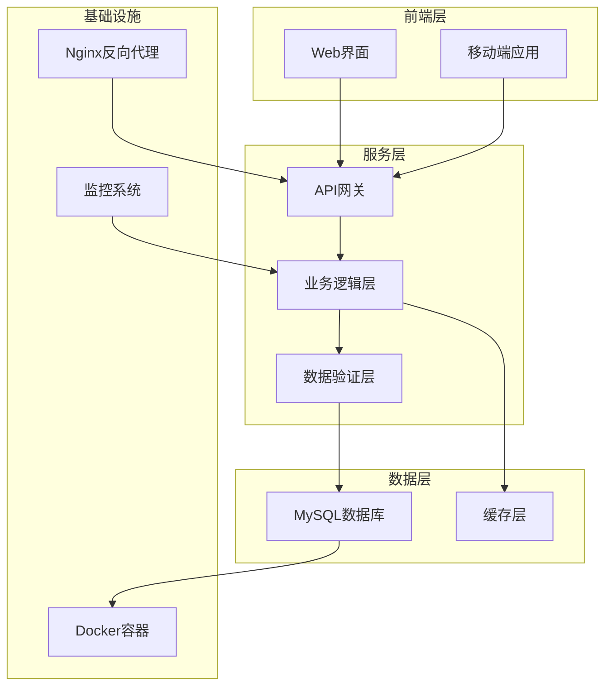
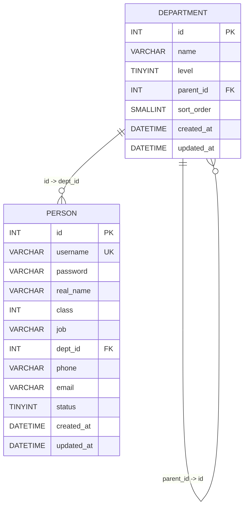
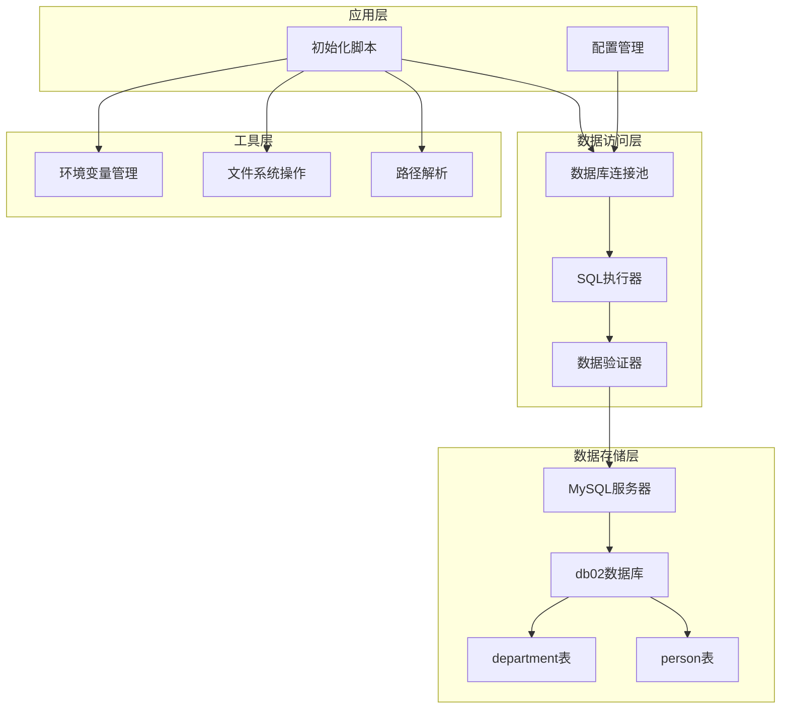
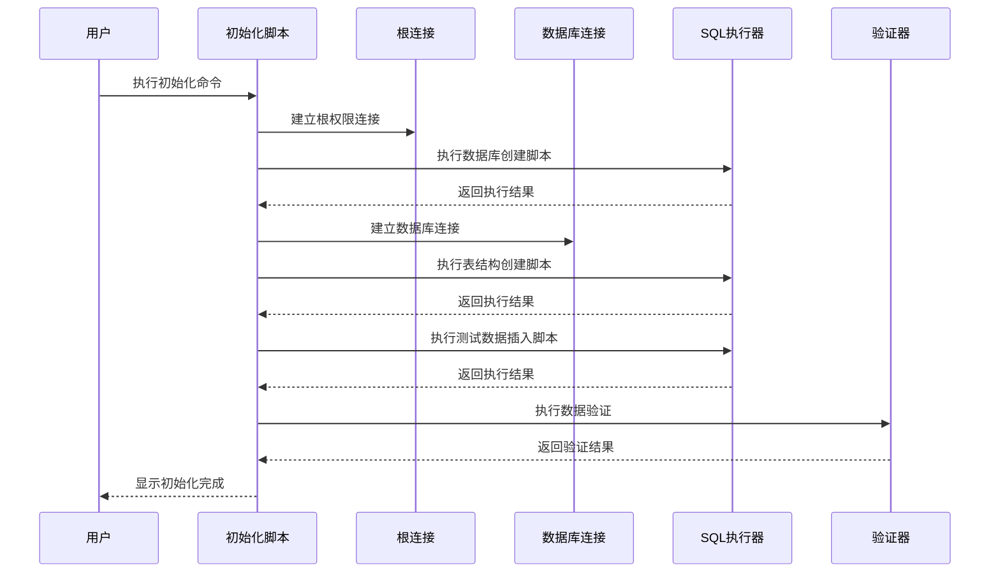
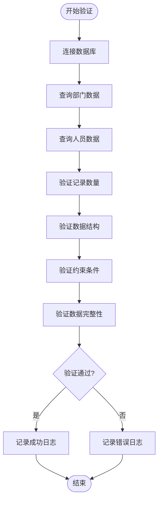
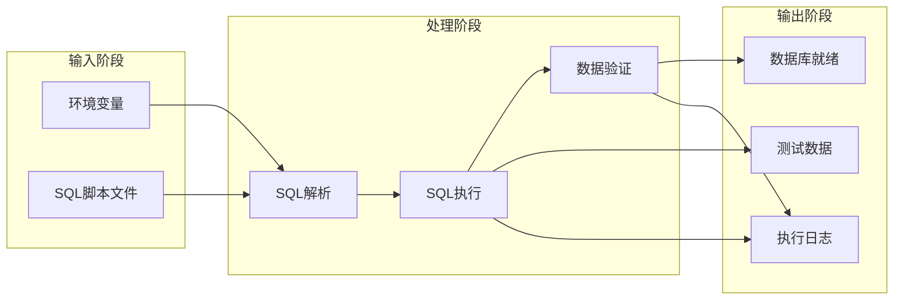

# 项目概述

<cite>
**本文档中引用的文件**
- [package.json](file://package.json)
- [init_db.js](file://scripts/init_db.js)
- [01_create_db.sql](file://sql/01_create_db.sql)
- [02_create_tables.sql](file://sql/02_create_tables.sql)
- [03_insert_test_data.sql](file://sql/03_insert_test_data.sql)
- [数据表设计方案.md](file://数据表设计方案.md)
</cite>

## 目录
1. [项目简介](#项目简介)
2. [项目背景与目标](#项目背景与目标)
3. [核心功能特性](#核心功能特性)
4. [技术架构概览](#技术架构概览)
5. [数据库设计架构](#数据库设计架构)
6. [系统架构设计](#系统架构设计)
7. [数据流分析](#数据流分析)
8. [性能考虑](#性能考虑)
9. [使用场景与价值主张](#使用场景与价值主张)
10. [故障排除指南](#故障排除指南)
11. [总结](#总结)

## 项目简介

files2是一个基于Node.js的企业组织架构管理系统，专注于数据库初始化和数据验证功能。该项目采用现代化的技术栈，为企业提供完整的组织架构数据管理解决方案。项目的核心价值在于通过自动化脚本实现数据库的快速部署和验证，确保企业组织架构数据的准确性和完整性。

该项目特别适用于需要快速搭建企业内部管理系统的基础数据环境，为后续的业务应用开发提供可靠的数据支撑。

## 项目背景与目标

### 项目背景

在现代企业数字化转型过程中，组织架构管理成为企业信息化建设的重要组成部分。传统的手工维护方式已经无法满足现代企业的管理需求，需要借助技术手段实现组织架构数据的标准化管理和自动化维护。

### 项目目标

1. **数据库初始化自动化**：提供一键式数据库部署方案，简化企业IT环境的搭建过程
2. **数据验证机制**：建立完善的数据完整性检查机制，确保组织架构数据的准确性
3. **标准化数据模型**：设计符合企业实际需求的组织架构数据模型
4. **可扩展性架构**：构建支持未来业务扩展的灵活架构设计

### 应用场景

- 新企业入驻时的组织架构数据初始化
- 系统升级或迁移过程中的数据准备
- 开发测试环境的快速搭建
- 企业内部管理系统的数据基础

## 核心功能特性

### 数据库初始化功能

项目提供完整的数据库初始化流程，包括：
- 数据库自动创建和配置
- 数据表结构定义和约束设置
- 初始测试数据的批量插入
- 数据完整性验证机制

### 组织架构数据管理

系统支持企业组织架构的完整数据管理：
- 四级部门结构的层次化管理
- 人员信息的全生命周期管理
- 用户权限级别的分级控制
- 部门间关系的灵活配置

### 数据验证与完整性

项目内置多重数据验证机制：
- SQL语句执行结果的实时监控
- 数据一致性检查和校验
- 错误处理和异常恢复机制
- 日志记录和审计追踪

## 技术架构概览

### 技术栈选择

项目采用"Node.js + MySQL"的技术组合，这一选择体现了以下优势：

**图表来源**
- [init_db.js:1-67](file://scripts/init_db.js#L1-L67)
- [package.json:13-16](file://package.json#L13-L16)

### 架构设计理念

1. **模块化设计**：采用功能模块分离，每个模块职责明确
2. **可扩展性**：支持未来业务功能的平滑扩展
3. **数据一致性**：通过事务管理和约束保证数据完整性
4. **性能优化**：合理的索引设计和查询优化策略

## 数据库设计架构

### 数据库表结构设计

项目采用邻接表模式实现四级组织架构，这种设计具有以下特点：

**图表来源**
- [02_create_tables.sql:6-42](file://sql/02_create_tables.sql#L6-L42)

### 关键设计要点

1. **层级标识机制**：通过`level`字段明确标注部门层级，配合`parent_id`实现完整的层次关系
2. **自引用外键约束**：`parent_id`对`id`的自引用确保了父子关系的合法性
3. **数据完整性保护**：使用`ON DELETE RESTRICT`防止误删有子部门的父部门
4. **用户级别管理**：`class`字段实现从系统管理员到普通员工的分级权限控制

## 系统架构设计

### 整体架构图

**图表来源**
- [init_db.js:1-67](file://scripts/init_db.js#L1-L67)
- [01_create_db.sql:1-7](file://sql/01_create_db.sql#L1-L7)
- [02_create_tables.sql:1-43](file://sql/02_create_tables.sql#L1-L43)

### 核心组件分析

#### 初始化脚本组件

初始化脚本是整个系统的核心执行组件，负责协调各个子系统的协同工作：

**图表来源**
- [init_db.js:20-61](file://scripts/init_db.js#L20-L61)

#### 数据验证组件

系统内置了完善的验证机制，确保数据的准确性和完整性：

**图表来源**
- [init_db.js:49-58](file://scripts/init_db.js#L49-L58)

## 数据流分析

### 初始化流程数据流

**图表来源**
- [init_db.js:6-18](file://scripts/init_db.js#L6-L18)
- [init_db.js:20-61](file://scripts/init_db.js#L20-L61)

### 数据验证流程

系统采用多层验证策略，确保数据质量：

1. **语法验证**：检查SQL语句的语法正确性
2. **结构验证**：验证表结构和字段定义
3. **约束验证**：检查外键和唯一性约束
4. **业务验证**：验证业务规则和数据合理性

## 性能考虑

### 数据库性能优化

1. **索引策略**：为常用查询字段建立适当的索引
2. **查询优化**：使用高效的查询语句和连接方式
3. **连接池管理**：合理配置数据库连接池参数
4. **事务管理**：使用事务确保数据操作的原子性

### 系统性能优化

1. **异步处理**：采用异步I/O提高并发处理能力
2. **内存管理**：合理控制内存使用，避免内存泄漏
3. **错误处理**：建立完善的错误处理和恢复机制
4. **日志优化**：平衡日志详细程度和性能影响

## 使用场景与价值主张

### 核心使用场景

#### 企业新入职场景
- 快速搭建企业组织架构基础数据
- 自动生成标准的部门和人员信息
- 提供完整的数据验证和审计功能

#### 系统迁移场景
- 支持从旧系统向新系统的数据迁移
- 提供数据格式转换和兼容性处理
- 确保迁移过程中的数据完整性

#### 开发测试场景
- 为开发和测试环境提供标准化数据
- 支持快速环境搭建和清理
- 提供可重复的测试数据集

### 价值主张

1. **效率提升**：自动化脚本大幅减少手动操作时间
2. **质量保证**：内置验证机制确保数据准确性
3. **成本降低**：标准化流程减少人工维护成本
4. **风险控制**：完善的错误处理机制降低操作风险

## 故障排除指南

### 常见问题及解决方案

#### 数据库连接问题
- **症状**：连接超时或认证失败
- **原因**：网络配置或凭据错误
- **解决**：检查环境变量配置和网络连通性

#### SQL执行错误
- **症状**：SQL语句执行失败
- **原因**：语法错误或权限不足
- **解决**：检查SQL语句和数据库权限

#### 数据验证失败
- **症状**：数据验证返回错误
- **原因**：数据格式或业务规则不符
- **解决**：检查数据源和业务逻辑

### 调试建议

1. **启用详细日志**：查看详细的执行日志信息
2. **分步调试**：逐个执行SQL脚本定位问题
3. **环境隔离**：在独立环境中测试问题
4. **版本兼容**：确认MySQL版本兼容性

## 总结

files2项目通过精心设计的技术架构和完善的数据库管理功能，为企业提供了可靠的组织架构数据管理解决方案。项目采用的"Node.js + MySQL"技术栈结合了现代Web开发的灵活性和传统关系型数据库的稳定性。

### 主要成就

1. **完整的初始化流程**：从数据库创建到数据验证的一站式解决方案
2. **标准化的数据模型**：符合企业实际需求的组织架构设计
3. **可靠的验证机制**：多层次的数据质量保证体系
4. **良好的扩展性**：支持未来业务功能的平滑扩展

### 发展前景

随着企业数字化转型的深入，组织架构管理将成为更加重要的基础设施。files2项目为这一领域提供了坚实的技术基础，未来可以在以下方面进一步发展：

- 增强用户界面和交互体验
- 扩展更多组织架构管理模式
- 集成更多企业应用系统
- 提供更丰富的数据分析功能

通过持续的改进和优化，files2项目将为企业提供更加完善和高效的组织架构管理解决方案。