# 文件管理系统

<cite>
**本文档引用的文件**
- [server.js](file://server.js)
- [package.json](file://package.json)
- [public/index.html](file://public/index.html)
- [public/main.html](file://public/main.html)
- [scripts/create_files_table.js](file://scripts/create_files_table.js)
- [scripts/init_db.js](file://scripts/init_db.js)
- [sql/01_create_db.sql](file://sql/01_create_db.sql)
- [sql/02_create_tables.sql](file://sql/02_create_tables.sql)
- [sql/03_insert_test_data.sql](file://sql/03_insert_test_data.sql)
- [sql/04_create_files_table.sql](file://sql/04_create_files_table.sql)
- [数据表设计方案.md](file://数据表设计方案.md)
</cite>

## 目录
1. [项目概述](#项目概述)
2. [项目结构](#项目结构)
3. [核心组件](#核心组件)
4. [架构概览](#架构概览)
5. [详细组件分析](#详细组件分析)
6. [数据库设计](#数据库设计)
7. [API 接口设计](#api-接口设计)
8. [性能考虑](#性能考虑)
9. [故障排除指南](#故障排除指南)
10. [部署指南](#部署指南)
11. [总结](#总结)

## 项目概述

文件管理系统是一个基于现代 Web 技术构建的企业级文件管理解决方案。该系统采用前后端分离架构，前端使用纯 HTML、CSS 和 JavaScript 实现，后端基于 Node.js 和 Express 框架开发，数据库采用 MySQL，文件存储集成 AWS S3 云存储服务。

### 主要功能特性

- **用户认证系统**：支持用户登录验证和会话管理
- **文件上传**：支持多文件拖拽上传和批量处理
- **文件分类管理**：按文件类型自动分类和标签管理
- **文件浏览**：提供丰富的文件列表展示和搜索功能
- **权限控制**：基于部门层级的文件访问权限管理
- **云端存储**：集成 AWS S3 实现高可靠性的文件存储
- **响应式设计**：适配各种设备和屏幕尺寸

## 项目结构

项目采用模块化的目录结构，清晰地分离了前端资源、后端逻辑、数据库脚本等各个组件。

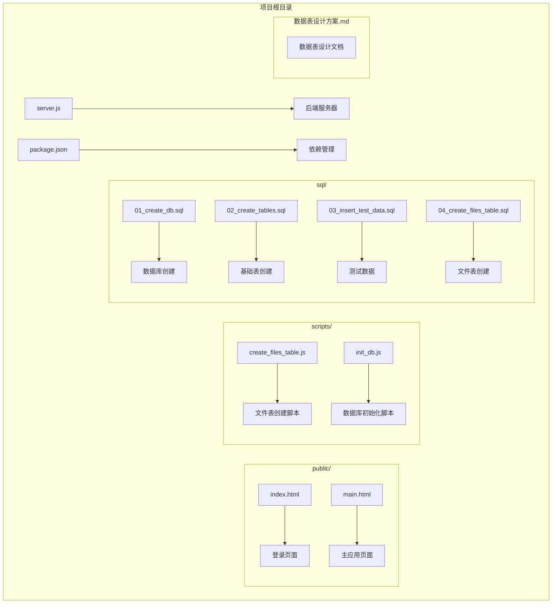

**图表来源**
- [server.js:1-283](file://server.js#L1-L283)
- [package.json:1-21](file://package.json#L1-L21)

**章节来源**
- [server.js:1-283](file://server.js#L1-L283)
- [package.json:1-21](file://package.json#L1-L21)

## 核心组件

### 后端服务器组件

系统的核心是基于 Express.js 的 Node.js 服务器，提供了完整的 RESTful API 接口和静态文件服务。

### 前端界面组件

前端采用现代化的单页应用架构，包含登录页面和主应用页面，提供直观的用户交互体验。

### 数据库组件

MySQL 数据库存储用户信息、部门结构和文件元数据，支持复杂的层级查询和权限控制。

### 云存储组件

AWS S3 集成提供高可用的文件存储服务，支持大规模文件的上传、下载和管理。

**章节来源**
- [server.js:8-35](file://server.js#L8-L35)
- [public/index.html:1-227](file://public/index.html#L1-L227)
- [public/main.html:1-1069](file://public/main.html#L1-L1069)

## 架构概览

系统采用典型的三层架构设计，实现了清晰的职责分离和良好的可维护性。

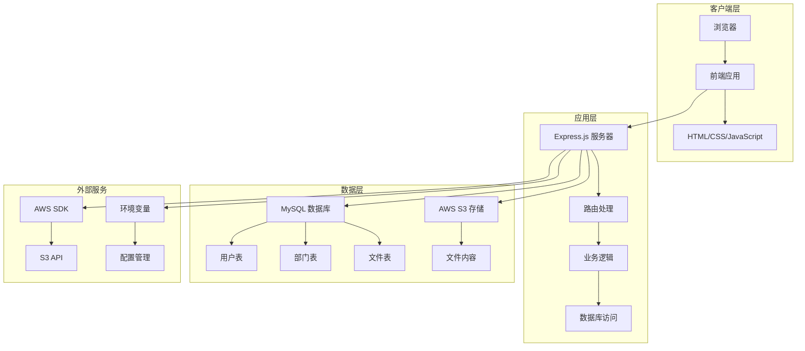

**图表来源**
- [server.js:17-35](file://server.js#L17-L35)
- [server.js:112-182](file://server.js#L112-L182)
- [server.js:204-253](file://server.js#L204-L253)

## 详细组件分析

### 服务器端架构

#### Express.js 应用配置

服务器使用 Express.js 框架构建，配置了必要的中间件来处理请求和响应。

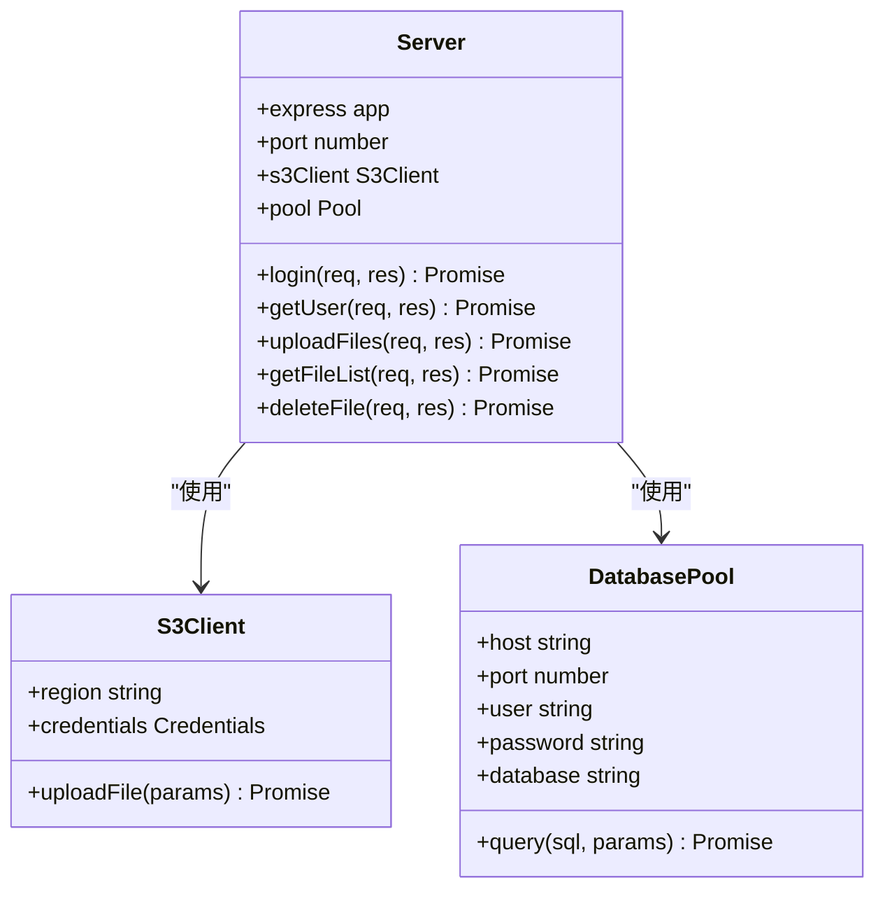

**图表来源**
- [server.js:8-35](file://server.js#L8-L35)
- [server.js:17-24](file://server.js#L17-L24)
- [server.js:26-35](file://server.js#L26-L35)

#### 文件类型识别系统

系统内置了完善的文件类型识别机制，支持多种常见文件格式的自动分类。

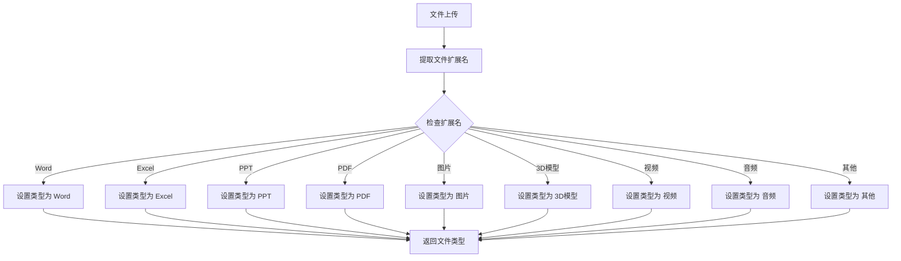

**图表来源**
- [server.js:92-109](file://server.js#L92-L109)
- [public/main.html:668-679](file://public/main.html#L668-L679)

**章节来源**
- [server.js:92-109](file://server.js#L92-L109)
- [server.js:184-201](file://server.js#L184-L201)
- [public/main.html:668-679](file://public/main.html#L668-L679)

### 前端用户界面

#### 登录页面设计

登录页面采用现代化的设计风格，提供简洁直观的用户认证界面。

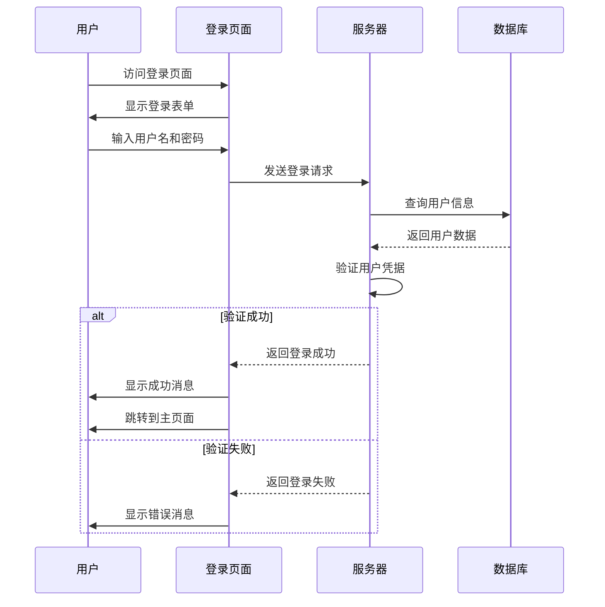

**图表来源**
- [public/index.html:171-224](file://public/index.html#L171-L224)
- [server.js:38-68](file://server.js#L38-L68)

#### 主应用页面功能

主应用页面集成了文件上传、文件浏览、分类筛选等多种功能。

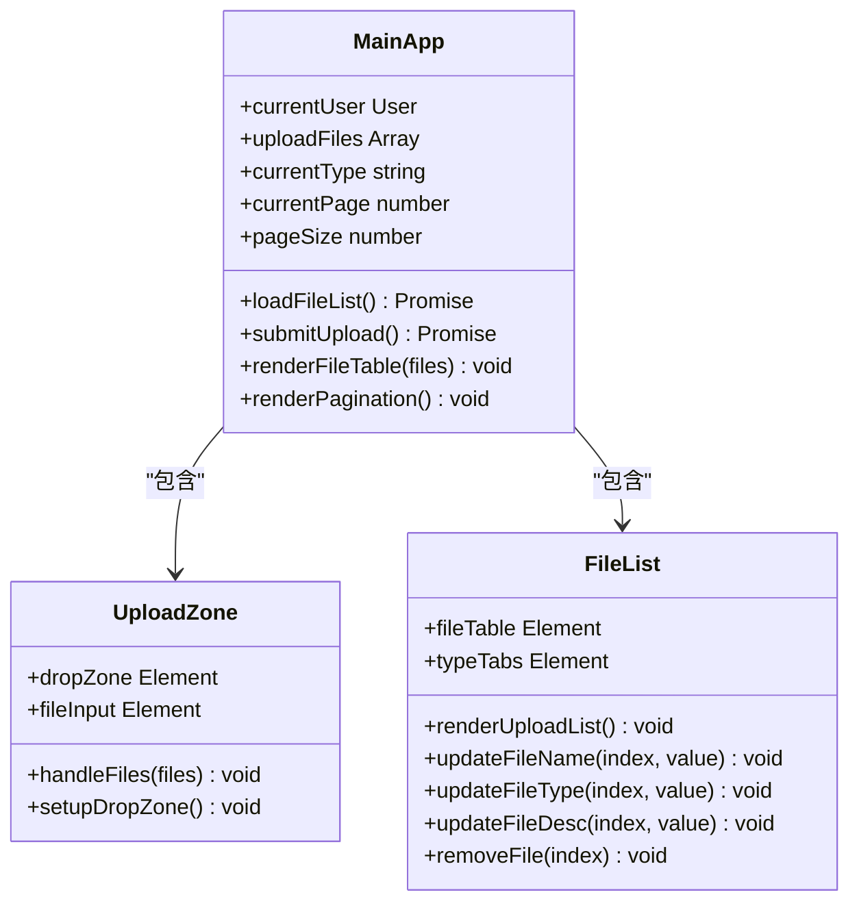

**图表来源**
- [public/main.html:658-1066](file://public/main.html#L658-L1066)
- [public/main.html:720-746](file://public/main.html#L720-L746)
- [public/main.html:748-829](file://public/main.html#L748-L829)

**章节来源**
- [public/index.html:171-224](file://public/index.html#L171-L224)
- [public/main.html:658-1066](file://public/main.html#L658-L1066)

### 数据库初始化流程

系统提供了完整的数据库初始化脚本，确保数据库结构的一致性和完整性。

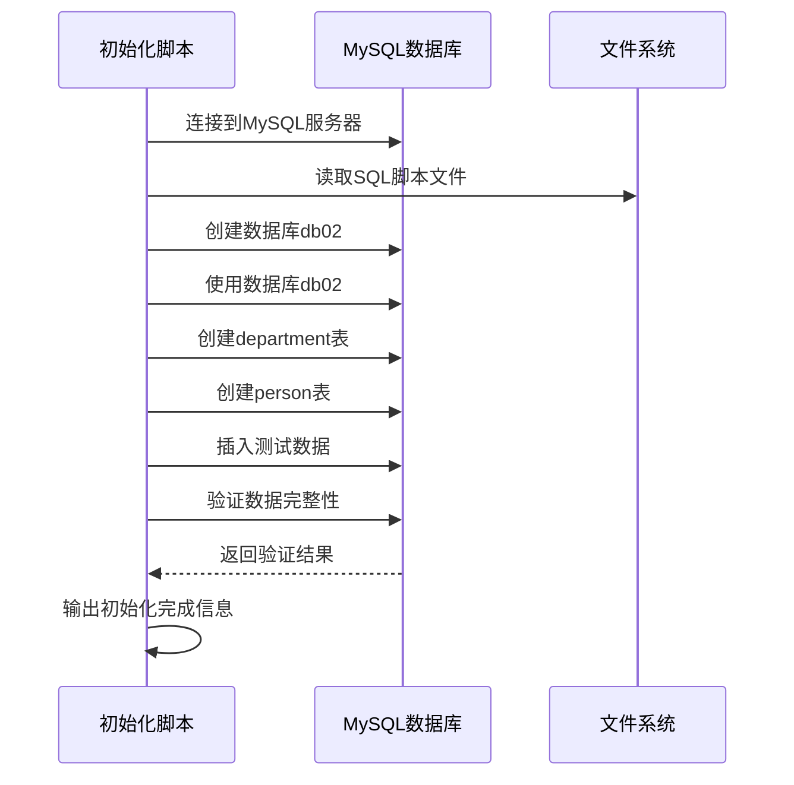

**图表来源**
- [scripts/init_db.js:20-61](file://scripts/init_db.js#L20-L61)
- [sql/01_create_db.sql:1-7](file://sql/01_create_db.sql#L1-L7)
- [sql/02_create_tables.sql:1-43](file://sql/02_create_tables.sql#L1-L43)
- [sql/03_insert_test_data.sql:1-45](file://sql/03_insert_test_data.sql#L1-L45)

**章节来源**
- [scripts/init_db.js:20-61](file://scripts/init_db.js#L20-L61)
- [scripts/create_files_table.js:4-43](file://scripts/create_files_table.js#L4-L43)

## 数据库设计

### 数据库架构

系统采用关系型数据库设计，支持复杂的层级结构和权限控制。

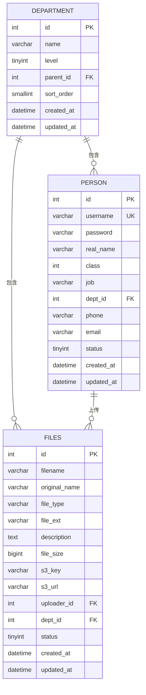

**图表来源**
- [sql/02_create_tables.sql:6-42](file://sql/02_create_tables.sql#L6-L42)
- [sql/04_create_files_table.sql:6-28](file://sql/04_create_files_table.sql#L6-L28)

### 部门层级设计

系统采用邻接表模式实现四级部门结构，支持灵活的组织架构管理。

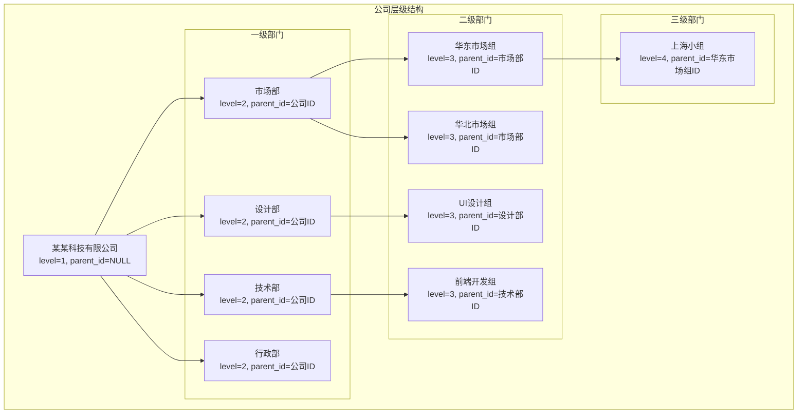

**图表来源**
- [数据表设计方案.md:61-72](file://数据表设计方案.md#L61-L72)
- [sql/03_insert_test_data.sql:8-27](file://sql/03_insert_test_data.sql#L8-L27)

### 用户权限体系

系统采用基于级别的用户权限模型，支持从系统管理员到普通员工的完整权限层次。

**章节来源**
- [数据表设计方案.md:1-115](file://数据表设计方案.md#L1-L115)
- [sql/02_create_tables.sql:21-42](file://sql/02_create_tables.sql#L21-L42)

## API 接口设计

### 认证相关接口

系统提供完整的用户认证接口，支持登录验证和用户信息获取。

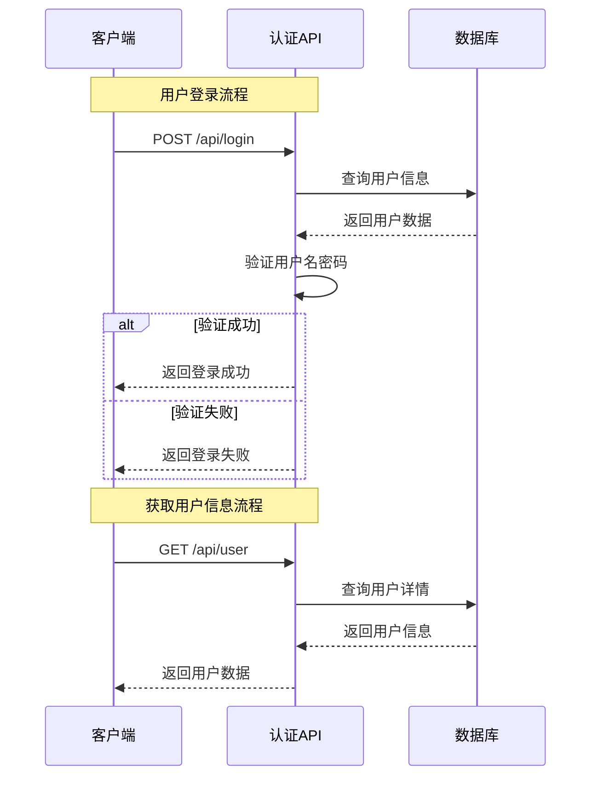

**图表来源**
- [server.js:38-68](file://server.js#L38-L68)
- [server.js:71-89](file://server.js#L71-L89)

### 文件管理接口

系统提供完整的文件管理接口，支持文件的上传、查询、删除等操作。

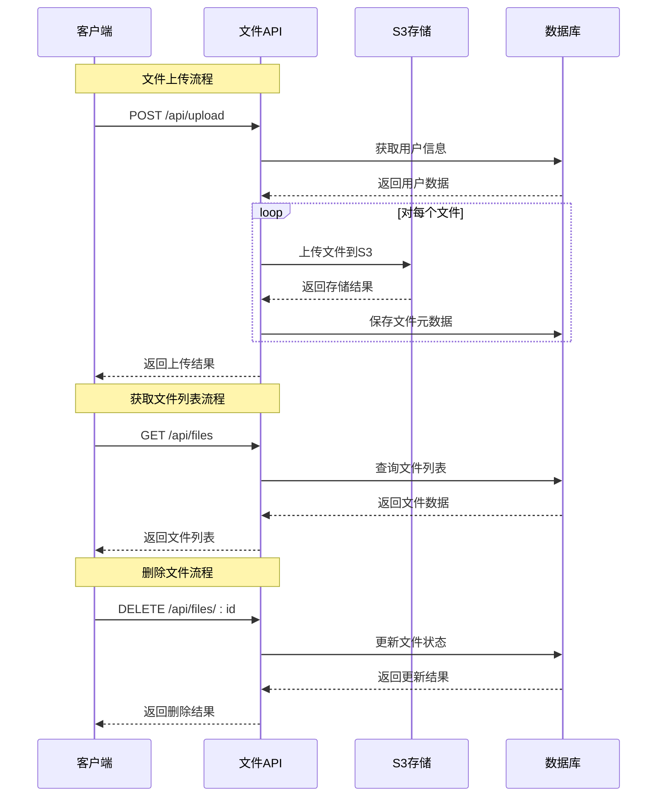

**图表来源**
- [server.js:112-182](file://server.js#L112-L182)
- [server.js:204-253](file://server.js#L204-L253)
- [server.js:264-278](file://server.js#L264-L278)

**章节来源**
- [server.js:38-68](file://server.js#L38-L68)
- [server.js:112-182](file://server.js#L112-L182)
- [server.js:204-278](file://server.js#L204-L278)

## 性能考虑

### 数据库优化策略

系统在数据库层面采用了多项优化措施来提升性能和可靠性。

- **索引优化**：为常用查询字段建立索引，包括文件类型、上传人、部门、创建时间等
- **连接池管理**：使用连接池减少数据库连接开销
- **查询优化**：采用分页查询和条件查询，避免全表扫描
- **数据类型优化**：合理选择数据类型，平衡存储空间和查询性能

### 文件存储优化

系统集成了 AWS S3 云存储，提供高性能的文件存储解决方案。

- **CDN 加速**：利用 S3 的全球 CDN 网络加速文件访问
- **缓存策略**：合理设置缓存头，减少重复请求
- **分块上传**：支持大文件的分块上传，提高上传成功率
- **压缩存储**：支持文件压缩存储，节省存储空间

### 前端性能优化

前端应用采用了多项优化技术来提升用户体验。

- **懒加载**：文件列表采用懒加载，只加载可视区域内的内容
- **虚拟滚动**：大量文件时使用虚拟滚动技术
- **图片预览**：仅在需要时加载图片预览
- **本地存储**：使用 localStorage 缓存用户信息

## 故障排除指南

### 常见问题及解决方案

#### 数据库连接问题

**问题症状**：应用启动时报数据库连接错误

**可能原因**：
- 数据库服务器不可达
- 用户名或密码错误
- 数据库不存在
- 网络连接问题

**解决步骤**：
1. 检查数据库服务器状态
2. 验证数据库连接参数
3. 确认数据库用户权限
4. 测试网络连通性

#### 文件上传失败

**问题症状**：文件上传过程中出现错误

**可能原因**：
- S3 凭证配置错误
- 网络连接不稳定
- 文件大小超出限制
- 权限不足

**解决步骤**：
1. 验证 S3 凭证配置
2. 检查网络连接稳定性
3. 确认文件大小限制
4. 验证用户权限

#### 用户认证失败

**问题症状**：用户无法登录系统

**可能原因**：
- 用户名或密码错误
- 用户状态异常
- 数据库查询失败

**解决步骤**：
1. 验证用户凭据
2. 检查用户状态
3. 查看数据库日志

**章节来源**
- [server.js:64-67](file://server.js#L64-L67)
- [server.js:178-181](file://server.js#L178-L181)
- [server.js:275-277](file://server.js#L275-L277)

## 部署指南

### 环境要求

系统部署需要满足以下环境要求：

- **Node.js 版本**：16.x 或更高版本
- **MySQL 版本**：8.0 或更高版本
- **内存**：至少 2GB RAM
- **存储**：根据文件数量和大小需求
- **网络**：稳定的互联网连接

### 配置文件设置

系统使用环境变量进行配置管理，需要设置以下关键参数：

- **数据库配置**：DB_HOST、DB_PORT、DB_USER、DB_PASSWORD、DB_DATABASE
- **AWS S3 配置**：AWS_REGION、AWS_ACCESS_KEY_ID、AWS_SECRET_ACCESS_KEY、S3_BUCKET_NAME
- **服务器配置**：PORT（默认 3000）

### 部署步骤

1. **安装依赖**：运行 `npm install`
2. **初始化数据库**：执行数据库初始化脚本
3. **配置环境变量**：设置必要的环境变量
4. **启动应用**：运行 `node server.js`
5. **验证部署**：访问应用确认正常运行

## 总结

文件管理系统是一个功能完整、架构清晰的企业级应用。系统采用现代化的技术栈，实现了高效的文件管理和用户认证功能。

### 主要优势

- **技术先进**：采用最新的 Web 技术和云存储服务
- **架构合理**：清晰的分层设计和职责分离
- **功能完善**：涵盖文件管理的各个环节
- **易于扩展**：模块化设计便于功能扩展
- **性能优良**：多层面的性能优化措施

### 技术特色

- **前后端分离**：采用现代化的开发模式
- **云原生设计**：充分利用云服务的优势
- **响应式界面**：适配各种设备和场景
- **安全可靠**：完善的权限控制和数据保护

该系统为企业提供了高效、可靠的文件管理解决方案，能够满足现代企业的文件管理需求。